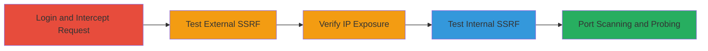

# Blind SSRF in Tumblr API to Probe Internal Services and Perform Port Scanning

Multi-stage attack chain demonstrating exploitation of a blind Server-Side Request Forgery (SSRF) vulnerability in Tumblr's GET /api/v2/url_info endpoint. The attack allows authenticated users to force the server to make requests to arbitrary internal and external URLs, enabling reconnaissance of internal infrastructure, IP exposure, port scanning via response timing differences, and potential resource exhaustion through bulk requests.

## Chain Metrics Dashboard

| Metric | Value |
|--------|-------|
| Chain Status | Unverified |
| Total Steps | 5 |
| Execution Time | ~10 minutes |
| Skill Level | Intermediate |
| Complexity | Medium |
| Impact Level | High |

## Attack Flow Visualization

## Prerequisites & Requirements

### Required Tools

- [[tools/Burp-Suite-Proxy]]
- [[tools/Burp-Suite-Intruder]]

### Target Environment

- Tumblr web platform (https://www.tumblr.com/)
- Required services/ports: HTTP/HTTPS on port 80/443 for API, internal ports like 9090 for testing
- Network access requirements: Internet access to Tumblr, ability to host an external server for callback

### Initial Access Requirements

- Valid Tumblr credentials (authenticated session required)
- Network position: External attacker with account
- Prior access needed: None beyond registration/login

## Detailed Attack Procedures

### Step 1: Login and Intercept Request
procedure: [[procedures/Login-and-Intercept-Tumblr-API-Request]]

**Objective**: Authenticate to Tumblr and capture the legitimate /api/v2/url_info request triggered by following a blog, setting up for parameter modification.

**Instructions**: Access the Tumblr login page and authenticate using valid credentials. Then, navigate to follow any blog, using [[tools/Burp-Suite-Proxy]] to intercept the GET request to /api/v2/url_info.

**Expected Output**: Intercepted request with original 'url' parameter pointing to a Tumblr blog URL, including headers like Host: www.tumblr.com and fields query parameters.

**Success Indicators**:
- Successful login and session cookie obtained
- Request to /api/v2/url_info captured in proxy

### Step 2: Test External SSRF
procedure: [[procedures/Test-External-SSRF-with-Attacker-Server]]

**Objective**: Modify the 'url' parameter to point to an external attacker-controlled server to confirm SSRF by observing request arrival.

**Instructions**: In the intercepted request, replace the 'url' parameter with your external server URL (e.g., http://your-server.com/test). Forward the request via proxy and monitor your server logs.

**Expected Output**: Incoming GET request from Tumblr's server to your endpoint, confirming SSRF.

**Success Indicators**:
- Request received on external server
- Source IP matches Automattic's range (e.g., 74.114.152.0/22)

### Step 3: Verify IP Exposure
procedure: [[procedures/Verify-IP-Exposure-from-External-SSRF]]

**Objective**: Analyze the incoming request to expose the internal IP of Tumblr's backend server.

**Instructions**: Review server logs from the external SSRF test for the source IP address.

**Expected Output**: Source IP such as 74.114.154.11, revealing internal infrastructure details.

**Success Indicators**:
- Internal IP logged and confirmed as Automattic-owned (AS2635)
- No direct access to internal services yet, but reconnaissance achieved

### Step 4: Test Internal SSRF
procedure: [[procedures/Test-Internal-SSRF-with-Localhost-URL]]

**Objective**: Modify the 'url' to a localhost address to probe internal services blindly.

**Instructions**: In a new intercepted request, set 'url' to http://127.0.0.1:9090/ and forward. Observe the response status and timing.

**Expected Output**: HTTP 200 response with potential 404 content, but varying response times indicating port status.

**Success Indicators**:
- Response received without error
- Timing differences noted for open vs. closed ports

### Step 5: Port Scanning and Probing
procedure: [[procedures/Perform-Port-Scanning-via-Response-Timing]]

**Objective**: Use fuzzing to scan internal ports and exhaust resources if needed.

**Instructions**: Configure [[tools/Burp-Suite-Intruder]] to fuzz the 'url' parameter with variations like http://127.0.0.1:{port}/, targeting ports (e.g., 9090). Send bulk requests and analyze response times.

**Expected Output**: Slower responses for open ports, faster for closed; potential for resource drain with high volume.

**Success Indicators**:
- Port states inferred from timing
- Internal services probed successfully

## Attack Chain Summary

### Key Achievements

1. Confirmed blind SSRF allowing external and internal URL fetches
2. Exposed internal IP (74.114.154.11) via callback server
3. Enabled port scanning on localhost ports like 9090 using response timing
4. Demonstrated potential for infrastructure exhaustion

## Technique & Tactic Coverage

### MITRE ATT&CK Techniques

- [[Exploit Public-Facing Application]] Exploit Public-Facing Application
- [[Active Scanning]] Active Scanning

### MITRE ATT&CK Tactics

- [[Initial Access]] Initial Access
- [[Reconnaissance]] Reconnaissance

---

*Last updated: 2023-10-01T00:00:00Z*
