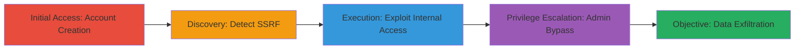

# Blind SSRF via Image Upload URL Downloader to Access Internal Services

Multi-stage attack chain demonstrating exploitation of a Blind SSRF vulnerability in a web application's image upload feature, leading to internal service access and information disclosure on a Moodle-based platform.

## Chain Metrics Dashboard

| Metric | Value |
|--------|-------|
| Chain Status | Unverified |
| Total Steps | 4 |
| Execution Time | ~15 minutes |
| Skill Level | Intermediate |
| Complexity | Medium |
| Impact Level | High |

## Attack Flow Visualization

## Prerequisites & Requirements

### Required Tools

- [[tools/Burp-Collaborator]]
- [[tools/Burp-Suite]]
- [[tools/Foxy-Proxy]]

### Target Environment

- Web application (Moodle-based) on PHP/7.4.28 with nginx
- Services: Postfix SMTP on port 25
- Network access: External access to the public-facing application

### Initial Access Requirements

- No prior credentials needed; self-registration enabled
- Browser with proxy support
- Burp Suite configured for interception

## Detailed Attack Procedures

### Step 1: Initial Access
procedure: [[procedures/Create-Account-and-Authenticate]]

**Objective**: Gain authenticated access to the profile editing page to reach the vulnerable URL downloader.

**Instructions**: Register a new user account on the application, then log in using the credentials. Navigate to the edit profile page at `/user/edit.php` and locate the image upload section, which exposes the URL downloader interface.

**Expected Output**: Successful login and access to the profile editor with the URL downloader field visible.

**Success Indicators**:
- User dashboard accessible
- URL downloader field present in profile edit form

### Step 2: Discovery
procedure: [[procedures/Detect-Blind-SSRF-with-Burp-Collaborator]]

**Objective**: Confirm the presence of Blind SSRF by detecting out-of-band interactions to external payloads.

**Instructions**: Launch Burp Collaborator to monitor callbacks. Enter a unique Collaborator-generated URL (e.g., `http://unique-collaborator.oastify.com/test.png`) in the URL downloader field and submit. Poll the Collaborator client for interactions, observing HTTP and DNS requests originating from the target's internal IP.

**Expected Output**: Burp Collaborator logs showing DNS resolution and HTTP requests to the payload URL from the internal server IP.

**Success Indicators**:
- Out-of-band DNS/HTTP interactions detected
- Confirmation of server-side URL fetching without response visibility

### Step 3: Execution
procedure: [[procedures/Exploit-SSRF-to-Access-Internal-Services]]

**Objective**: Exploit SSRF to connect to internal endpoints, leaking server details and accessing services like localhost and Postfix SMTP.

**Instructions**: Configure Foxy Proxy to route traffic through Burp Suite. Submit internal URLs like `http://127.0.0.1/test.png` in the downloader field. Intercept the POST request to `/repository/repository_ajax.php?action=signin` with the `file` parameter URL-encoded (e.g., `http%3A%2F%2F127.0.0.1%2Ftest.png`). Forward the request and observe the JSON error response containing raw internal 404 (with nginx headers, PHP version). Modify to target port 25 (`http://127.0.0.1:25/test.png`) to leak Postfix details.

**Expected Output**: HTTP 200 response with JSON error embedding internal server responses, including headers like `Server: nginx`, `PHP/7.4.28`, and Postfix SMTP info.

**Success Indicators**:
- Leaked internal headers and service details
- Confirmation of libcurl usage from error behavior

### Step 4: Privilege Escalation
procedure: [[procedures/Bypass-Admin-Access-Control]]

**Objective**: Bypass client-side access controls to reach the admin interface for potential unauthorized access.

**Instructions**: Navigate directly to `/admin/user.php` and bypass the JavaScript check on `window.location.pathname` by disabling JS or using browser dev tools to remove the restriction. Attempt login with default credentials like `admin/admin` if exposed in config.

**Expected Output**: Access to the admin panel without authentication prompts or with successful default login.

**Success Indicators**:
- Admin interface loaded
- Potential credential validation bypassed

## Attack Chain Summary

### Key Achievements

1. Confirmed Blind SSRF allowing arbitrary internal URL fetching
2. Leaked server internals including nginx, PHP version, and Postfix details
3. Demonstrated potential for data exfiltration via internal service access
4. Bypassed admin access controls for further privilege escalation

## Technique & Tactic Coverage

### MITRE ATT&CK Techniques

- [[Exploit Public-Facing Application]] Exploit Public-Facing Application
- [[Gather Victim Host Information]] Gather Victim Host Information

### MITRE ATT&CK Tactics

- [[Initial Access]] Initial Access
- [[Discovery]] Discovery

---

*Last updated: 2023-10-01T00:00:00Z*
