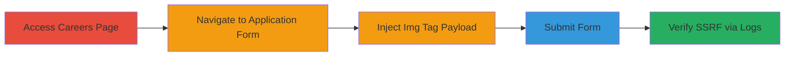

---
tags:
  - ssrf
  - blind-ssrf
  - html-injection
  - web-vulnerability
type: attack_chain
tools: []
tactics:
  - '[[Initial Access]]'
  - '[[Reconnaissance]]'
verified: false
platforms:
  - Web
submitted: true
complexity: medium
created_at: '2023-10-01T00:00:00Z'
procedures:
  - '[[procedures/Inject-Img-Tag-for-Blind-SSRF-in-Web-Form]]'
step_count: 5
techniques:
  - '[[Exploit Public-Facing Application]]'
updated_at: '2025-12-14T04:39:09.990Z'
description: >-
  A multi-stage attack exploiting insufficient input sanitization in the Mixmax
  career form to trigger blind SSRF, leading to unauthorized server requests and
  potential internal reconnaissance.
skill_level: intermediate
impact_level: high
id: ec6878b1-5dfe-45d9-874e-521211e67162
validated: true
mitre_tactics:
  - '[[Initial Access]]'
  - '[[Reconnaissance]]'
mitre_techniques:
  - '[[Exploit Public-Facing Application]]'
---
# Blind SSRF via Img Tag Injection in Mixmax Career Application Form

Multi-stage attack chain demonstrating exploitation of a blind Server-Side Request Forgery (SSRF) vulnerability in the Mixmax career application form through HTML img tag injection. The attack allows the server to make unauthorized requests to external URLs controlled by the attacker, potentially leaking internal network details such as the server's IP address and User-Agent string.

## Chain Metrics Dashboard

| Metric | Value |
|--------|-------|
| Chain Status | Unverified |
| Total Steps | 5 |
| Execution Time | ~5 minutes |
| Skill Level | Intermediate |
| Complexity | Medium |
| Impact Level | High |

## Attack Flow Visualization

## Prerequisites & Requirements

### Required Tools

- Web browser (e.g., Firefox or Chrome)
- Server to host the target URL for verification (e.g., a simple HTTP server logging requests)

### Target Environment

- Web platform
- Public-facing career application form at https://mixmax.com/careers
- No specific ports or services required beyond standard HTTPS (443)

### Initial Access Requirements

- Public internet access
- No credentials needed
- Attacker must control an external URL to receive and log requests

## Detailed Attack Procedures

### Step 1: Access Careers Page
procedure: [[procedures/Inject-Img-Tag-for-Blind-SSRF-in-Web-Form]]

**Objective**: Navigate to the target career page to begin the application process.

**Instructions**: Open a web browser and visit the Mixmax careers page.

**Expected Output**: The careers page loads, displaying available job positions.

**Success Indicators**:
- Page title includes "Careers | Mixmax"
- Job listings are visible

### Step 2: Navigate to Application Form
procedure: [[procedures/Inject-Img-Tag-for-Blind-SSRF-in-Web-Form]]

**Objective**: Locate and access a job application form to prepare for payload injection.

**Instructions**: Select a job position and click the "Apply now" button to open the application form.

**Expected Output**: The job application form appears with input fields for personal details, resume, etc.

**Success Indicators**:
- Form fields such as name, email, and message are present
- Submit button is visible

### Step 3: Inject Img Tag Payload
procedure: [[procedures/Inject-Img-Tag-for-Blind-SSRF-in-Web-Form]]

**Objective**: Insert the SSRF payload into form fields to trigger server-side resource fetching.

**Instructions**: In every input field of the form (e.g., name, email, cover letter), inject the payload ``, replacing `your_choice.com` with a domain you control that logs incoming requests.

**Expected Output**: All form fields contain the injected HTML tag.

**Success Indicators**:
- Payload is visible in form inputs without immediate client-side rejection
- No JavaScript errors on the page

### Step 4: Submit Form
procedure: [[procedures/Inject-Img-Tag-for-Blind-SSRF-in-Web-Form]]

**Objective**: Trigger server-side processing to execute the SSRF.

**Instructions**: Complete any remaining fields if necessary and click the "Send Application" button to submit the form.

**Expected Output**: Form submission confirmation or redirect.

**Success Indicators**:
- Submission succeeds without errors
- No immediate feedback on payload execution (blind SSRF)

### Step 5: Verify Exploitation
procedure: [[procedures/Inject-Img-Tag-for-Blind-SSRF-in-Web-Form]]

**Objective**: Confirm the SSRF by checking logs on the attacker's controlled server.

**Instructions**: Monitor your controlled server's access logs for incoming requests from the target server.

**Expected Output**: Log entries showing requests from the target's IP (e.g., 66.249.84.213) with User-Agent like "Mozilla/5.0 (Windows NT 5.1; rv:11.0) Gecko Firefox/11.0 (via ggpht.com GoogleImageProxy)".

**Success Indicators**:
- Unauthorized request received on attacker's server
- Internal details like IP and User-Agent leaked

## Attack Chain Summary

### Key Achievements

1. Successful injection of HTML img tags into unsanitized form fields
2. Triggered blind SSRF causing server to fetch external resources
3. Leaked internal server information including IP address and User-Agent

## Technique & Tactic Coverage

### MITRE ATT&CK Techniques

- [[Exploit Public-Facing Application]]

### MITRE ATT&CK Tactics

- [[Initial Access]]
- [[Reconnaissance]]

---
*Last updated: 2023-10-01T00:00:00Z*
