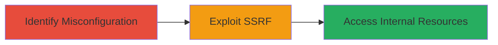

# Blind SSRF via Sentry Source Code Scraping Misconfiguration on Cloudflare Platform

Multi-stage attack chain demonstrating exploitation of a blind SSRF vulnerability on platform.dash.cloudflare.com caused by a misconfigured Sentry deployment in Cloudflare's infrastructure. The attack leverages the enabled source code scraping feature to send unauthorized requests to internal endpoints, potentially exposing sensitive internal resources.

## Chain Metrics Dashboard

| Metric | Value |
|--------|-------|
| Chain Status | Unverified |
| Total Steps | 2 |
| Execution Time | ~5 minutes |
| Skill Level | Intermediate |
| Complexity | Medium |
| Impact Level | High |

## Attack Flow Visualization

## Prerequisites & Requirements

### Required Tools

- [[tools/Sentry]]

### Target Environment

- Cloudflare platform (platform.dash.cloudflare.com)
- Sentry application monitoring service
- Web browser or HTTP client for testing

### Initial Access Requirements

- Public access to platform.dash.cloudflare.com
- No authentication required for initial probing
- Knowledge of Cloudflare's infrastructure

## Detailed Attack Procedures

### Step 1: Identify Misconfiguration
procedure: [[procedures/Identify-Sentry-Source-Code-Scraping-Misconfiguration]]

**Objective**: Detect the enabled source code scraping feature in Cloudflare's Sentry deployment that allows arbitrary request forwarding.

**Instructions**: Probe the Sentry instance integrated with platform.dash.cloudflare.com to check for the source code scraping functionality. Use a web browser or HTTP client to interact with the monitoring setup and observe if requests can be initiated to external or internal-like endpoints.

**Expected Output**: Confirmation that Sentry's source code scraping is active, enabling blind requests through Cloudflare's infrastructure.

**Success Indicators**:
- Response indicating source code fetching is enabled
- Ability to trigger requests without errors

### Step 2: Exploit Blind SSRF
procedure: [[procedures/Exploit-Blind-SSRF-with-Sentry]]

**Objective**: Leverage the misconfiguration to send blind SSRF requests to arbitrary internal endpoints using Cloudflare's infrastructure.

**Instructions**: Utilize the enabled feature to craft requests that forward to internal services. For example, submit a payload via the Sentry interface that instructs it to scrape or fetch from an internal URL like metadata endpoints.

**Expected Output**: Successful blind requests to internal resources, potentially revealing sensitive data or allowing further pivoting.

**Success Indicators**:
- No client-side errors on request submission
- Indirect evidence of internal access (e.g., delayed responses or logs)

## Attack Chain Summary

### Key Achievements

1. Identified and confirmed Sentry misconfiguration enabling SSRF.
2. Executed blind requests to internal endpoints via Cloudflare infrastructure.
3. Demonstrated potential for sensitive data exposure or service access.

## Technique & Tactic Coverage

### MITRE ATT&CK Techniques

- [[Exploit Public-Facing Application]]

### MITRE ATT&CK Tactics

- [[Initial Access]]

---

*Last updated: 2023-10-01T00:00:00Z*
