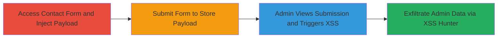

# Blind Stored XSS in Contact Form Leading to Admin Session and PII Leakage

Multi-stage attack chain demonstrating exploitation of unsanitized input fields in a web contact form to achieve blind stored XSS, enabling data theft from an admin context.

## Chain Metrics Dashboard

| Metric | Value |
|--------|-------|
| Chain Status | Unverified |
| Total Steps | 3 |
| Execution Time | ~10-30 minutes (includes waiting for admin interaction) |
| Skill Level | Intermediate |
| Complexity | Medium |
| Impact Level | High |

## Attack Flow Visualization

## Prerequisites & Requirements

### Required Tools

- [[tools/XSS-Hunter]]

### Target Environment

- Web platform with contact form (e.g., https://www.topcoder.com/contact-us/)
- Backend admin panel for viewing submissions
- Services: MailChimp, Salesforce (Visualforce)
- No specific ports required; standard HTTPS access

### Initial Access Requirements

- Public internet access to the target website
- No credentials needed for initial submission
- Account on XSS Hunter service for payload generation and monitoring

## Detailed Attack Procedures

### Step 1: Access Contact Form and Inject Payload
procedure: [[procedures/Inject-Blind-Stored-XSS-Payload-into-Contact-Form]]

**Objective**: Inject a blind XSS payload into unsanitized form fields to store malicious JavaScript in the backend.

**Instructions**: Navigate to the target contact form and fill fields with the payload. Use a payload like `` in fields such as First name, Last name, Company, and description. No specific commands are executed; this is done via browser form input.

**Expected Output**: Form fields populated with payload, ready for submission.

**Success Indicators**:
- Payload successfully entered without client-side validation errors
- Form appears ready to submit

### Step 2: Submit the Form
procedure: [[procedures/Inject-Blind-Stored-XSS-Payload-into-Contact-Form]]

**Objective**: Submit the form to persist the XSS payload in the backend database or storage.

**Instructions**: Click the submit button on the contact form after injecting the payload. The unsanitized input is stored server-side without sanitization, awaiting admin review. Monitor the submission confirmation page for any errors.

**Expected Output**: Confirmation message from the form (e.g., "Thank you for your submission").

**Success Indicators**:
- Form submits successfully without errors
- No immediate payload execution (blind nature confirms storage)

### Step 3: Wait for Admin Access and Monitor Trigger
procedure: [[procedures/Monitor-XSS-Trigger-for-Data-Exfiltration]]

**Objective**: Wait for an administrator to view the submission in the backend panel, triggering the XSS and exfiltrating data to the attacker's XSS Hunter instance.

**Instructions**: After submission, log into your XSS Hunter dashboard to monitor for triggers. The payload executes in the admin's browser context when they access the submission, sending data like IP (e.g., 76.24.165.111), session cookies, MailChimp customer/subscription details, backend service info, and PII.

**Expected Output**: Notification in XSS Hunter dashboard with captured data including admin IP, cookies, and PII.

**Success Indicators**:
- XSS Hunter alerts of payload trigger
- Captured data includes admin session tokens and sensitive info
- Potential for further exploitation like admin panel access using stolen cookies

## Attack Chain Summary

### Key Achievements

1. Successful injection and storage of blind XSS payload in contact form fields.
2. Triggering of XSS upon admin interaction, bypassing sanitization.
3. Exfiltration of high-value data including session cookies, IP, and integrated service details (MailChimp, Salesforce), enabling account takeover risks.

## Technique & Tactic Coverage

### MITRE ATT&CK Techniques

- [[JavaScript]]
- [[Exploit Public-Facing Application]]

### MITRE ATT&CK Tactics

- [[Initial Access]]
- [[Collection]]

---
*Last updated: 2023-10-01T00:00:00Z*
