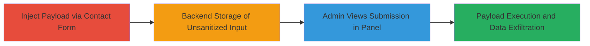

---
tags:
  - xss
  - stored-xss
  - blind-xss
  - data-exfiltration
  - session-hijacking
  - dod
  - government
type: attack_chain
tools:
  - '[[tools/XSS-Hunter]]'
tactics:
  - '[[Initial Access]]'
  - '[[Execution]]'
  - '[[Collection]]'
verified: false
platforms:
  - Web
submitted: true
complexity: medium
created_at: '2023-10-01T12:00:00Z'
procedures:
  - '[[procedures/Inject-Blind-Stored-XSS-Payload-into-Contact-Form]]'
  - '[[procedures/Trigger-and-Detect-XSS-Exploitation-via-Admin-Access]]'
step_count: 3
techniques:
  - '[[Exploit Public-Facing Application]]'
  - '[[JavaScript]]'
updated_at: '2025-12-14T03:47:13.080Z'
description: >-
  A multi-stage attack exploiting a blind stored XSS vulnerability in a U.S.
  Department of Defense contact form to inject malicious payloads, store them in
  the backend, and trigger execution upon admin access, resulting in
  exfiltration of sensitive admin data including IP, application details,
  MailChimp info, and session cookies.
skill_level: intermediate
impact_level: high
id: 0957d6ab-b19b-4fe0-84e4-11126c7d30ff
validated: true
mitre_tactics:
  - '[[Initial Access]]'
  - '[[Execution]]'
  - '[[Collection]]'
mitre_techniques:
  - '[[Exploit Public-Facing Application]]'
  - '[[JavaScript]]'
---
# Blind Stored XSS in DoD Contact Form Leading to Admin Session Cookie Leakage

Multi-stage attack chain demonstrating exploitation of a blind stored XSS vulnerability in a U.S. Department of Defense website's contact form, leading to the leakage of administrator credentials and sensitive backend data.

## Chain Metrics Dashboard

| Metric | Value |
|--------|-------|
| Chain Status | Unverified |
| Total Steps | 3 |
| Execution Time | ~5 minutes |
| Skill Level | Intermediate |
| Complexity | Medium |
| Impact Level | High |

## Attack Flow Visualization

## Prerequisites & Requirements

### Required Tools

- [[tools/XSS-Hunter]]

### Target Environment

- Web platform with public-facing contact form
- No authentication required for form submission
- Backend admin panel accessible only to administrators

### Initial Access Requirements

- Public internet access to the target website (e.g., https://██████.mil/)
- No credentials needed for initial injection
- Account on XSS Hunter service for payload detection

## Detailed Attack Procedures

### Step 1: Inject Blind Stored XSS Payload into Contact Form
procedure: [[procedures/Inject-Blind-Stored-XSS-Payload-into-Contact-Form]]

**Objective**: Submit a malicious JavaScript payload through the contact form fields to store it unsanitized in the backend database.

**Instructions**: Navigate to the contact form page at https://██████.mil/. Fill in the fields (First name, Last name, Company, Description) with a blind XSS payload that includes angle brackets and a script tag pointing to an XSS Hunter callback URL, such as ``. Ensure the payload is crafted to evade basic filters but exploit the lack of sanitization for dangerous characters.

**Expected Output**: Form submission success message, with the payload stored in the backend without sanitization.

**Success Indicators**:
- Form submits without errors
- No immediate JavaScript execution (blind nature confirms storage only)

### Step 2: Backend Storage of Unsanitized Input
procedure: [[procedures/Inject-Blind-Stored-XSS-Payload-into-Contact-Form]]

**Objective**: Confirm the payload is persisted in the backend for later execution when viewed by an admin.

**Instructions**: After submission, the form handler stores the input directly into the database or log without HTML encoding or sanitization, allowing the script to remain executable. No further action is needed from the attacker at this stage; the payload lies dormant.

**Expected Output**: Payload stored server-side, ready for admin interaction.

**Success Indicators**:
- Subsequent form submissions with non-malicious data process normally
- No server-side errors indicating sanitization

### Step 3: Trigger and Detect XSS Exploitation via Admin Access
procedure: [[procedures/Trigger-and-Detect-XSS-Exploitation-via-Admin-Access]]

**Objective**: Wait for an administrator to view the submission in the backend panel, triggering the payload to execute and exfiltrate data to the XSS Hunter service.

**Instructions**: Monitor the XSS Hunter dashboard for incoming notifications. When an admin accesses the /admin panel and views the contact submission, the stored payload executes in the admin's browser context, sending a beacon to the XSS Hunter URL with captured data including the admin's IP address, backend application details (e.g., server headers), MailChimp customer keys and subscription email titles, and admin session cookies.

**Expected Output**: Notification in XSS Hunter containing exfiltrated data, such as IP: 192.168.1.1, cookies: session=abc123, and MailChimp details.

**Success Indicators**:
- XSS Hunter receives a hit with leaked session cookies
- Captured data enables potential session hijacking for admin panel access

## Attack Chain Summary

### Key Achievements

1. Successful injection and storage of blind XSS payload in a high-security DoD contact form.
2. Triggering of payload upon admin interaction, bypassing frontend sanitization.
3. Exfiltration of sensitive admin credentials and backend details, enabling unauthorized access.

## Technique & Tactic Coverage

### MITRE ATT&CK Techniques

- [[Exploit Public-Facing Application]]
- [[JavaScript]]

### MITRE ATT&CK Tactics

- [[Initial Access]]
- [[Execution]]
- [[Collection]]

---

*Last updated: 2023-10-01T12:00:00Z*
