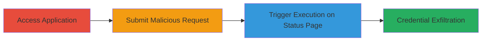

---
tags:
  - xss
  - stored-xss
  - blind-xss
  - credential-theft
  - web
type: attack_chain
tools: []
tactics:
  - '[[Execution]]'
verified: false
platforms:
  - Web
submitted: true
complexity: medium
created_at: '2023-10-01T00:00:00Z'
procedures:
  - '[[procedures/Access-and-Authenticate-to-DoD-Application]]'
  - '[[procedures/Inject-Stored-XSS-Payload-in-Request]]'
  - '[[procedures/Trigger-XSS-on-Request-Status-Page]]'
step_count: 6
techniques:
  - '[[JavaScript]]'
updated_at: '2025-12-14T03:16:02.456Z'
description: >-
  A multi-step attack exploiting a blind stored XSS vulnerability in a U.S.
  Department of Defense web application to steal administrator credentials via
  session hijacking.
skill_level: intermediate
impact_level: high
id: a9289ecf-3389-4e75-b3ce-a71161b2513e
validated: true
mitre_tactics:
  - '[[Execution]]'
mitre_techniques:
  - '[[JavaScript]]'
---
# Blind Stored XSS in DoD Request Description for Admin Credential Theft

Multi-stage attack chain demonstrating a complete workflow for exploiting a blind stored XSS vulnerability in a U.S. Department of Defense application to potentially steal administrator session credentials.

## Chain Metrics Dashboard

| Metric | Value |
|--------|-------|
| Chain Status | Unverified |
| Total Steps | 6 |
| Execution Time | ~5 minutes |
| Skill Level | Intermediate |
| Complexity | Medium |
| Impact Level | High |

## Attack Flow Visualization

## Prerequisites & Requirements

### Required Tools

- Web browser (e.g., Chrome or Firefox with developer tools)

### Target Environment

- Web application hosted at https://██████████ (DoD request submission system)
- Required services/ports: HTTPS (443)
- Network access requirements: Internet access to the target DoD domain

### Initial Access Requirements

- No prior credentials needed; registration is open
- Attacker must have a valid email for receiving exfiltrated data
- Basic knowledge of JavaScript for crafting payloads

## Detailed Attack Procedures

### Step 1: Register or Login to the Application
procedure: [[procedures/Access-and-Authenticate-to-DoD-Application]]

**Objective**: Gain authenticated access to the request submission functionality.

**Instructions**: Open a web browser and navigate to the application's login or registration page. Complete the registration process if needed, or log in with existing credentials.

**Expected Output**: Successful login, redirect to the dashboard or main menu.

**Success Indicators**:
- User account created or session established
- Access to the request submission section granted

### Step 2: Navigate to the Request Submission Page
procedure: [[procedures/Access-and-Authenticate-to-DoD-Application]]

**Objective**: Reach the form where the vulnerable description field is located.

**Instructions**: From the authenticated dashboard, locate and click on the link or menu option to create a new request, leading to the submission form at https://███.

**Expected Output**: Request form loads with fields including the description textarea.

**Success Indicators**:
- Form page accessible without errors
- Description field visible and editable

### Step 3: Craft and Enter XSS Payload in the Description Field
procedure: [[procedures/Inject-Stored-XSS-Payload-in-Request]]

**Objective**: Insert a malicious JavaScript payload into the unsanitized description field to enable stored XSS.

**Instructions**: In the description field, enter a payload such as: ``. This payload captures the viewer's cookies (including admin sessions) and sends them to the attacker's controlled server for logging/email notification.

**Expected Output**: Payload entered without immediate errors or sanitization visible.

**Success Indicators**:
- Payload text appears in the field as entered
- No client-side validation blocks the input

### Step 4: Submit the Request
procedure: [[procedures/Inject-Stored-XSS-Payload-in-Request]]

**Objective**: Store the malicious payload in the backend database for later retrieval.

**Instructions**: Fill any required fields minimally and click the submit button to send the form data to the server.

**Expected Output**: Confirmation message or redirect indicating successful submission.

**Success Indicators**:
- Request ID or confirmation displayed
- No server-side errors on submission

### Step 5: Navigate to the Request Status Page
procedure: [[procedures/Trigger-XSS-on-Request-Status-Page]]

**Objective**: Access the page where the stored description is rendered, triggering the XSS for an admin viewer.

**Instructions**: After submission, go to the status or review page at https://█████████ and select the newly created request to view its details.

**Expected Output**: Request details load, including the description field.

**Success Indicators**:
- Status page accessible
- Description content displays (payload not visibly altered)

### Step 6: Observe Payload Execution
procedure: [[procedures/Trigger-XSS-on-Request-Status-Page]]

**Objective**: Confirm the XSS executes when an admin views the page, exfiltrating credentials.

**Instructions**: As the attacker, you may not see execution immediately; monitor your logging server. When an admin reviews the request, the payload runs in their browser context, sending session cookies to your endpoint.

**Expected Output**: Network request to attacker's server with admin cookies received.

**Success Indicators**:
- HTTP request logged on attacker's server
- Admin session data (e.g., cookies) captured for potential hijacking

## Attack Chain Summary

### Key Achievements

1. Successful injection and storage of XSS payload without detection
2. Demonstration of blind execution when admins access the status page
3. Potential for credential theft enabling further unauthorized access

## Technique & Tactic Coverage

### MITRE ATT&CK Techniques

- [[JavaScript]]

### MITRE ATT&CK Tactics

- [[Execution]]

---
*Last updated: 2023-10-01T00:00:00Z*
