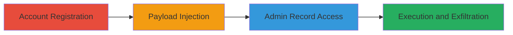

---
tags:
  - xss
  - stored-xss
  - blind-xss
  - web-vulnerability
  - session-theft
type: attack_chain
tools:
  - '[[tools/XSS-Hunter]]'
tactics:
  - '[[Initial Access]]'
  - '[[Execution]]'
  - '[[Collection]]'
verified: false
platforms:
  - Web
submitted: true
complexity: medium
created_at: '2023-10-01T00:00:00Z'
procedures:
  - '[[procedures/Create-Temporary-Account-on-Informatica-Registration]]'
  - '[[procedures/Inject-Blind-XSS-Payload-in-Company-Field]]'
  - '[[procedures/Wait-for-Admin-to-Access-User-Record]]'
  - '[[procedures/Monitor-XSS-Execution-with-XSS-Hunter]]'
step_count: 4
techniques:
  - '[[Exploit Public-Facing Application]]'
  - '[[JavaScript]]'
updated_at: '2025-12-14T03:46:38.188Z'
description: >-
  A multi-stage attack exploiting improper input sanitization in the Informatica
  account registration form to inject a blind stored XSS payload, leading to
  execution in the admin context for session theft and data exfiltration.
skill_level: intermediate
impact_level: high
id: b501fdc0-fdc1-4ce3-85cc-5c5db508f9ea
validated: true
mitre_tactics:
  - '[[Initial Access]]'
  - '[[Execution]]'
  - '[[Collection]]'
mitre_techniques:
  - '[[Exploit Public-Facing Application]]'
  - '[[JavaScript]]'
---
# Blind Stored XSS in Informatica Registration for Admin Session Theft

Multi-stage attack chain demonstrating a complete workflow for exploiting a stored XSS vulnerability in the Informatica account registration form. The attack involves creating an account with a malicious payload in the Company field, which persists in the backend and executes JavaScript when an administrator views the user record in the admin panel. This allows theft of admin session cookies, IP logging, malware delivery, and leakage of sensitive user data like names and emails.

## Chain Metrics Dashboard

| Metric | Value |
|--------|-------|
| Chain Status | Unverified |
| Total Steps | 4 |
| Execution Time | ~5-30 minutes (plus wait for admin action) |
| Skill Level | Intermediate |
| Complexity | Medium |
| Impact Level | High |

## Attack Flow Visualization

## Prerequisites & Requirements

### Required Tools

- [[tools/XSS-Hunter]]

### Target Environment

- Web platform (Informatica Cloud account registration at https://accounts.informatica.com/registration.html)
- ASP.NET-based application
- No specific ports or services beyond standard HTTPS (443)

### Initial Access Requirements

- Public internet access to the registration page
- No credentials required for registration
- Account on XSS Hunter for payload monitoring

## Detailed Attack Procedures

### Step 1: Create Temporary Account
procedure: [[procedures/Create-Temporary-Account-on-Informatica-Registration]]

**Objective**: Gain a foothold by registering a new user account to store the malicious payload.

**Instructions**: Open a web browser and navigate to the registration page. Fill in required fields with arbitrary but valid data (e.g., fake name, email). Submit the form to create the account.

**Expected Output**: Confirmation of account creation and access to the new user profile.

**Success Indicators**:
- Account successfully registered
- User ID generated (e.g., visible in profile or logs)

### Step 2: Inject Blind XSS Payload
procedure: [[procedures/Inject-Blind-XSS-Payload-in-Company-Field]]

**Objective**: Embed a dormant JavaScript payload in the Company field that will execute in the admin's browser context.

**Instructions**: During registration or profile update, enter the payload in the Company input field and submit.

**Expected Output**: Payload stored without immediate execution; no errors on form submission.

**Success Indicators**:
- Form submits successfully
- Payload persists in the backend user record

### Step 3: Wait for Admin Access
procedure: [[procedures/Wait-for-Admin-to-Access-User-Record]]

**Objective**: Allow time for an administrator to view the compromised user record, triggering payload execution.

**Instructions**: No active actions needed; monitor passively. The payload activates when an admin navigates to the user record in the admin panel.

**Expected Output**: Payload fires silently in admin's browser, reporting to attacker's endpoint.

**Success Indicators**:
- Admin interaction detected via monitoring tool
- No direct confirmation; relies on step 4

### Step 4: Monitor Execution
procedure: [[procedures/Monitor-XSS-Execution-with-XSS-Hunter]]

**Objective**: Capture the results of payload execution, including stolen cookies, IP, and leaked data.

**Instructions**: Log into XSS Hunter dashboard to view reports from triggered payloads.

**Expected Output**: Report with admin's IP, session cookies, user data leaks.

**Success Indicators**:
- Execution report received
- Sensitive data (e.g., cookies, emails) captured

## Attack Chain Summary

### Key Achievements

1. Successful injection of persistent XSS payload via public registration form
2. Execution in privileged admin context for session hijacking
3. Exfiltration of admin credentials and customer data

## Technique & Tactic Coverage

### MITRE ATT&CK Techniques

- [[Exploit Public-Facing Application]]
- [[JavaScript]]

### MITRE ATT&CK Tactics

- [[Initial Access]]
- [[Execution]]
- [[Collection]]

---
*Last updated: 2023-10-01T00:00:00Z*
