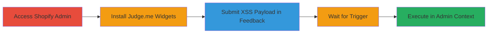

---
tags:
  - xss
  - blind-xss
  - stored-xss
  - shopify
  - admin-hijack
type: attack_chain
tools:
  - '[[tools/xsshunter]]'
tactics:
  - '[[Execution]]'
  - '[[Collection]]'
verified: false
platforms:
  - Web
  - Shopify
submitted: true
complexity: medium
created_at: '2023-10-01T00:00:00Z'
procedures:
  - '[[procedures/Exploiting-Blind-Stored-XSS-in-Judge-me-Feedback-Form]]'
step_count: 5
techniques:
  - '[[JavaScript]]'
  - '[[Archive via Custom Method]]'
updated_at: '2025-12-13T23:52:49.532Z'
description: >-
  A multi-step attack exploiting a Blind Stored XSS vulnerability in the
  Judge.me Shopify app's feedback form to execute JavaScript in the admin
  context, enabling session hijacking and data access.
skill_level: intermediate
impact_level: high
id: 090e9ddf-f41a-405a-a1d7-6715cd17f82d
validated: true
mitre_tactics:
  - '[[Execution]]'
  - '[[Collection]]'
mitre_techniques:
  - '[[JavaScript]]'
  - '[[Archive via Custom Method]]'
---
# Blind Stored XSS in Judge.me Feedback Form Leading to Admin Cookie Theft

Multi-stage attack chain demonstrating a complete attack workflow exploiting a Blind Stored XSS in the Judge.me Shopify app.

## Chain Metrics Dashboard

| Metric | Value |
|--------|-------|
| Chain Status | Unverified |
| Total Steps | 5 |
| Execution Time | ~30 minutes |
| Skill Level | Intermediate |
| Complexity | Medium |
| Impact Level | High |

## Attack Flow Visualization

## Prerequisites & Requirements

### Required Tools

- [[tools/xsshunter]]

### Target Environment

- Shopify store with admin access
- Judge.me app installed or accessible
- Network access to Shopify admin panel

### Initial Access Requirements

- Valid Shopify admin credentials for a test store
- No prior Judge.me installation required

## Detailed Attack Procedures

### Step 1: Access Shopify Admin Panel
procedure: [[procedures/Exploiting-Blind-Stored-XSS-in-Judge-me-Feedback-Form]]

**Objective**: Gain entry to the target Shopify store's admin interface to begin the installation process.

**Instructions**: Open a web browser and navigate to the Shopify admin URL for the test store. Enter the provided test credentials to log in.

**Expected Output**: Successful login to the admin dashboard at https://odo-tester.myshopify.com/admin/.

**Success Indicators**:
- Admin dashboard loads without errors
- User is authenticated as store admin

### Step 2: Navigate to Judge.me App
procedure: [[procedures/Exploiting-Blind-Stored-XSS-in-Judge-me-Feedback-Form]]

**Objective**: Locate and access the Judge.me Product Reviews app within the Shopify ecosystem.

**Instructions**: From the left sidebar in the Shopify admin, click on the "Apps" tab. Then, select "Judge.me Product Reviews" from the list of installed or available apps.

**Expected Output**: The Judge.me app interface opens within the Shopify admin.

**Success Indicators**:
- Apps tab accessible
- Judge.me app selected and loaded

### Step 3: Initiate Widget Installation
procedure: [[procedures/Exploiting-Blind-Stored-XSS-in-Judge-me-Feedback-Form]]

**Objective**: Start the widget installation process to reach the feedback form stage.

**Instructions**: Within the Judge.me app, click "Add Widgets". Then, select "Start Installation" and proceed through the guided setup prompts until completion.

**Expected Output**: Widgets are installed on the store, prompting a satisfaction survey.

**Success Indicators**:
- Installation completes successfully
- Post-installation feedback prompt appears

### Step 4: Submit Blind XSS Payload in Feedback Form
procedure: [[procedures/Exploiting-Blind-Stored-XSS-in-Judge-me-Feedback-Form]]

**Objective**: Inject a malicious JavaScript payload into the feedback mechanism to store it for later execution.

**Instructions**: When prompted with "Are you happy with how everything looks?", select "No, please remove all widgets". This opens the feedback form. In the feedback field, submit a blind XSS payload generated using [[tools/xsshunter]], such as ``. Complete and submit the form.

**Expected Output**: Feedback submitted, widgets removed, no immediate alert.

**Success Indicators**:
- Form submission succeeds
- No validation errors on payload

### Step 5: Wait for Payload Execution
procedure: [[procedures/Exploiting-Blind-Stored-XSS-in-Judge-me-Feedback-Form]]

**Objective**: Monitor for the stored payload to execute in the admin context, confirming the vulnerability.

**Instructions**: Wait approximately 20-30 minutes. Access the Judge.me admin panel at https://judge.me/admin/, which uses HTTP Basic Authentication. The payload should trigger, executing JavaScript and notifying via the xsshunter callback.

**Expected Output**: JavaScript execution in the browser console or xsshunter alert with captured data like admin cookies.

**Success Indicators**:
- Alert from xsshunter tool
- Potential theft of admin session cookies
- Access to sensitive admin pages

## Attack Chain Summary

### Key Achievements

1. Successful injection of blind stored XSS payload during app interaction
2. Delayed execution in a privileged admin context
3. Potential for session hijacking and data exfiltration from Judge.me admin

## Technique & Tactic Coverage

### MITRE ATT&CK Techniques

- [[JavaScript]]
- [[Archive via Custom Method]]

### MITRE ATT&CK Tactics

- [[Execution]]
- [[Collection]]

---
*Last updated: 2023-10-01T00:00:00Z*
