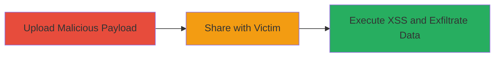

# Blind Stored XSS in Nextcloud iOS App WebView for Victim Data Exfiltration

Multi-stage attack chain demonstrating a complete attack workflow exploiting unsanitized HTML rendering in the Nextcloud iOS App.

## Chain Metrics Dashboard

| Metric | Value |
|--------|-------|
| Chain Status | Unverified |
| Total Steps | 3 |
| Execution Time | ~5 minutes |
| Skill Level | Intermediate |
| Complexity | Medium |
| Impact Level | High |

## Attack Flow Visualization

## Prerequisites & Requirements

### Required Tools

- None (relies on Nextcloud web interface and iOS app)

### Target Environment

- Nextcloud server with file upload and sharing enabled
- Nextcloud iOS App installed on victim's device (version vulnerable to unsanitized WebView)
- Attacker access to Nextcloud account for uploads and sharing
- Attacker-controlled server to receive exfiltrated data

### Initial Access Requirements

- Valid Nextcloud user credentials for uploading and sharing
- Network access to Nextcloud instance
- No prior victim access needed; social engineering for file opening

## Detailed Attack Procedures

### Step 1: Upload Malicious HTML
procedure: [[procedures/Upload-Malicious-HTML-XSS-Payload-to-Nextcloud]]

**Objective**: Prepare and upload an HTML file containing a blind XSS payload to the Nextcloud server.

**Instructions**: Create an HTML file with JavaScript that beacons victim data (e.g., IP, location, OS) to your server upon execution. Upload it via the Nextcloud web interface.

**Expected Output**: File successfully uploaded and visible in Nextcloud file list.

**Success Indicators**:
- File upload confirmation in Nextcloud
- Payload file accessible in shared storage

### Step 2: Share the File with Victim
procedure: [[procedures/Share-Malicious-HTML-File-with-Victim-via-Nextcloud]]

**Objective**: Distribute the malicious file to the target victim using Nextcloud's sharing features.

**Instructions**: Use Nextcloud's share link or direct attachment to send the HTML file to the victim, prompting them to open it in the iOS app.

**Expected Output**: Share link generated and sent to victim.

**Success Indicators**:
- Victim receives share notification
- Link or file accessible via iOS app

### Step 3: Wait for Victim Interaction and Exfiltration
procedure: [[procedures/Trigger-Blind-Stored-XSS-in-Nextcloud-iOS-App-WebView]]

**Objective**: Victim opens the file, triggering XSS execution and data exfiltration.

**Instructions**: Monitor your callback server for incoming requests from the victim's device once they open the file in the Nextcloud iOS App.

**Expected Output**: Callback data received on attacker's server, including victim IP, geolocation, and OS details.

**Success Indicators**:
- HTTP request from victim's IP to callback endpoint
- Extracted data logged (e.g., user agent indicating iOS)

## Attack Chain Summary

### Key Achievements

1. Successful upload of unsanitized HTML payload to Nextcloud
2. Delivery of payload to victim via sharing
3. Execution of blind XSS in iOS WebView for data theft

## Technique & Tactic Coverage

### MITRE ATT&CK Techniques

- [[JavaScript]]

### MITRE ATT&CK Tactics

- [[Execution]]
- [[Collection]]

---
*Last updated: 2023-10-01T00:00:00Z*
