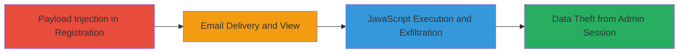

# Blind Stored XSS in Rocket.Chat Registration Email Leading to Admin DOM Exfiltration

Multi-stage attack chain demonstrating a complete blind stored XSS workflow in Rocket.Chat's user registration system, leading to arbitrary JavaScript execution in the admin's Android client and potential session hijacking.

## Chain Metrics Dashboard

| Metric | Value |
|--------|-------|
| Chain Status | Unverified |
| Total Steps | 3 |
| Execution Time | ~5 minutes |
| Skill Level | Intermediate |
| Complexity | Medium |
| Impact Level | High |

## Attack Flow Visualization



## Prerequisites & Requirements

### Required Tools

- [[tools/xss-ht]]

### Target Environment

- Rocket.Chat instance with admin email approval enabled for user registrations
- Access to user registration form (public or authenticated)
- Admin using Rocket.Chat Android client for email viewing
- Network access to external domains like xss.ht for payload hosting

### Initial Access Requirements

- No prior credentials needed for injection (public registration)
- Attacker must control an external domain for callback/exfiltration
- Admin must interact with the email in the vulnerable client

## Detailed Attack Procedures

### Step 1: Payload Injection
procedure: [[procedures/Inject-XSS-Payload-in-Rocket-Chat-Registration-Reason]]

**Objective**: Inject a blind XSS payload into the unsanitized reason field during user registration to store it for later reflection in the admin email.

**Instructions**: During registration, submit the malicious payload in the reason field. The payload uses an img tag with base64-encoded JavaScript in the id attribute, triggered on error to append external scripts.

```html
"></b>
```

**Expected Output**: Registration request accepted; payload stored in backend for email generation.

**Success Indicators**:
- Registration completes without error
- No immediate alert or sanitization visible

### Step 2: Email Trigger
procedure: [[procedures/Trigger-XSS-via-Admin-Email-View-in-Android-Client]]

**Objective**: Wait for the admin to receive and open the approval email, where the payload reflects unsanitized in the HTML body, executing in the Android WebView.

**Instructions**: No direct action needed; monitor external callback server (e.g., xss.ht) for execution confirmation. The email renders the reason as: `<p>Reason: <b>"&gt;</b></p>`.

**Expected Output**: Payload triggers onerror in WebView (email:// protocol), decoding and evaluating the base64 JS.

**Success Indicators**:
- Callback received on attacker's server indicating script load
- No server-side errors in Rocket.Chat logs

### Step 3: Exfiltration Execution
procedure: [[procedures/Execute-XSS-to-Exfiltrate-Admin-DOM-and-Session-Data]]

**Objective**: Once executed, the JS appends scripts from external host, captures the email view DOM (including meta, styles, content), and exfiltrates to attacker's server for session theft.

**Instructions**: The decoded JS creates and appends `<script>` tags from https://2973956338.xss.ht, then uses hidden iframes to scrape and send DOM data via fetch or img src callbacks.

**Expected Output**: Attacker receives exfiltrated data including admin session tokens, viewport details, and email contents.

**Success Indicators**:
- Data packets arrive at xss.ht endpoint
- Potential follow-on access to admin account

## Attack Chain Summary

### Key Achievements

1. Successful blind injection without direct feedback
2. Client-side execution in privileged admin context
3. DOM and session data theft enabling account takeover

## Technique & Tactic Coverage

### MITRE ATT&CK Techniques

- [[JavaScript]]
- [[Archive via Custom Method]]

### MITRE ATT&CK Tactics

- [[Execution]]
- [[Collection]]

---
*Last updated: 2023-10-01T00:00:00Z*
