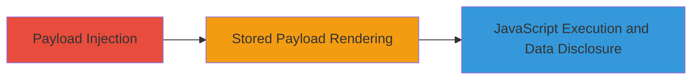

---
tags:
  - xss
  - stored-xss
  - blind-xss
  - parquet
  - shopify
  - gcp
type: attack_chain
tools: []
tactics:
  - '[[Execution]]'
  - '[[Collection]]'
commands: []
platforms:
  - Web
  - GCP
complexity: medium
procedures:
  - '[[procedures/Inject-Blind-Stored-XSS-Payload-into-Shopify-System]]'
  - '[[procedures/Trigger-XSS-Execution-in-Parquet-Viewer]]'
step_count: 2
techniques:
  - '[[JavaScript]]'
description: >-
  A blind stored XSS vulnerability in Shopify's internal Parquet Viewer tool
  allows injection of JavaScript payloads that execute when an employee views a
  malicious Parquet file, potentially disclosing limited internal data.
skill_level: intermediate
impact_level: low
id: 80f5b505-7cff-4e7e-90ab-c1c901e7258d
created_at: '2025-12-13T23:55:06.119Z'
updated_at: '2025-12-13T23:55:06.119Z'
verified: false
validated: true
submitted: true
mitre_tactics:
  - '[[Execution]]'
  - '[[Collection]]'
mitre_techniques:
  - '[[JavaScript]]'
---
# Blind Stored XSS in Shopify Internal Parquet Viewer for Employee Data Disclosure

## Overview

This attack chain exploits a blind stored cross-site scripting (XSS) vulnerability in Shopify's internal Parquet Viewer tool. The attacker submits a JavaScript payload through an unknown entry point in Shopify's system, where it is stored and later rendered when an employee uses the Parquet Viewer to open a specific Parquet file from Google Cloud Storage. The payload executes in the context of the employee's local browser, potentially disclosing a limited subset of internal data, such as approximately 20 sample rows from a database table. The impact is confined to the internal tool, with no broader system access or privilege escalation.

## Chain Metrics Dashboard

| Metric | Value |
|--------|-------|
| Chain Status | Unverified |
| Total Steps | 2 |
| Execution Time | ~1-24 hours (dependent on employee viewing the file) |
| Skill Level | Intermediate |
| Complexity | Medium |
| Impact Level | Low |

## Attack Flow Visualization

## Prerequisites & Requirements

### Required Tools

- None (relies on standard web submission methods)

### Target Environment

- Shopify internal systems with Parquet Viewer tool
- Access to submit data via user input fields
- Google Cloud Storage (GCS) integration for Parquet files

### Initial Access Requirements

- Valid user account or public submission point in Shopify's system
- No special credentials beyond basic access to the entry point
- Network access to Shopify's web interfaces

## Detailed Attack Procedures

### Step 1: Payload Injection
procedure: [[procedures/Inject-Blind-Stored-XSS-Payload-into-Shopify-System]]

**Objective**: Submit a blind XSS payload through an entry point in Shopify's system to store malicious JavaScript that will be processed by the internal Parquet Viewer.

**Instructions**: Identify and use an unknown user input field in Shopify's system (likely a form or API endpoint that handles data storage leading to Parquet file generation). Craft a payload such as `` or a more sophisticated one to exfiltrate data, e.g., ``. Submit the payload via the entry point. The payload is stored and eventually incorporated into a Parquet file in GCS.

**Expected Output**: No immediate feedback (blind XSS); confirmation via out-of-band channel if exfiltration is used.

**Success Indicators**:
- Payload submission accepted without error
- Monitoring of attacker's server for callback if exfiltration payload is triggered

### Step 2: Trigger Execution in Viewer
procedure: [[procedures/Trigger-XSS-Execution-in-Parquet-Viewer]]

**Objective**: Wait for an employee to view the affected Parquet file in the internal tool, causing the stored payload to render and execute JavaScript locally.

**Instructions**: The payload executes automatically when an employee opens the Parquet Viewer on their local machine (e.g., file://localhost/private/var/folders/.../parquet-viewer-6296239398097329598.html) and loads the specific file from GCS (e.g., gs://starscream-adhoc/user/███/shop_dimension/part-00039-4039dc30-6a7a-4108-838d-fb1daec9a216-c000.snappy.parquet). The viewer renders unsanitized data from the Parquet file as HTML, executing the JavaScript. This may display the employee's name and send data to the attacker.

**Expected Output**: JavaScript execution in the employee's browser context, potentially logging ~20 rows of sample data from the shop_dimension table.

**Success Indicators**:
- Attacker receives exfiltrated data via callback
- Alert or network request to attacker's domain

## Attack Chain Summary

### Key Achievements

1. Successful blind payload injection into internal data pipeline
2. JavaScript execution in privileged internal tool context
3. Limited data disclosure without requiring direct access to the viewer

## Technique & Tactic Coverage

### MITRE ATT&CK Techniques

- [[JavaScript]]

### MITRE ATT&CK Tactics

- [[Execution]]
- [[Collection]]

---
*Last updated: 2023-10-01*
