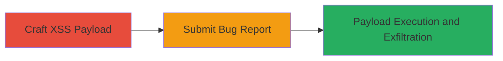

# Blind Stored XSS in Twitter's Internal Jira via Bug Bounty Report for Sensitive Data Exfiltration

Multi-stage attack chain demonstrating exploitation of a blind stored XSS vulnerability in Twitter's internal Jira instance via a bug bounty submission, resulting in the execution of malicious JavaScript and exfiltration of sensitive hacker reports and other internal data.

## Chain Metrics Dashboard

| Metric | Value |
|--------|-------|
| Chain Status | Unverified |
| Total Steps | 3 |
| Execution Time | ~5 minutes |
| Skill Level | Intermediate |
| Complexity | Medium |
| Impact Level | High |

## Attack Flow Visualization

## Prerequisites & Requirements

### Required Tools

- None (relies on standard web submission interfaces)

### Target Environment

- Web platform with Jira integration
- Bug bounty program via HackerOne
- Internal Jira instance handling user-supplied content

### Initial Access Requirements

- Access to Twitter's bug bounty program on HackerOne
- No prior credentials needed; public submission
- Knowledge of XSS payloads

## Detailed Attack Procedures

### Step 1: Craft XSS Payload
procedure: [[procedures/Craft-and-Submit-Blind-XSS-Payload-in-Bug-Report]]

**Objective**: Create a malicious bug report containing a blind stored XSS payload that will be stored without immediate execution.

**Instructions**: Develop a proof-of-concept XSS payload, such as `` or a more advanced beacon for exfiltration, and embed it in the bug report description. Ensure the payload is obfuscated if necessary to bypass basic filters.

**Expected Output**: A formatted bug report ready for submission, with the payload integrated into fields like comments or attachments.

**Success Indicators**:
- Payload crafted without syntax errors
- Report description includes the malicious code seamlessly

### Step 2: Submit Bug Report
procedure: [[procedures/Integrate-Payload-into-Internal-Jira-Instance]]

**Objective**: Submit the crafted report to the bug bounty program, triggering integration into the internal Jira system.

**Instructions**: Log into HackerOne, select the X / xAI program, and submit the bug report with the XSS payload in the relevant fields. The submission process will forward the content to Twitter's internal Jira for review.

**Expected Output**: Confirmation of report submission on HackerOne, with report ID generated.

**Success Indicators**:
- Report accepted without immediate rejection
- No errors in submission process

### Step 3: Payload Execution and Exfiltration
procedure: [[procedures/Execute-XSS-and-Exfiltrate-Sensitive-Data]]

**Objective**: Wait for an employee to view the report in Jira, triggering the XSS payload to execute and exfiltrate sensitive data.

**Instructions**: Monitor for execution (e.g., via a callback to an attacker-controlled server). Upon viewing, the payload runs JavaScript to scrape Jira page content, including hacker reports, and sends it to the attacker's endpoint.

**Expected Output**: Exfiltrated data received on attacker's server, such as JSON payloads containing internal reports.

**Success Indicators**:
- Callback or data received confirming execution
- Sensitive information like hacker reports captured

## Attack Chain Summary

### Key Achievements

1. Successful submission of blind XSS payload via legitimate bug bounty channel
2. Storage and execution of payload in internal Jira without direct access
3. Exfiltration of sensitive internal data, demonstrating high impact on confidentiality

## Technique & Tactic Coverage

### MITRE ATT&CK Techniques

- [[JavaScript]]

### MITRE ATT&CK Tactics

- [[Initial Access]]
- [[Execution]]
- [[Collection]]

---
*Last updated: 2024-10-01T00:00:00Z*
