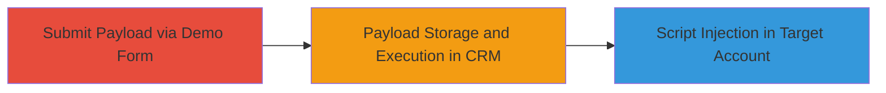

# Blind Stored XSS in Upserve Demo Form Leading to Script Execution in CRM

Multi-stage attack chain demonstrating exploitation of a blind stored XSS vulnerability in Upserve's 'get a demo' form, which feeds into a third-party marketing tool integrated with their CRM system. The payload is submitted via the form, stored unsanitized, and executes when viewed in a target company's CRM account, potentially enabling script injection, data theft, or further compromise.

## Chain Metrics Dashboard

| Metric | Value |
|--------|-------|
| Chain Status | Unverified |
| Total Steps | 2 |
| Execution Time | ~5 minutes |
| Skill Level | Intermediate |
| Complexity | Medium |
| Impact Level | High |

## Attack Flow Visualization

## Prerequisites & Requirements

### Required Tools

- Web browser or [[tools/Burp-Suite]] for form interception and payload testing

### Target Environment

- Web platform with Upserve CRM
- Third-party marketing tool integration (e.g., similar to HubSpot or Marketo)
- Access to public 'get a demo' form endpoint

### Initial Access Requirements

- No credentials required; public-facing form
- Internet access to submit form
- Knowledge of target company's CRM usage with Upserve

## Detailed Attack Procedures

### Step 1: Payload Submission
procedure: [[procedures/Submit-Malicious-Payload-to-Upserve-Demo-Form]]

**Objective**: Inject a malicious JavaScript payload into the unsanitized demo request form to store it in the backend CRM system.

**Instructions**: Navigate to the Upserve 'get a demo' form (typically at a URL like https://upserve.com/get-a-demo). Fill in the form fields with benign data but inject the payload into a text field such as company name or message. Use a blind XSS payload that beacons back to a controlled server for confirmation, e.g., ``.

Submit the form using a standard POST request or via browser.

**Expected Output**: Form submission success message; no immediate alert since it's blind stored XSS.

**Success Indicators**:
- Form accepted without validation errors
- Later confirmation via beacon server logs when payload executes

### Step 2: Trigger Execution
procedure: [[procedures/Trigger-XSS-Execution-in-Third-Party-Marketing-Tool]]

**Objective**: Cause the stored payload to execute in the context of a target company's CRM account by accessing the integrated third-party marketing tool.

**Instructions**: The payload executes automatically when Upserve staff or the target company views the demo request in their CRM dashboard via the third-party tool. Monitor your controlled server for incoming requests from the execution context, which may include cookies or DOM data from the company's environment.

If needed, social engineer a Upserve contact to view the request or wait for routine processing.

**Expected Output**: Server logs showing beacon hit with potential exfiltrated data like session tokens.

**Success Indicators**:
- Beacon request received from target domain/IP
- JavaScript execution confirmed in CRM context

## Attack Chain Summary

### Key Achievements

1. Successful payload injection into public form without detection
2. Remote code execution in target company's CRM environment
3. Potential for data exfiltration or session hijacking via XSS

## Technique & Tactic Coverage

### MITRE ATT&CK Techniques

- [[Exploit Public-Facing Application]] Exploit Public-Facing Application
- [[JavaScript]] JavaScript

### MITRE ATT&CK Tactics

- [[Initial Access]] Initial Access
- [[Execution]] Execution

---
*Last updated: 2023-10-01T00:00:00Z*
