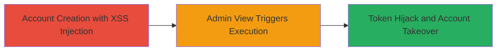

# Blind Stored XSS in User Name for Admin Data Theft and Account Takeover

Multi-stage attack chain demonstrating a complete attack workflow exploiting a blind stored XSS in the user name field during account registration, resulting in admin-side script execution, sensitive data theft, and account takeover via CSRF token hijacking.

## Chain Metrics Dashboard

| Metric | Value |
|--------|-------|
| Chain Status | Unverified |
| Total Steps | 3 |
| Execution Time | ~5 minutes |
| Skill Level | Intermediate |
| Complexity | Medium |
| Impact Level | High |

## Attack Flow Visualization

## Prerequisites & Requirements

### Required Tools

- Web browser (e.g., Chrome with developer tools)
- Optional: Proxy tool like Burp Suite for payload testing

### Target Environment

- Web platform
- Services: Detrack (app.detrack.com), Grab Parcel (parcel.grab.com)
- No specific ports required; standard HTTPS (443)

### Initial Access Requirements

- No prior credentials needed for attacker
- Attacker must be able to register a new account on parcel.grab.com
- Admin access to app.detrack.com for triggering (social engineering or waiting for admin view)

## Detailed Attack Procedures

### Step 1: Account Creation with XSS Injection
procedure: [[procedures/Inject-XSS-Payload-in-Account-Creation]]

**Objective**: Inject a malicious JavaScript payload into the user name field during registration, storing it blindly for later execution.

**Instructions**: Navigate to https://parcel.grab.com/ and initiate account creation. In the name field, inject the payload `` (replace x.com with your controlled domain hosting the script). Complete registration with valid details for other fields.

**Expected Output**: Account created successfully; payload stored in backend without immediate execution.

**Success Indicators**:
- Registration completes without errors
- No visible payload reflection on registration page (blind nature)

### Step 2: Trigger XSS Execution via Admin View
procedure: [[procedures/Trigger-XSS-Execution-via-Admin-View]]

**Objective**: Cause the stored payload to execute in the admin's browser context when viewing the user list.

**Instructions**: As an admin (or lure an admin), navigate to https://app.detrack.com/a/. The user list will display the injected name, rendering the script and executing it in the admin's session.

**Expected Output**: Script from the external source loads and runs, potentially alerting or exfiltrating data.

**Success Indicators**:
- Admin browser executes the script (e.g., network request to attacker's server)
- Console logs or alerts confirm execution

### Step 3: Hijack CSRF Token for Account Takeover
procedure: [[procedures/Hijack-CSRF-Token-for-Account-Takeover]]

**Objective**: Use the executed XSS to steal the CSRF authenticity token and perform unauthorized actions like adding a new admin.

**Instructions**: The XSS payload should extract the authenticity_token from the page (e.g., via document.querySelector or parsing). Send it to attacker's server, then use it to forge requests (e.g., POST to add admin endpoint) from the admin's context.

**Expected Output**: Successful addition of attacker-controlled admin, granting account takeover.

**Success Indicators**:
- Token exfiltrated to attacker's server
- Unauthorized admin added to the account

## Attack Chain Summary

### Key Achievements

1. Successful blind storage of XSS payload during user registration
2. Execution of script in high-privilege admin context, stealing sensitive user data (names, emails, organizations, IDs, mobiles)
3. CSRF token hijacking enabling account takeover

## Technique & Tactic Coverage

### MITRE ATT&CK Techniques

- [[JavaScript]]

### MITRE ATT&CK Tactics

- [[Execution]]
- [[Collection]]

---
*Last updated: 2023-10-01T00:00:00Z*
