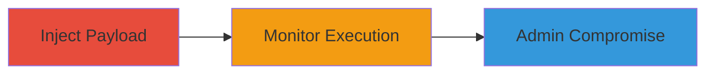

---
tags:
  - xss
  - stored-xss
  - blind-xss
  - web-vulnerability
type: attack_chain
tools:
  - '[[tools/XSS-Hunter]]'
tactics:
  - '[[Execution]]'
verified: false
platforms:
  - Web
submitted: true
complexity: medium
created_at: '2023-10-01T00:00:00Z'
procedures:
  - '[[procedures/Inject-Blind-Stored-XSS-Payload-into-Order-Form]]'
  - '[[procedures/Monitor-and-Confirm-XSS-Execution-in-Admin-Dashboard]]'
step_count: 2
techniques:
  - '[[JavaScript]]'
updated_at: '2025-12-13T23:52:49.917Z'
description: >-
  A multi-step attack exploiting a blind stored XSS vulnerability in Zomato's
  order placement form to execute JavaScript in the context of an admin
  dashboard user.
skill_level: intermediate
impact_level: high
id: b209cad0-6102-4ddb-a238-bbcf73e83594
validated: true
mitre_tactics:
  - '[[Execution]]'
mitre_techniques:
  - '[[JavaScript]]'
---
# Blind Stored XSS in Zomato Order Address Field Leading to Admin Compromise

Multi-stage attack chain demonstrating a complete attack workflow exploiting a blind stored XSS vulnerability in Zomato's order placement system.

## Chain Metrics Dashboard

| Metric | Value |
|--------|-------|
| Chain Status | Unverified |
| Total Steps | 2 |
| Execution Time | ~5 minutes |
| Skill Level | Intermediate |
| Complexity | Medium |
| Impact Level | High |

## Attack Flow Visualization

## Prerequisites & Requirements

### Required Tools

- [[tools/XSS-Hunter]]

### Target Environment

- Web platform (Zomato order placement form and admin dashboard)
- Required services/ports: HTTPS (443)
- Network access requirements: Public internet access to Zomato.com

### Initial Access Requirements

- No credentials required for injection (public user account sufficient)
- Network position: External attacker
- Prior access needed: Ability to place an order on Zomato

## Detailed Attack Procedures

### Step 1: Payload Injection
procedure: [[procedures/Inject-Blind-Stored-XSS-Payload-into-Order-Form]]

**Objective**: Inject a malicious JavaScript payload into the order address field to store it server-side without immediate execution.

**Instructions**: Navigate to Zomato's order placement form as a regular user. In the address field, append the XSS payload to a valid address. Use XSS Hunter to generate a unique payload for tracking.

Example payload injection:

Enter in address field: `Valid Address">`

Complete the order placement to store the payload.

**Expected Output**: Order placed successfully, payload stored in backend without visible errors.

**Success Indicators**:
- Order confirmation received
- No immediate alert or block from the application

### Step 2: Trigger and Confirm Execution
procedure: [[procedures/Monitor-and-Confirm-XSS-Execution-in-Admin-Dashboard]]

**Objective**: Wait for a support agent to view the order details in the admin dashboard, triggering the payload execution in their browser context.

**Instructions**: After injection, monitor the XSS Hunter dashboard for execution callbacks. The payload will execute when an authenticated admin or support user accesses the tainted order details.

No direct action needed post-injection; rely on normal business workflows for triggering.

**Expected Output**: Alert or callback in XSS Hunter confirming JavaScript execution, such as an alert(0) or custom report.

**Success Indicators**:
- XSS Hunter reports execution with victim details (e.g., admin session context)
- Potential for further exploitation like session hijacking

## Attack Chain Summary

### Key Achievements

1. Successful storage of XSS payload in user-controlled input without sanitization
2. Blind execution confirmed in privileged admin context
3. Potential for data theft or session hijacking from support agents

## Technique & Tactic Coverage

### MITRE ATT&CK Techniques

- [[JavaScript]]

### MITRE ATT&CK Tactics

- [[Execution]]

---

*Last updated: 2023-10-01T00:00:00Z*
