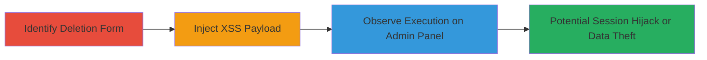

---
tags:
  - xss
  - blind-xss
  - stored-xss
  - web-vulnerability
  - session-hijacking
type: attack_chain
tools: []
tactics:
  - '[[Execution]]'
verified: false
platforms:
  - Web
submitted: true
complexity: medium
procedures:
  - '[[procedures/Identify-Account-Deletion-Form]]'
  - '[[procedures/Inject-XSS-Payload-into-Deletion-Form]]'
  - '[[procedures/Observe-Payload-Execution-on-Admin-Panel]]'
step_count: 3
techniques:
  - '[[JavaScript]]'
description: >-
  Exploitation of a Blind Stored XSS vulnerability in the account deletion form
  on account.acronis.com, resulting in arbitrary JavaScript execution within the
  admin interface on admin.acronis.com.
skill_level: intermediate
impact_level: high
id: 6eb056bd-85c6-4c05-b04f-9bc306aa3c6c
created_at: '2025-12-13T23:52:50.059Z'
updated_at: '2025-12-13T23:52:50.059Z'
validated: true
mitre_tactics:
  - '[[Execution]]'
mitre_techniques:
  - '[[JavaScript]]'
---
# Blind Stored XSS via Account Deletion Form Leading to Admin JavaScript Execution

Multi-stage attack chain demonstrating the exploitation of a Blind Stored XSS vulnerability in the Acronis account management system.

## Chain Metrics Dashboard

| Metric | Value |
|--------|-------|
| Chain Status | Unverified |
| Total Steps | 3 |
| Execution Time | ~5 minutes |
| Skill Level | Intermediate |
| Complexity | Medium |
| Impact Level | High |

## Attack Flow Visualization

## Prerequisites & Requirements

### Required Tools

- Web browser (e.g., Chrome with Developer Tools)
- Burp Suite or similar proxy for payload testing (optional)

### Target Environment

- Web platform
- Access to account.acronis.com (user account required)
- Administrative viewing on admin.acronis.com (for observation)

### Initial Access Requirements

- Valid user credentials for account.acronis.com
- No special network position needed; public-facing web app
- Ability to initiate account deletion process

## Detailed Attack Procedures

### Step 1: Identify Account Deletion Form
procedure: [[procedures/Identify-Account-Deletion-Form]]

**Objective**: Locate and analyze the account deletion form to identify input fields vulnerable to XSS injection.

**Instructions**: Navigate to account.acronis.com and log in with a test account. Access the account settings or profile section, then proceed to the deletion option. Inspect the form using browser developer tools to note input fields, such as reason for deletion or comments, which accept user input without visible sanitization.

**Expected Output**: Form identified with unsanitized input fields ready for payload testing.

**Success Indicators**:
- Form loads successfully
- Input fields accept arbitrary text

### Step 2: Inject XSS Payload into Deletion Form
procedure: [[procedures/Inject-XSS-Payload-into-Deletion-Form]]

**Objective**: Submit a malicious JavaScript payload through the deletion form to store it for later execution in the admin panel.

**Instructions**: In the deletion form's input field (e.g., deletion reason), enter a blind XSS payload such as `` or a more advanced one like ``. Complete the deletion process by submitting the form. The payload is stored in the backend and queued for admin review.

**Expected Output**: Account deletion processed; payload stored invisibly (blind nature means no immediate feedback).

**Success Indicators**:
- Form submission succeeds without errors
- No immediate payload execution (confirms blind/stored behavior)

### Step 3: Observe Payload Execution on Admin Panel
procedure: [[procedures/Observe-Payload-Execution-on-Admin-Panel]]

**Objective**: Confirm the stored payload executes when an administrator views the deletion request on admin.acronis.com.

**Instructions**: If possible, monitor via a controlled admin account or wait for admin interaction. Upon admin viewing the deletion log, the payload triggers, executing JavaScript in the admin's browser context. Observe effects like alert popups or cookie theft via network requests.

**Expected Output**: JavaScript alert or exfiltration request fired in admin session.

**Success Indicators**:
- Payload executes in admin interface
- Potential for session hijacking or data access confirmed

## Attack Chain Summary

### Key Achievements

1. Identified vulnerable input in account deletion workflow
2. Stored malicious payload blindly without detection
3. Achieved code execution in high-privilege admin context, enabling further compromise

## Technique & Tactic Coverage

### MITRE ATT&CK Techniques

- [[JavaScript]]

### MITRE ATT&CK Tactics

- [[Execution]]

---
*Last updated: 2023-10-01*
