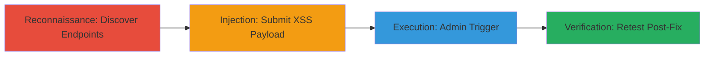

# Blind XSS Exploitation in Review Ratings Endpoint via Admin Portal Reflection

Multi-stage attack chain demonstrating reconnaissance, payload injection, execution, and verification of a blind XSS vulnerability in a web application.

## Chain Metrics Dashboard

| Metric | Value |
|--------|-------|
| Chain Status | Unverified |
| Total Steps | 4 |
| Execution Time | ~30 minutes |
| Skill Level | Intermediate |
| Complexity | Medium |
| Impact Level | High |

## Attack Flow Visualization



## Prerequisites & Requirements

### Required Tools

- [[tools/Wayback-Machine]]
- [[tools/Custom-Blind-XSS-Application]]

### Target Environment

- Web platform
- Accessible public-facing application (e.g., app.pullrequest.com)
- No specific ports required beyond standard HTTPS (443)

### Initial Access Requirements

- Public internet access
- No credentials needed for injection phase
- Attacker-controlled server for blind XSS detection

## Detailed Attack Procedures

### Step 1: Discover Archived Endpoints
procedure: [[procedures/Discover-Archived-Endpoints-with-Wayback-Machine]]

**Objective**: Identify hidden or deprecated endpoints like /reviews/ratings/{uuid} using web archives to expand the attack surface.

**Instructions**: Query the Wayback Machine CDX server using [[commands/wayback-machine-cdx-query]] to retrieve archived URLs:

```bash
http://web.archive.org/cdx/search/cdx?url=app.pullrequest.com/*&output=text&fl=original&collapse=urlkey
```

Review the output for relevant endpoints such as /reviews/ratings/{uuid}.

**Expected Output**: A text list of archived URLs, including discovered endpoints.

**Success Indicators**:
- List of URLs containing /reviews/ratings/{uuid}
- Confirmation of endpoint existence via archive snapshots

### Step 2: Inject Blind XSS Payload
procedure: [[procedures/Inject-Blind-XSS-Payload-into-Review-Form]]

**Objective**: Submit a malicious payload into form fields that will be reflected in the admin portal.

**Instructions**: Navigate to the discovered endpoint, e.g., https://app.pullrequest.com/reviews/ratings/6eaa6b75-b958-4530-ba46-0d00cbe74e0b/false, and inject the payload into fields like Disliked_reviewers, Liked_reviewers, and Reasons:

Payload: `''">'` (base64-encoded for blind detection).

Submit the form without executing [[commands/wayback-machine-cdx-query]] or other tools.

**Expected Output**: Form submission success; no immediate alert, as it's blind XSS.

**Success Indicators**:
- Payload accepted in form fields
- No client-side sanitization errors

### Step 3: Trigger and Detect Execution
procedure: [[procedures/Trigger-and-Detect-Blind-XSS-Execution]]

**Objective**: Wait for an admin to view the injected review, triggering the payload in their browser context.

**Instructions**: Monitor the custom blind XSS server for incoming alerts. The payload executes in the admin portal at https://app.pullrequest.com/admin-portal, reflecting in elements like <div id="feedback-types-content"> without encoding.

Use [[tools/Custom-Blind-XSS-Application]] to log the alert, which sends data to the attacker's server.

**Expected Output**: Alert received on attacker's server, confirming execution (e.g., JavaScript eval of base64 payload).

**Success Indicators**:
- Incoming HTTP request to blind XSS server
- Payload decoded and executed (e.g., alert or data exfil)

### Step 4: Retest Post-Fix
procedure: [[procedures/Retest-Vulnerability-Post-Fix]]

**Objective**: Verify the vulnerability has been remediated after disclosure.

**Instructions**: Use a new endpoint like https://app.pullrequest.com/reviews/ratings/9eedb57b-785a-4e3d-ad47-45626aeaaa30/false and inject the same payload into form fields. Monitor for execution in the admin panel.

**Expected Output**: No alert or execution; payload sanitized or encoded.

**Success Indicators**:
- No incoming alerts to blind XSS server
- Admin view shows encoded payload without triggering

## Attack Chain Summary

### Key Achievements

1. Discovered hidden endpoint via archival reconnaissance
2. Achieved blind XSS execution in high-privilege admin context
3. Demonstrated potential for data exfiltration or session hijacking
4. Verified fix through retesting

## Technique & Tactic Coverage

### MITRE ATT&CK Techniques

- [[Hardware]] Gather Victim Host Information: Websites
- [[Drive-by Compromise]] Drive-by Compromise
- [[JavaScript]] Command and Scripting Interpreter: JavaScript

### MITRE ATT&CK Tactics

- [[Reconnaissance]] Reconnaissance
- [[Initial Access]] Initial Access
- [[Execution]] Execution

---

*Last updated: 2024-01-01T00:00:00Z*
