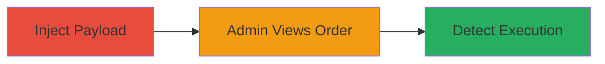

# Blind XSS in Zomato Order Special Instructions for Admin Dashboard Execution

Multi-stage attack chain demonstrating a Blind XSS vulnerability in the Zomato app's order placement process, where a payload injected into the special instructions field executes in the admin dashboard upon order review.

## Chain Metrics Dashboard

| Metric | Value |
|--------|-------|
| Chain Status | Unverified |
| Total Steps | 3 |
| Execution Time | ~30 minutes |
| Skill Level | Intermediate |
| Complexity | Medium |
| Impact Level | High |

## Attack Flow Visualization

## Prerequisites & Requirements

### Required Tools

- [[tools/XSS-Hunter]]

### Target Environment

- Zomato mobile app or web order API endpoint
- Access to place orders (user account required)
- Network access to Zomato services

### Initial Access Requirements

- Valid Zomato user account
- No special privileges needed for injection
- XSS Hunter account for payload hosting

## Detailed Attack Procedures

### Step 1: Payload Injection
procedure: [[procedures/Inject-XSS-Payload-into-Zomato-Order-Special-Instructions]]

**Objective**: Inject a Blind XSS payload into the special instructions field during order placement to target the admin dashboard.

**Instructions**: Use the Zomato app to place an order and enter the XSS payload in the special instructions field. The payload is `'>`, where `{$handle}` is your unique XSS Hunter subdomain.

**Expected Output**: Order placed successfully with payload in special instructions.

**Success Indicators**:
- Order confirmation received
- Payload not sanitized (no error on submission)

### Step 2: Trigger Execution
procedure: [[procedures/Monitor-Admin-View-of-Order-Details]]

**Objective**: Wait for an admin to access the order details in the backend dashboard, triggering the payload.

**Instructions**: After placing the order, monitor the XSS Hunter dashboard for any activity. The payload executes when an admin views the order, loading the script from XSS Hunter.

**Expected Output**: No immediate feedback; execution is blind until callback.

**Success Indicators**:
- Order status updates in app (indicating admin review)
- Potential delay based on order volume

### Step 3: Confirm Detection
procedure: [[procedures/Detect-XSS-Execution-via-XSS-Hunter-Callback]]

**Objective**: Receive and verify the callback from XSS Hunter confirming script execution in the admin context.

**Instructions**: Check the XSS Hunter interface for incoming requests. The callback includes details like user-agent and IP, confirming execution in the admin's browser.

**Expected Output**: Notification or log entry in XSS Hunter showing payload fire.

**Success Indicators**:
- Callback received with admin context indicators (e.g., internal dashboard UA)
- Payload details match injection

## Attack Chain Summary

### Key Achievements

1. Successful injection of Blind XSS payload via user-controlled input
2. Execution in privileged admin context without direct access
3. Detection and verification using external callback service

## Technique & Tactic Coverage

### MITRE ATT&CK Techniques

- [[JavaScript]]

### MITRE ATT&CK Tactics

- [[Execution]]

---
*Last updated: 2023-10-01T00:00:00Z*
