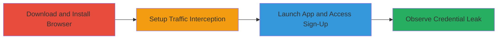

---
tags:
  - information-disclosure
  - referer-leak
  - credential-exposure
  - blockstack
type: attack_chain
tools:
  - '[[tools/Burp-Suite]]'
  - '[[tools/Firefox]]'
tactics:
  - '[[Credential Access]]'
verified: false
platforms:
  - macOS
  - Web
submitted: true
complexity: medium
created_at: '2023-10-01T00:00:00Z'
procedures:
  - '[[procedures/Download-and-Install-Blockstack-Browser]]'
  - '[[procedures/Configure-Burp-Suite-Proxy]]'
  - '[[procedures/Launch-Blockstack-and-Access-Sign-Up]]'
  - '[[procedures/Observe-Password-Leak-in-Referer-Headers]]'
step_count: 4
techniques:
  - '[[Unsecured Credentials]]'
  - '[[Exfiltration Over Alternative Protocol]]'
updated_at: '2025-12-14T17:32:10.209Z'
description: >-
  Demonstrates the leakage of sensitive Core API Password in Blockstack Browser
  for Mac through Referer HTTP headers to third-party sites due to improper URL
  query parameters and missing Referer-Policy.
skill_level: intermediate
impact_level: high
id: fffb289f-9ea0-4a28-90c1-0e2fdb165ef8
validated: true
mitre_tactics:
  - '[[Credential Access]]'
mitre_techniques:
  - '[[Unsecured Credentials]]'
  - '[[Exfiltration Over Alternative Protocol]]'
---
# Blockstack Browser Core API Password Leakage via Referer Header

Multi-stage attack chain demonstrating the information disclosure vulnerability in Blockstack Browser for Mac, where the sensitive Core API Password is leaked to third-party websites via the Referer HTTP header. This occurs because the password is included in URL query parameters without proper Referer-Policy headers, allowing exposure in server logs, analytics, or compromised sites.

## Chain Metrics Dashboard

| Metric | Value |
|--------|-------|
| Chain Status | Unverified |
| Total Steps | 4 |
| Execution Time | ~10 minutes |
| Skill Level | Intermediate |
| Complexity | Medium |
| Impact Level | High |

## Attack Flow Visualization

## Prerequisites & Requirements

### Required Tools

- [[tools/Burp-Suite]]
- [[tools/Firefox]]

### Target Environment

- macOS (tested on 10.14.4)
- Required services/ports: Localhost port 8888 for Blockstack app
- Network access requirements: Internet access for downloads and proxy setup

### Initial Access Requirements

- No credentials required
- Local machine access
- No prior access needed beyond installing software

## Detailed Attack Procedures

### Step 1: Download and Install Blockstack Browser
procedure: [[procedures/Download-and-Install-Blockstack-Browser]]

**Objective**: Obtain and set up the vulnerable Blockstack Browser application on macOS to prepare for traffic analysis.

**Instructions**: Download the DMG file from the official release and install the application.

**Expected Output**: Blockstack Browser installed and ready to launch.

**Success Indicators**:
- DMG file downloaded successfully
- Application installed without errors

### Step 2: Configure Proxy for Traffic Interception
procedure: [[procedures/Configure-Burp-Suite-Proxy]]

**Objective**: Set up Burp Suite to capture all HTTP traffic, including localhost, to monitor internal app communications.

**Instructions**: Configure Burp Suite as the system proxy and ensure no exceptions for localhost to intercept local traffic.

**Expected Output**: Proxy active and intercepting traffic from the browser.

**Success Indicators**:
- System proxy set to Burp Suite
- Localhost traffic visible in Burp

### Step 3: Launch Blockstack and Access Sign-Up Page
procedure: [[procedures/Launch-Blockstack-and-Access-Sign-Up]]

**Objective**: Start the Blockstack application and navigate to the sign-up page to trigger requests containing the sensitive password.

**Instructions**: Launch the app using Firefox configured with the proxy and visit the local sign-up endpoint.

**Expected Output**: Sign-up page loaded, with outbound requests intercepted.

**Success Indicators**:
- App launches successfully
- Sign-up page accessible at http://localhost:8888/sign-up

### Step 4: Observe Password Leak in Referer Headers
procedure: [[procedures/Observe-Password-Leak-in-Referer-Headers]]

**Objective**: Monitor intercepted traffic to identify the Core API Password in Referer headers sent to third-party domains.

**Instructions**: Inspect requests in Burp Suite for headers to domains like appco.imgix.net, api.app.co, and browser-api.blockstack.org.

**Expected Output**: Referer headers containing URLs with the Core API Password query parameter.

**Success Indicators**:
- Requests to third-party sites observed
- Password visible in plaintext in Referer header

## Attack Chain Summary

### Key Achievements

1. Successful installation and launch of Blockstack Browser
2. Interception of localhost traffic without exceptions
3. Identification of password leakage to multiple third-party services
4. Demonstration of high-impact credential exposure contradicting security claims

## Technique & Tactic Coverage

### MITRE ATT&CK Techniques

- [[Unsecured Credentials]] Unprotected Storage of Credentials
- [[Exfiltration Over Alternative Protocol]] Exfiltration Over Alternative Protocol

### MITRE ATT&CK Tactics

- [[Credential Access]] Credential Access

---

*Last updated: 2023-10-01T00:00:00Z*
