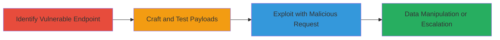

---
tags:
  - sqli
  - blind-sqli
  - boolean-based
  - aspnet
  - web-vulnerability
type: attack_chain
tools: []
tactics:
  - '[[Initial Access]]'
verified: false
platforms:
  - Web
submitted: true
complexity: medium
created_at: '2023-10-01T00:00:00Z'
procedures:
  - '[[procedures/Identify-Vulnerable-Endpoint-and-Parameter]]'
  - '[[procedures/Craft-and-Test-Boolean-Based-SQL-Injection-Payloads]]'
  - '[[procedures/Exploit-SQL-Injection-with-Malicious-POST-Request]]'
step_count: 3
techniques:
  - '[[Exploit Public-Facing Application]]'
updated_at: '2025-12-14T03:46:26.115Z'
description: >-
  A multi-step attack exploiting SQL injection in the sDirID parameter of an
  ASP.NET web application's resource manager endpoint, using boolean-based blind
  techniques to bypass authentication and manipulate database queries.
skill_level: intermediate
impact_level: high
id: 565a98e2-9c25-4926-b1fc-4591f36b5937
validated: true
mitre_tactics:
  - '[[Initial Access]]'
mitre_techniques:
  - '[[Exploit Public-Facing Application]]'
---
# Boolean-Based Blind SQL Injection in ASP.NET Resource Manager sDirID Parameter

Multi-stage attack chain demonstrating a complete SQL injection workflow targeting an ASP.NET web application, specifically the resource manager endpoint vulnerable to blind boolean-based SQLi in the sDirID parameter. This exploit allows attackers to confirm injection points without direct output, potentially leading to data exfiltration, modification, or escalation to OS command execution.

## Chain Metrics Dashboard

| Metric | Value |
|--------|-------|
| Chain Status | Unverified |
| Total Steps | 3 |
| Execution Time | ~5 minutes |
| Skill Level | Intermediate |
| Complexity | Medium |
| Impact Level | High |

## Attack Flow Visualization

## Prerequisites & Requirements

### Required Tools

- Browser developer tools or proxy like Burp Suite for request manipulation
- No specialized tools required; standard HTTP clients suffice

### Target Environment

- ASP.NET web application with SQL backend
- Exposed endpoint like /DocCenter.aspx
- Network access to the web server (public-facing)

### Initial Access Requirements

- No prior credentials needed; targets public endpoints
- Ability to send POST requests with form-encoded data
- Knowledge of ASP.NET ViewState and EventValidation handling

## Detailed Attack Procedures

### Step 1: Identify Vulnerable Endpoint and Parameter
procedure: [[procedures/Identify-Vulnerable-Endpoint-and-Parameter]]

**Objective**: Locate the resource manager endpoint and confirm the sDirID parameter as the injection point.

**Instructions**: Monitor network traffic or inspect form submissions to the /DocCenter.aspx endpoint, focusing on POST requests with EVENTTARGET=ResourceManager1 and EVENTARGUMENT=-|public|GetDirs. Identify the sDirID value in the submitDirectEventConfig JSON within the request body.

**Expected Output**: Confirmation of the endpoint structure, including required headers like Content-Type: application/x-www-form-urlencoded and ASP.NET tokens (VIEWSTATE, EVENTVALIDATION).

**Success Indicators**:
- Endpoint responds to legitimate requests with directory listings
- sDirID parameter appears in extraParams of submitDirectEventConfig

### Step 2: Craft and Test Boolean-Based SQL Injection Payloads
procedure: [[procedures/Craft-and-Test-Boolean-Based-SQL-Injection-Payloads]]

**Objective**: Develop and validate payloads that inject SQL conditions evaluating to TRUE or FALSE to detect injection without errors.

**Instructions**: Replace the legitimate sDirID value (e.g., '51') with test payloads like '-1 OR 3*2*1=6 AND 000159=000159' (TRUE) or '-1 OR 3*2=5 AND 000159=000159' (FALSE). Send requests using [[commands/post-sqli-boolean-payload-initial]] and observe response differences, such as page behavior or error absence.

**Expected Output**: TRUE payloads return normal or expanded results (e.g., all directories), while FALSE payloads return empty or error-like responses.

**Success Indicators**:
- Behavioral differences in application responses
- No SQL errors triggered, confirming blind injection

### Step 3: Exploit SQL Injection with Malicious POST Request
procedure: [[procedures/Exploit-SQL-Injection-with-Malicious-POST-Request]]

**Objective**: Submit a crafted request to manipulate the database query, bypassing authorization and retrieving unauthorized data.

**Instructions**: Construct a full POST request to /DocCenter.aspx using [[commands/post-sqli-boolean-payload-followup]], including updated VIEWSTATE and EVENTVALIDATION. Inject the confirmed TRUE payload into sDirID to force the query to return all records.

**Expected Output**: Server response with manipulated data, such as a full directory listing or database contents, indicating successful bypass.

**Success Indicators**:
- Unauthorized data exposure in response
- Potential for further payloads to extract or modify data

## Attack Chain Summary

### Key Achievements

1. Confirmed blind SQLi vulnerability without direct output
2. Bypassed authentication to access restricted resources
3. Enabled potential data exfiltration or command execution

## Technique & Tactic Coverage

### MITRE ATT&CK Techniques

- [[Exploit Public-Facing Application]]

### MITRE ATT&CK Tactics

- [[Initial Access]]

---
*Last updated: 2023-10-01T00:00:00Z*
