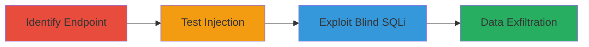

---
tags:
  - sqli
  - blind-sqli
  - web
  - data-exfiltration
type: attack_chain
tools:
  - '[[tools/Burp-Suite]]'
tactics:
  - '[[Initial Access]]'
  - '[[Collection]]'
commands:
  - '[[commands/curl-test-sqli-payload]]'
platforms:
  - Web
complexity: medium
procedures:
  - '[[procedures/Identify-Vulnerable-Order-ID-Endpoint]]'
  - '[[procedures/Test-Order-ID-for-SQL-Injection]]'
  - '[[procedures/Exploit-Boolean-Based-Blind-SQLi]]'
step_count: 3
techniques:
  - '[[Exploit Public-Facing Application]]'
description: >-
  A multi-step attack exploiting SQL Injection in the order_id parameter of a
  Zomato web endpoint to enable boolean-based blind data exfiltration from the
  database.
skill_level: intermediate
impact_level: high
id: fec77723-1fa6-4a49-8b33-073eed607429
created_at: '2025-12-14T03:15:30.596Z'
updated_at: '2025-12-14T03:15:30.596Z'
verified: false
validated: true
submitted: true
mitre_tactics:
  - '[[Initial Access]]'
  - '[[Collection]]'
mitre_techniques:
  - '[[Exploit Public-Facing Application]]'
---
# Boolean-Based Blind SQL Injection in Order ID Parameter for Unauthorized Data Access

## Overview

This attack chain demonstrates the discovery and exploitation of a SQL Injection vulnerability in the 'order_id' parameter of a Zomato web endpoint. The attacker identifies the endpoint, tests for injection by observing response changes, and uses boolean-based blind techniques to exfiltrate sensitive data such as order or user information from the backend SQL database. The vulnerability stems from insufficient input sanitization, allowing malicious payloads to alter database queries.

## Chain Metrics Dashboard

| Metric | Value |
|--------|-------|
| Chain Status | Unverified |
| Total Steps | 3 |
| Execution Time | ~15 minutes |
| Skill Level | Intermediate |
| Complexity | Medium |
| Impact Level | High |

## Attack Flow Visualization



## Prerequisites & Requirements

### Required Tools

- [[tools/Burp-Suite]]

### Target Environment

- Web platform with SQL backend (e.g., MySQL or PostgreSQL)
- Required services/ports: HTTP/HTTPS on port 80/443
- Network access requirements: Direct internet access to the target endpoint

### Initial Access Requirements

- No credentials required
- External network position (public-facing web app)
- No prior access needed

## Detailed Attack Procedures

### Step 1: Identify Vulnerable Endpoint
procedure: [[procedures/Identify-Vulnerable-Order-ID-Endpoint]]

**Objective**: Locate the web endpoint that processes the order_id parameter for querying order details.

**Instructions**: Use Burp Suite to intercept and analyze traffic to Zomato's order-related pages. Identify API calls or form submissions that include the order_id parameter, such as GET requests to /orders/{order_id}.

**Expected Output**: Confirmation of the endpoint URL and parameter usage.

**Success Indicators**:
- Endpoint identified with order_id in query string or body
- Normal response returns order details without errors

### Step 2: Test for SQL Injection
procedure: [[procedures/Test-Order-ID-for-SQL-Injection]]

**Objective**: Inject a test payload to detect SQL injection by observing response anomalies like length changes.

**Instructions**: Intercept a request in Burp Suite and modify the order_id parameter with the payload '-if(1=2,'0','1')-'. Send the request and compare response lengths to the original.

Execute [[commands/curl-test-sqli-payload]] to simulate:

```bash
curl -X GET "https://www.zomato.com/api/orders?order_id='-if(1=2,'0','1')-'" -H "User-Agent: Mozilla/5.0"
```

**Expected Output**: Altered response length or content indicating injection success.

**Success Indicators**:
- Response length differs from baseline
- No SQL error but behavioral change observed

### Step 3: Exploit Boolean-Based Blind SQLi
procedure: [[procedures/Exploit-Boolean-Based-Blind-SQLi]]

**Objective**: Use conditional boolean payloads to systematically extract database data.

**Instructions**: Build on the injection point by crafting payloads like 'AND (SELECT LENGTH(DATABASE()) > 5)--' and iterate based on true/false response differences. Use Burp Intruder for automation.

**Expected Output**: Bit-by-bit or byte-by-byte data leakage through response analysis.

**Success Indicators**:
- Consistent true/false response patterns
- Successful extraction of database name, tables, or sensitive fields

## Attack Chain Summary

### Key Achievements

1. Identified injectable order_id parameter without triggering errors
2. Confirmed blind SQLi via response length differentials
3. Enabled potential exfiltration of user and order data

## Technique & Tactic Coverage

### MITRE ATT&CK Techniques

- [[Exploit Public-Facing Application]]

### MITRE ATT&CK Tactics

- [[Initial Access]]
- [[Collection]]

---
*Last updated: 2023-10-01*
