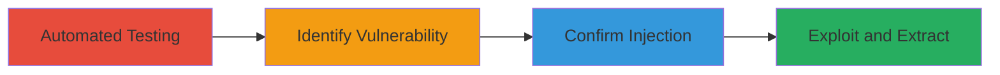

# Boolean-Based Blind SQL Injection via User-Agent Header in SharePoint Application

Multi-stage attack chain demonstrating a complete workflow for discovering and exploiting a boolean-based blind SQL injection vulnerability in the User-Agent header of a Microsoft SharePoint application, leading to information disclosure from the backend MySQL database.

## Chain Metrics Dashboard

| Metric | Value |
|--------|-------|
| Chain Status | Unverified |
| Total Steps | 4 |
| Execution Time | ~30 minutes |
| Skill Level | Intermediate |
| Complexity | Medium |
| Impact Level | High |

## Attack Flow Visualization



## Prerequisites & Requirements

### Required Tools

- [[tools/sqlmap]]
- [[tools/Burp-Suite]]

### Target Environment

- Web platform with Microsoft SharePoint 16.0.0.5452
- Backend MySQL 8 (MariaDB fork)
- Accessible HTTPS endpoint (e.g., https://target.mil/)

### Initial Access Requirements

- Direct network access to the target URL
- No authentication required for initial requests
- Ability to modify HTTP headers

## Detailed Attack Procedures

### Step 1: Automated SQL Injection Testing
procedure: [[procedures/Automated-SQL-Injection-Testing-with-SQLMap]]

**Objective**: Initiate comprehensive testing for SQL injection vulnerabilities across the target application, including headers.

**Instructions**: Launch SQLMap with high risk and level settings to scan the target URL, using a random User-Agent to evade detection.

Execute [[commands/sqlmap-boolean-blind-test]]:

```bash
sqlmap --url https://target.mil/ --random-agent -risk 3 --level 5 --batch
```

**Expected Output**: SQLMap identifies potential injection points, including in the User-Agent header, and reports boolean-based blind SQLi.

**Success Indicators**:
- SQLMap detects injectable parameters
- Logs show response time differences or boolean condition evaluations

### Step 2: Identify Vulnerable User-Agent Header
procedure: [[procedures/Identify-Vulnerable-User-Agent-Header]]

**Objective**: Pinpoint the User-Agent header as the injection point by injecting test payloads.

**Instructions**: Use a proxy like Burp Suite to intercept requests and modify the User-Agent header with a basic SQL payload to observe anomalies.

Intercept a request and set User-Agent to a test string like 'Mozilla/5.0 (test; SQL' to check for errors or delays.

**Expected Output**: Application responses indicate parsing issues or delays, suggesting header inclusion in SQL queries.

**Success Indicators**:
- Response anomalies when injecting SQL syntax in User-Agent
- No errors in other headers

### Step 3: Confirm Boolean-Based Blind SQLi
procedure: [[procedures/Confirm-Boolean-Based-Blind-SQLi]]

**Objective**: Verify the vulnerability type by crafting payloads that rely on boolean conditions to alter responses.

**Instructions**: Manually inject a true condition payload into the User-Agent header and compare with a false condition.

Use Burp Suite to send requests with User-Agent: 'Mozilla/5.0 AND 8074=8074' (true) vs. 'Mozilla/5.0 AND 8074=8075' (false).

**Expected Output**: Normal response for true condition, delayed or altered response for false, confirming blind boolean-based SQLi.

**Success Indicators**:
- Differential responses based on boolean evaluation
- No direct error messages, indicating blind nature

### Step 4: Exploit SQLi for Data Extraction
procedure: [[procedures/Exploit-SQLi-for-Data-Extraction]]

**Objective**: Extract database schema and sensitive data through conditional payloads.

**Instructions**: Use SQLMap for automated extraction or manually craft payloads in Burp Suite to infer information bit by bit.

Run SQLMap with database enumeration flags or manually test conditions like 'AND ASCII(SUBSTRING((SELECT database()),1,1))=97'.

**Expected Output**: Inferred database names, tables, and data via response analysis.

**Success Indicators**:
- Successful extraction of schema details
- Access to sensitive information without direct output

## Attack Chain Summary

### Key Achievements

1. Discovery of SQLi in an uncommon header (User-Agent)
2. Confirmation of blind boolean-based technique
3. Potential for full database enumeration on SharePoint backend

## Technique & Tactic Coverage

### MITRE ATT&CK Techniques

- [[Exploit Public-Facing Application]]

### MITRE ATT&CK Tactics

- [[Initial Access]]
- [[Collection]]

---
*Last updated: 2023-10-01T00:00:00Z*
