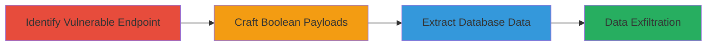

# Boolean-Based SQL Injection for Unauthorized Database Access on Zomato

Multi-stage attack chain demonstrating a boolean-based SQL injection exploit in a Zomato web application, leading to unauthorized database access and potential data extraction.

## Chain Metrics Dashboard

| Metric | Value |
|--------|-------|
| Chain Status | Unverified |
| Total Steps | 3 |
| Execution Time | ~30 minutes |
| Skill Level | Intermediate |
| Complexity | Medium |
| Impact Level | High |

## Attack Flow Visualization



## Prerequisites & Requirements

### Required Tools

- [[tools/Burp-Suite]]

### Target Environment

- Web application on www.zomato.com
- HTTP/HTTPS access to the application
- No specific ports required beyond standard web (80/443)

### Initial Access Requirements

- Public access to the web application
- No credentials needed for initial probing
- Network position: External/internet-facing

## Detailed Attack Procedures

### Step 1: Identify Vulnerable Endpoint
procedure: [[procedures/Identify-SQL-Injection-Endpoint]]

**Objective**: Locate input parameters in the Zomato application susceptible to SQL injection by testing for error responses or time delays.

**Instructions**: Use Burp Suite to intercept requests to the target application and inject basic SQL payloads like ' OR 1=1 -- into form fields or URL parameters.

Execute [[commands/burp-intercept-request]] to capture traffic:

```bash
# In Burp Suite: Proxy > Intercept > On, then submit form with payload
```

Follow with [[commands/sqlmap-basic-test]] for automated probing:

```bash
sqlmap -u "https://www.zomato.com/app?param=value" --batch --level=1
```

**Expected Output**: Identification of injectable parameters, such as error messages revealing SQL syntax or boolean responses differing based on true/false conditions.

**Success Indicators**:
- Database error messages (e.g., MySQL syntax errors)
- Consistent response differences for true/false payloads

### Step 2: Craft Boolean Payloads
procedure: [[procedures/Craft-Boolean-SQL-Payloads]]

**Objective**: Develop boolean-based payloads to confirm injection and prepare for data extraction by manipulating query conditions.

**Instructions**: Build payloads that use boolean logic to infer database structure, such as checking if a character exists in a column.

Use [[commands/manual-boolean-payload]] in Burp Repeater:

```bash
# Example payload in parameter: ' AND (SELECT SUBSTRING(table_name,1,1) FROM information_schema.tables)='a' --
```

Iterate with [[commands/sqlmap-boolean-mode]] to automate:

```bash
sqlmap -u "https://www.zomato.com/app?param=value" --technique=B --dbms=mysql --batch
```

**Expected Output**: Confirmation of injection via response variations (e.g., page loads for true, errors for false).

**Success Indicators**:
- Payloads elicit different responses based on boolean outcomes
- Database type inferred (e.g., MySQL)

### Step 3: Extract Database Data
procedure: [[procedures/Extract-Database-Data-via-Boolean-SQLi]]

**Objective**: Systematically extract sensitive data like user records or configuration details using boolean conditions to guess characters one by one.

**Instructions**: Enumerate databases, tables, and columns using conditional payloads, then dump data.

Employ [[commands/sqlmap-dump-boolean]] for extraction:

```bash
sqlmap -u "https://www.zomato.com/app?param=value" --technique=B --dbms=mysql --dump-all --batch
```

For manual extraction, craft payloads like [[commands/manual-data-extraction]]:

```bash
# Payload: ' AND (SELECT COUNT(*) FROM users WHERE username='admin')>0 --
```

**Expected Output**: Retrieved database schema and data, such as table names, user credentials, or application data.

**Success Indicators**:
- Successful enumeration of database contents
- Exfiltration of at least one sensitive record

## Attack Chain Summary

### Key Achievements

1. Identification of SQL injection point in Zomato application
2. Confirmation of boolean-based exploitation feasibility
3. Potential unauthorized access to database for data theft or manipulation

## Technique & Tactic Coverage

### MITRE ATT&CK Techniques

- [[Exploit Public-Facing Application]]

### MITRE ATT&CK Tactics

- [[Initial Access]]
- [[Collection]]

---
*Last updated: 2023-10-01T00:00:00Z*
