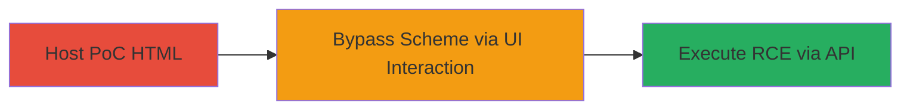

---
tags:
  - brave-browser
  - scheme-bypass
  - rce
  - ui-redressing
  - client-exploitation
type: attack_chain
tools:
  - '[[tools/Generic-Web-Server]]'
tactics:
  - '[[Execution]]'
verified: false
platforms:
  - Web
  - Microsoft Windows
submitted: true
complexity: medium
created_at: '2023-10-01T00:00:00Z'
procedures:
  - '[[procedures/Host-and-Deliver-Brave-PoC-HTML]]'
  - '[[procedures/Bypass-chrome-Scheme-via-Bookmarking-or-Drag-and-Drop]]'
  - '[[procedures/Execute-RCE-on-chrome-brave-Page]]'
step_count: 3
techniques:
  - '[[Exploitation for Client Execution]]'
  - '[[JavaScript]]'
updated_at: '2025-12-14T17:23:31.284Z'
description: >-
  Multi-stage attack exploiting a scheme bypass in Brave browser to access the
  restricted chrome://brave page and achieve remote code execution on Windows
  via exposed APIs.
skill_level: intermediate
impact_level: high
id: 02c26d16-2b8d-4456-a5c9-c01ea9b19e96
validated: true
mitre_tactics:
  - '[[Execution]]'
mitre_techniques:
  - '[[Exploitation for Client Execution]]'
  - '[[JavaScript]]'
---
# Brave Browser chrome:// Scheme Bypass via Bookmarking and Drag-and-Drop Leading to RCE

Multi-stage attack chain demonstrating exploitation of a vulnerability in Brave browser (based on Chromium) that allows bypassing restrictions on chrome:// URLs to access the internal 'chrome://brave' page, exposing dangerous APIs for remote code execution on Windows systems. The attack relies on user interaction to open a malicious local HTML PoC, which facilitates UI redressing to load the restricted page via bookmarking or drag-and-drop, ultimately executing arbitrary local files or commands.

## Chain Metrics Dashboard

| Metric | Value |
|--------|-------|
| Chain Status | Unverified |
| Total Steps | 3 |
| Execution Time | ~5 minutes |
| Skill Level | Intermediate |
| Complexity | Medium |
| Impact Level | High |

## Attack Flow Visualization



## Prerequisites & Requirements

### Required Tools

- [[tools/Generic-Web-Server]]

### Target Environment

- Brave Browser on Microsoft Windows
- User with access to download and open local HTML files
- No specific ports or services required beyond standard web access

### Initial Access Requirements

- Social engineering to convince target to download and open PoC
- Local file system write access for saving HTML
- Browser bookmarks enabled

## Detailed Attack Procedures

### Step 1: Host and Deliver PoC HTML
procedure: [[procedures/Host-and-Deliver-Brave-PoC-HTML]]

**Objective**: Deliver the malicious HTML PoC to the target, tricking them into saving and opening it locally in Brave browser to set up the UI redressing attack.

**Instructions**: Use [[tools/Generic-Web-Server]] to host the PoC HTML file (e.g., braveRCE.html) containing JavaScript to open a popup with an anchor tag href="chrome://brave". Instruct the target via email or chat to download the file and open it in Brave from the local disk.

**Expected Output**: Target opens the HTML in Brave, triggering a popup with the malicious anchor.

**Success Indicators**:
- PoC file downloaded and opened locally
- Popup window appears in browser

### Step 2: Bypass chrome:// Scheme via Bookmarking or Drag-and-Drop
procedure: [[procedures/Bypass-chrome-Scheme-via-Bookmarking-or-Drag-and-Drop]]

**Objective**: Use UI interactions to navigate to the restricted 'chrome://brave' page, bypassing Brave's scheme protections through bookmarking or direct drag-and-drop.

**Instructions**: Instruct the target to click in the PoC popup to reveal the anchor, then drag the anchor tag to the browser's bookmark bar (or right-click to bookmark if bar is empty). Next, hold CTRL and click the bookmark to open in a new tab, or use middle mouse button/right-click open. Alternatively, drag the anchor directly into the main browser window (e.g., navigated to brave.com) to load the page.

**Expected Output**: New tab or window loads the 'chrome://brave' internal page, exposing Brave-specific APIs.

**Success Indicators**:
- Restricted page loads without error
- APIs like chrome.remote.shell are accessible in console

### Step 3: Execute RCE on chrome://brave Page
procedure: [[procedures/Execute-RCE-on-chrome-brave-Page]]

**Objective**: Leverage the exposed chrome.remote.shell API on the loaded page to execute arbitrary local files or commands, achieving RCE on the Windows host.

**Instructions**: On the loaded 'chrome://brave' page, open the browser console and execute [[commands/chrome-remote-shell-openitem-temp]] to open a pre-placed .lnk shortcut file that runs a payload (e.g., calc.exe). Ensure the .lnk is in an existing directory like C:\temp\ to avoid creation issues.

```javascript
chrome.remote.shell.openItem("C://temp//test.lnk");
```

**Expected Output**: The linked executable or command runs on the system (e.g., calculator opens if test.lnk points to calc.exe).

**Success Indicators**:
- Local command executes
- No browser crashes or blocks

## Attack Chain Summary

### Key Achievements

1. Bypassed chrome:// scheme restrictions in Brave via user-driven UI redressing
2. Accessed internal APIs without authentication
3. Achieved full RCE on Windows, allowing arbitrary code execution

## Technique & Tactic Coverage

### MITRE ATT&CK Techniques

- [[Exploitation for Client Execution]] Exploitation for Client Execution
- [[JavaScript]] Command and Scripting Interpreter: JavaScript

### MITRE ATT&CK Tactics

- [[Execution]] Execution

---
*Last updated: 2023-10-01T00:00:00Z*
