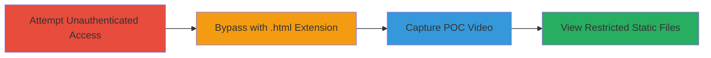

# Broken Access Control Bypass via .html URL Extension on Acronis Notary Panel

Multi-stage attack chain demonstrating a complete attack workflow for exploiting broken access controls on the notary.acronis.com endpoint.

## Chain Metrics Dashboard

| Metric | Value |
|--------|-------|
| Chain Status | Unverified |
| Total Steps | 3 |
| Execution Time | ~5 minutes |
| Skill Level | Beginner |
| Complexity | Low |
| Impact Level | Low |

## Attack Flow Visualization

## Prerequisites & Requirements

### Required Tools

- Web browser (e.g., Chrome or Firefox with developer tools)
- Screen recording software for POC (e.g., built-in OS recorder)

### Target Environment

- Web platform
- Target: notary.acronis.com panel endpoints
- No specific services/ports required beyond standard HTTPS (443)
- Network access: Public internet

### Initial Access Requirements

- No credentials required
- Direct public access to the target URL
- No prior access needed

## Detailed Attack Procedures

### Step 1: Attempt Unauthenticated Access to Panel
procedure: [[procedures/Attempt-Unauthenticated-Access-to-Panel]]

**Objective**: Verify that the panel blocks unauthenticated access to confirm the presence of access controls.

**Instructions**: Navigate to the notary.acronis.com panel endpoint using a web browser without logging in. Attempt to load the main panel URL directly.

**Expected Output**: Access denied or redirect to login page, indicating authentication is enforced.

**Success Indicators**:
- Error message or block for unauthenticated user
- Confirmation that dynamic panel functions are protected

### Step 2: Bypass Access Controls with .html Extension
procedure: [[procedures/Bypass-Access-Controls-with-HTML-Extension]]

**Objective**: Exploit the misconfiguration to access static files by modifying URLs to append .html.

**Instructions**: Identify a panel function URL (e.g., /panel/some-function). Append .html to the end (e.g., /panel/some-function.html). Load the modified URL in the browser. Repeat for other panel URLs to retrieve HTML, JS, and CSS files.

**Expected Output**: Successful loading of static content such as HTML pages, JavaScript files, or CSS stylesheets that were intended to be restricted.

**Success Indicators**:
- Static files render or download without authentication prompt
- Exposure of internal UI elements or scripts

### Step 3: Capture POC Video of Bypass
procedure: [[procedures/Capture-POC-Video-of-Bypass]]

**Objective**: Document the exploit for reporting or verification purposes.

**Instructions**: Use screen recording software to capture the browser session. Demonstrate the failed unauthenticated access, then the successful .html bypass, showing the retrieved static files.

**Expected Output**: A video file showcasing the access denial followed by the bypass and file viewing.

**Success Indicators**:
- Video clearly shows the vulnerability in action
- Static files visible in the recording without auth

## Attack Chain Summary

### Key Achievements

1. Confirmed enforcement of authentication on dynamic panel access
2. Bypassed controls to view restricted static resources (HTML, JS, CSS)
3. Documented the issue via POC video for validation

## Technique & Tactic Coverage

### MITRE ATT&CK Techniques

- [[Exploit Public-Facing Application]]
- [[File and Directory Discovery]]

### MITRE ATT&CK Tactics

- [[Initial Access]]
- [[Discovery]]

---
*Last updated: 2023-10-01T00:00:00Z*
