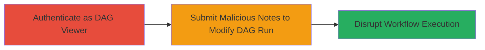

# Broken Access Control in Apache Airflow Allowing Unauthorized DAG Run Modification

Multi-stage attack chain demonstrating exploitation of CVE-2023-47037 in Apache Airflow versions before 2.7.3, where authenticated users with DAG-view permissions can alter DAG run details via the notes feature, leading to workflow disruptions.

## Chain Metrics Dashboard

| Metric | Value |
|--------|-------|
| Chain Status | Unverified |
| Total Steps | 1 |
| Execution Time | ~5 minutes |
| Skill Level | Intermediate |
| Complexity | Low |
| Impact Level | High |

## Attack Flow Visualization

## Prerequisites & Requirements

### Required Tools

- Web browser (e.g., Chrome with developer tools)
- Optional: [[curl]] for API simulation

### Target Environment

- Apache Airflow web server (versions < 2.7.3)
- Required services/ports: Web UI on port 8080 (default)
- Network access requirements: Internal network access to Airflow instance

### Initial Access Requirements

- Valid credentials for an authenticated user with DAG-view authorization
- No elevated privileges needed beyond view access
- Prior access: None, assuming legitimate authentication

## Detailed Attack Procedures

### Step 1: Authenticate and Modify DAG Run via Notes
procedure: [[procedures/Exploit-Airflow-DAG-Run-Modification-via-Notes]]

**Objective**: Gain access to the Airflow UI and submit crafted notes to alter DAG run configurations, such as start dates or parameters, to disrupt executions.

**Instructions**: Log in to the Airflow web interface with DAG-view credentials. Navigate to the DAG runs view, select a target DAG run, and use the notes submission feature to inject modifications. For example, append JSON-like payloads in the notes field to override configurations (e.g., changing start_date or conf parameters). If API access is available, simulate via POST requests to the /api/v1/dagruns/{dag_id}/notes endpoint with altered payloads.

**Expected Output**: Successful update of DAG run details, visible in the UI or logs, leading to failed or altered workflow runs.

**Success Indicators**:
- DAG run configuration changes reflected in the Airflow UI
- Workflow execution anomalies, such as unexpected start times or parameter errors in logs

## Attack Chain Summary

### Key Achievements

1. Bypassed intended read-only access for DAG views
2. Modified critical DAG run parameters without write permissions
3. Disrupted data pipelines and workflow integrity

## Technique & Tactic Coverage

### MITRE ATT&CK Techniques

- [[Valid Accounts]]

### MITRE ATT&CK Tactics

- [[Initial Access]]
- [[Impact]]

---
*Last updated: 2023-10-01T00:00:00Z*
