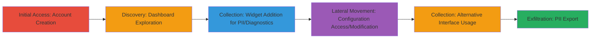

---
tags:
  - broken-access-control
  - pii-leak
  - dod-vulnerability
  - web-access-bypass
type: attack_chain
tools: []
tactics:
  - '[[Initial Access]]'
  - '[[Discovery]]'
  - '[[Collection]]'
verified: false
platforms:
  - Web
submitted: true
complexity: medium
created_at: '2023-10-01T00:00:00Z'
procedures:
  - '[[procedures/Create-Verified-Account-and-Access-Dashboard]]'
  - '[[procedures/Add-Widgets-to-Expose-Sensitive-Data]]'
  - '[[procedures/Access-and-Modify-System-Configurations]]'
  - '[[procedures/Switch-to-Alternative-Dashboard-Interface]]'
  - '[[procedures/Add-Content-in-Alternative-Interface]]'
  - '[[procedures/View-and-Export-User-PII]]'
step_count: 6
techniques:
  - '[[Valid Accounts]]'
  - '[[Exploit Public-Facing Application]]'
updated_at: '2025-12-14T17:28:51.695Z'
description: >-
  Multi-stage attack exploiting improper access controls in a U.S. Department of
  Defense web application dashboard, enabling any verified user to access,
  modify, and export sensitive PII and system configurations without elevated
  privileges.
skill_level: intermediate
impact_level: high
id: 55b6256e-b3c6-4fe1-8c1b-bbde7c03de01
validated: true
mitre_tactics:
  - '[[Initial Access]]'
  - '[[Discovery]]'
  - '[[Collection]]'
mitre_techniques:
  - '[[Valid Accounts]]'
  - '[[Exploit Public-Facing Application]]'
---
# Broken Access Control in DoD Dashboard Allowing Unauthorized PII Exposure and Configuration Modification

Multi-stage attack chain demonstrating exploitation of improper access controls in a U.S. Department of Defense web application, where standard verified users can add dashboard widgets to view, modify, and export sensitive Personally Identifiable Information (PII) and system diagnostics without role-based restrictions.

## Chain Metrics Dashboard

| Metric | Value |
|--------|-------|
| Chain Status | Unverified |
| Total Steps | 6 |
| Execution Time | ~10 minutes |
| Skill Level | Intermediate |
| Complexity | Medium |
| Impact Level | High |

## Attack Flow Visualization

## Prerequisites & Requirements

### Required Tools

- Web browser (e.g., Chrome or Firefox with developer tools for inspection)

### Target Environment

- Web application hosted on DoD infrastructure
- No specific ports required beyond standard HTTPS (443)
- Internet access to the redacted application URL

### Initial Access Requirements

- No prior credentials needed; standard user registration is sufficient
- Network position: External access as a public user
- Account verification via email or standard process

## Detailed Attack Procedures

### Step 1: Create Verified Account and Access Dashboard
procedure: [[procedures/Create-Verified-Account-and-Access-Dashboard]]

**Objective**: Establish initial foothold by registering a standard user account and navigating to the vulnerable dashboard.

**Instructions**: Register a new account on the application at the redacted URL `███████/`. Complete verification (e.g., email confirmation). Once verified, log in and navigate to the dashboard page at `███████`.

**Expected Output**: Successful login and dashboard interface loaded, prompting for creation if first-time access.

**Success Indicators**:
- Account verification email received
- Dashboard page accessible without errors

### Step 2: Create Initial Dashboard
procedure: [[procedures/Add-Widgets-to-Expose-Sensitive-Data]]

**Objective**: Set up the dashboard environment to enable widget addition for data exposure.

**Instructions**: On first access to the dashboard, use the built-in creation feature to initialize a new dashboard layout.

**Expected Output**: Empty or default dashboard ready for widget customization.

**Success Indicators**:
- Dashboard creation confirmation
- Interface allows widget addition

### Step 3: Add Widgets to Expose Sensitive Data
procedure: [[procedures/Add-Widgets-to-Expose-Sensitive-Data]]

**Objective**: Exploit the Add Widgets feature to reveal PII, diagnostic data like memory usage, and incident counts.

**Instructions**: Click the 'Add Widgets' button in the dashboard interface. Select and add various widgets that display sensitive information, such as user details and system metrics. Screenshots from exploration show exposed full names, emails, addresses, phone numbers, and diagnostics.

**Expected Output**: Widgets populated with unauthorized data visible on the dashboard.

**Success Indicators**:
- Widgets load without permission errors
- Sensitive PII and diagnostics displayed

### Step 4: Access and Modify System Configurations
procedure: [[procedures/Access-and-Modify-System-Configurations]]

**Objective**: Use widget interactions to view and edit system catalogs and configurations.

**Instructions**: In an added widget (e.g., the third one), click on elements like 'All(22)' to expand and view configuration items. Edit fields directly in the interface to modify settings.

**Expected Output**: List of 22+ configuration items accessible; changes saved without restrictions.

**Success Indicators**:
- Configuration details loaded
- Edits applied successfully

### Step 5: Switch to Alternative Dashboard Interface
procedure: [[procedures/Switch-to-Alternative-Dashboard-Interface]]

**Objective**: Access an enhanced interface for broader functionality and additional exposure.

**Instructions**: Navigate from the primary dashboard to the alternative at `███/home`, which provides a similar but more feature-rich layout.

**Expected Output**: Alternative dashboard loaded with expanded options.

**Success Indicators**:
- Page transition successful
- Additional UI elements visible

### Step 6: Add Content and Export PII in Alternative Interface
procedure: [[procedures/View-and-Export-User-PII]]

**Objective**: Add specialized widgets in the alternative interface to view and export user PII.

**Instructions**: Click 'Add Content' in the top-left corner. Add the specific `███████` widget to display user accounts. Click into accounts (e.g., test account `███`) to view details like names, emails, addresses, and phone numbers. Use export features to download data.

**Expected Output**: PII details for multiple users, including exportable formats; test accounts show limited but real accounts reveal full data.

**Success Indicators**:
- Widget adds without errors
- PII exportable and downloaded

## Attack Chain Summary

### Key Achievements

1. Unauthorized access to extensive PII for numerous users using only a standard verified account.
2. Modification of critical system configurations and catalogs, potentially disrupting operations.
3. Exposure of diagnostic data enabling operational reconnaissance by adversaries.
4. Easy data exfiltration, amplifying the risk of identity theft or targeted attacks.

## Technique & Tactic Coverage

### MITRE ATT&CK Techniques

- [[Valid Accounts]] Valid Accounts
- [[Exploit Public-Facing Application]] Exploit Public-Facing Application

### MITRE ATT&CK Tactics

- [[Initial Access]] Initial Access
- [[Discovery]] Discovery
- [[Collection]] Collection

---

*Last updated: 2023-10-01T00:00:00Z*
