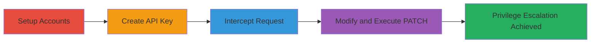

# Broken Access Control in Frontegg API Allowing Admin to Edit Owner API Keys via PATCH Manipulation

Multi-stage attack chain demonstrating exploitation of a broken access control vulnerability in Frontegg's API, where Admins can edit Owner API keys by intercepting and modifying DELETE requests to unauthorized PATCH operations. This allows privilege escalation, such as changing roles to Impersonator, and disrupts access controls without traceability.

## Chain Metrics Dashboard

| Metric | Value |
|--------|-------|
| Chain Status | Unverified |
| Total Steps | 4 |
| Execution Time | ~15 minutes |
| Skill Level | Intermediate |
| Complexity | Medium |
| Impact Level | High |

## Attack Flow Visualization

## Prerequisites & Requirements

### Required Tools

- [[tools/Burp-Suite]]

### Target Environment

- Web-based SaaS platform (Frontegg)
- Required services: API Tokens, Tenants management
- Network access: Direct browser access to Frontegg dashboard and API endpoints

### Initial Access Requirements

- Valid user credentials for Owner account
- Ability to register new accounts
- Proxy setup (e.g., Burp Suite) to intercept traffic

## Detailed Attack Procedures

### Step 1: Setup Accounts and Roles
procedure: [[procedures/Setup-Frontegg-Accounts-and-Roles]]

**Objective**: Establish Owner and Admin accounts to simulate privilege boundaries.

**Instructions**: Register two new user accounts in the Frontegg platform. From the Owner account, invite the Admin account to the tenant panel with Admin role.

**Expected Output**: Admin account granted access to the Owner's tenant panel.

**Success Indicators**:
- Invitation email received and accepted by Admin
- Admin visible in tenant users list with Admin role

### Step 2: Create Owner API Key
procedure: [[procedures/Create-Owner-API-Key]]

**Objective**: Generate an API key with Owner privileges for targeting.

**Instructions**: Log in as Owner and navigate to the API keys section to create a new key assigned to the Owner role.

**Expected Output**: New API key generated with Owner role, visible in the dashboard.

**Success Indicators**:
- API key listed with Owner role
- Key ID retrievable for later use

### Step 3: Intercept and Modify DELETE to PATCH Request
procedure: [[procedures/Intercept-and-Modify-DELETE-to-PATCH-Request]]

**Objective**: Capture the Admin's DELETE attempt and alter it for unauthorized editing.

**Instructions**: From Admin account, attempt to delete the Owner's API key via UI. Intercept the DELETE request using Burp Suite, drop it, change method to PATCH, and prepare for payload.

**Expected Output**: Modified PATCH request ready in Burp Repeater.

**Success Indicators**:
- Original DELETE intercepted and not executed
- Request method successfully changed to PATCH

### Step 4: Execute PATCH and Verify API Key Edit
procedure: [[procedures/Execute-PATCH-and-Verify-API-Key-Edit]]

**Objective**: Send the modified request to edit the API key and confirm privilege changes.

**Instructions**: Add JSON payload to the PATCH request (e.g., update description and roleIds to Impersonator). Send from Burp Repeater and verify changes in the dashboard.

**Expected Output**: 200 OK response; API key updated with new description and role.

**Success Indicators**:
- Response confirms update
- Dashboard shows edited fields (e.g., role changed to Impersonator)

## Attack Chain Summary

### Key Achievements

1. Unauthorized editing of Owner API keys by Admin
2. Privilege escalation via role changes (e.g., to Impersonator)
3. Potential disruption of tenant configurations without audit trails

## Technique & Tactic Coverage

### MITRE ATT&CK Techniques

- [[Exploitation for Privilege Escalation]] Exploitation for Privilege Escalation
- [[Valid Accounts]] Valid Accounts

### MITRE ATT&CK Tactics

- [[Privilege Escalation]] Privilege Escalation

---
*Last updated: 2023-10-01T00:00:00Z*
