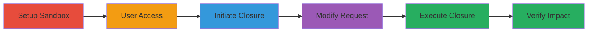

---
tags:
  - broken-access-control
  - web-vulnerability
  - hackerone
  - authorization-bypass
type: attack_chain
tools: []
tactics:
  - '[[Initial Access]]'
commands:
  - '[[commands/hackerone-bulk-report-close]]'
verified: false
platforms:
  - Web
submitted: true
complexity: medium
created_at: '2024-01-01T00:00:00Z'
procedures:
  - '[[procedures/Create-HackerOne-Sandbox-Program]]'
  - '[[procedures/Invite-and-Authenticate-Test-User]]'
  - '[[procedures/Initiate-Report-Closure-Request]]'
  - '[[procedures/Modify-and-Execute-Cross-Program-Duplicate-Closure]]'
step_count: 6
techniques:
  - '[[Exploit Public-Facing Application]]'
updated_at: '2025-12-14T17:30:46.987Z'
description: >-
  Demonstrates exploitation of improper access controls in HackerOne's report
  management system to close reports as duplicates across different programs,
  potentially exposing sensitive information and disrupting workflows.
skill_level: intermediate
impact_level: high
id: 98c19014-c894-4b82-8ff8-5516f33f3b64
validated: true
mitre_tactics:
  - '[[Initial Access]]'
mitre_techniques:
  - '[[Exploit Public-Facing Application]]'
---
# Broken Access Control in HackerOne Enabling Unauthorized Cross-Program Report Closure

Multi-stage attack chain demonstrating exploitation of an improper access control vulnerability in HackerOne's /reports/bulk endpoint. By modifying the original_report_id parameter in a POST request, an attacker with limited access can close reports in one program as duplicates of reports from another program, bypassing authorization checks. This can lead to exposure of sensitive details from limited-disclosure reports, disruption of bug bounty workflows, and misleading program teams.

## Chain Metrics Dashboard

| Metric | Value |
|--------|-------|
| Chain Status | Unverified |
| Total Steps | 6 |
| Execution Time | ~15 minutes |
| Skill Level | Intermediate |
| Complexity | Medium |
| Impact Level | High |

## Attack Flow Visualization

## Prerequisites & Requirements

### Required Tools

- Browser with developer tools or proxy like Burp Suite for request interception

### Target Environment

- HackerOne platform (web application)
- Required services/ports: HTTPS on port 443
- Network access requirements: Internet access to hackerone.com

### Initial Access Requirements

- HackerOne account with ability to create sandbox programs
- No special credentials beyond standard user access
- Prior access needed: Valid HackerOne login

## Detailed Attack Procedures

### Step 1: Create Sandbox Program
procedure: [[procedures/Create-HackerOne-Sandbox-Program]]

**Objective**: Establish a controlled test environment to simulate a private program for vulnerability testing.

**Instructions**: Log in to your HackerOne account and navigate to the program creation section. Configure the program as a sandbox with limited visibility settings to mimic a real private program.

**Expected Output**: New sandbox program created with a unique program handle.

**Success Indicators**:
- Program dashboard accessible
- Sandbox settings confirmed (e.g., limited disclosure enabled)

### Step 2: Invite and Authenticate Test User
procedure: [[procedures/Invite-and-Authenticate-Test-User]]

**Objective**: Grant limited access to a test user to simulate an authorized but restricted actor.

**Instructions**: From the sandbox program settings, invite a secondary user (User B) with 'Report' and 'Engagement' permissions. Have User B accept the invitation and log in using their credentials.

**Expected Output**: User B gains access to the sandbox program's reports section.

**Success Indicators**:
- Invitation accepted
- User B can view reports in the sandbox

### Step 3: Initiate Report Closure Request
procedure: [[procedures/Initiate-Report-Closure-Request]]

**Objective**: Generate a legitimate HTTP request for closing a report as a duplicate within the sandbox.

**Instructions**: As User B, navigate to a test report in the sandbox, select the 'Close as duplicate' option, and capture the resulting POST request using a proxy tool.

**Expected Output**: Captured HTTP POST request to /reports/bulk with original_report_id set to a sandbox report.

**Success Indicators**:
- Request intercepted successfully
- Parameters include report_ids[] and original_report_id

### Step 4: Modify Request for Cross-Program Access
procedure: [[procedures/Modify-and-Execute-Cross-Program-Duplicate-Closure]]

**Objective**: Alter the request to reference a report from a different program, bypassing access controls.

**Instructions**: In the intercepted request, replace original_report_id with the ID of a public report from another program (e.g., HackerOne's own program, ID: ███████). Ensure User B's cookies and CSRF token are preserved. Update report_ids[] to the target sandbox report ID.

**Expected Output**: Modified POST request ready for forwarding.

**Success Indicators**:
- Parameters updated without syntax errors
- CSRF token valid

### Step 5: Execute Modified Request
procedure: [[procedures/Modify-and-Execute-Cross-Program-Duplicate-Closure]]

**Objective**: Submit the tampered request to perform unauthorized closure.

**Instructions**: Forward the modified POST request to the /reports/bulk endpoint using the proxy or curl equivalent.

**Expected Output**: 200 OK response from the server.

**Success Indicators**:
- HTTP 200 status
- No authorization error

### Step 6: Verify Unauthorized Closure
procedure: [[procedures/Modify-and-Execute-Cross-Program-Duplicate-Closure]]

**Objective**: Confirm the report was closed as a duplicate of the unauthorized report and assess impact.

**Instructions**: Refresh the sandbox program dashboard to check the report status. Verify it is marked as duplicate referencing the external report ID. Test for exposure of sensitive details if the original was limited-disclosure.

**Expected Output**: Report status updated to 'Closed - Duplicate' with cross-program reference.

**Success Indicators**:
- Report closed successfully
- Duplicate linked to external report
- Potential sensitive info accessible via the closure action

## Attack Chain Summary

### Key Achievements

1. Bypassed program-specific access controls to close reports across organizations.
2. Demonstrated potential for sensitive data exposure from limited-disclosure reports.
3. Highlighted risks to bug bounty workflow integrity and team decision-making.

## Technique & Tactic Coverage

### MITRE ATT&CK Techniques

- [[Exploit Public-Facing Application]]

### MITRE ATT&CK Tactics

- [[Initial Access]]

---
*Last updated: 2024-01-01T00:00:00Z*
